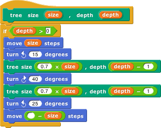
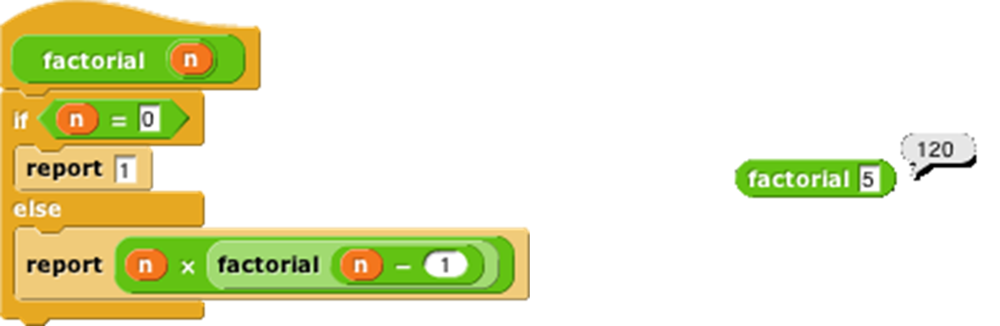

---
---

:::{index}
BYOB
Build Your Own Blocks
Scratch
:::

(sec-ch03)=
# 3. Building a Block

The first version of Snap<em>!</em> was called BYOB, for “Build Your Own Blocks .” This was the first and is still the
most important capability we added to Scratch . (The
name was changed because a few teachers have no sense of humor. ☹ You
pick your battles.) Scratch 2.0 and later also has a partial custom
block capability.

:::{index} Make a block
color of blocks
shapes of blocks
jigsaw-piece blocks
prototype
:::

## Simple Blocks

In every palette, at or near the bottom, is a button labeled "`Make a block`" . Also, floating near the top of the palette
is a plus sign (+). Also, the menu you get by right-clicking on the
background of the scripting area has a "`make a block`" option.

{img alt="image523.png" width="2.84in"}`images/03-building-a-block/image523.png`

Clicking any of these will
display a dialog window in which you choose the block’s name, shape, and
palette/color. You also decide whether the block will be available to
all sprites, or only to the current sprite and its children.

{img alt="image501.png" width="2.27in"}`images/03-building-a-block/image501.png`

In this dialog box, you can choose the block's palette, shape, and name.
With one exception, there is one color per
palette, e.g., all {span .mono}`Motion` blocks are blue. But the {span .mono}`Variables` palette
includes the orange variable-related blocks and the red list-related
blocks. Both colors are available, along with an "`Other`" option that
makes grey blocks in the {span .mono}`Variables` palette for blocks that don’t fit any
category.

There are three block shapes , following a
convention that should be familiar to Scratch users: The
jigsaw-puzzle-piece shaped blocks are
Commands, and don’t report a value. The {index}`oval blocks`
are Reporters, and the {index}`hexagonal blocks` are
Predicates, which is the technical term for reporters that report
Boolean (true or false) values.

Suppose you want to make a block named “square” that draws a square. You
would choose {span .mono}`Motion`, Command, and type “square” into the name field.
When you click "`OK`", you enter the {index}`Block Editor`.
This works just like making a script in the sprite’s scripting area,
except that the “hat” block at the top, instead of saying something like
<code>when I am clicked</code>, has a picture of the block you’re building. This
{index}`hat block` is called the *prototype*
of your custom block.[^3] You drag blocks under the hat to program your
custom block, then click OK:

{img alt="image502.png" width="4.21in"}`images/03-building-a-block/image502.png`

{img alt="image503.png" width="4.62in"}`images/03-building-a-block/image503.png`

Your block appears at the bottom of the {span .mono}`Motion` palette. Here’s the block
and the result of using it:

{img alt="image524.png" width="4.20in"}`images/03-building-a-block/image524.png`

[^3]: This use of the word “prototype” is unrelated to the *prototyping
object oriented programming* discussed later.

:::{index} Block Editor
input name dialog
title text
:::

### Custom Blocks with Inputs

But suppose you want to be able to draw squares of different sizes.
"`Control-click`" or "`right click`" on the block, choose "`edit`", and the Block
Editor will open. Notice the plus signs before and
after the word square in the prototype block. If you hover the mouse
over one, it lights up:

{img alt="image508.png" width="3.44in"}`images/03-building-a-block/image508.png`

Click on the plus on the right. You will then see the “input name” dialog :

{img alt="image509.png" width="2.58in"}`images/03-building-a-block/image509.png`

Type in the name “size” and click "`OK`" There are other options in this
dialog; you can choose "`title text`" if you want to
add words to the block name, so it can have text after an input slot,
like the <code>move ( ) steps</code> block. Or you can select a more extensive
dialog with a lot of options about your input name. But we’ll leave that
for later. When you click OK, the new input appears in the block
prototype:

{img alt="image510.png" width="1.48in"}`images/03-building-a-block/image510.png`

You can now drag the orange variable down into the script, then click okay:

{img alt="image511.png" width="1.47in"}`images/03-building-a-block/image511.png`

Your block now appears in the {span .mono}`Motion` palette with an input box: {inline alt="image512.png"}`images/03-building-a-block/image512.png` <!--  width="0.69792in" / --> You can draw
any size square by entering the length of its side in the box and
running the block as usual, by clicking it or by putting it in a script.

:::{index}
script pic
translations option
:::

### Editing Block Properties

What if you change your mind about a block’s color (palette) or shape (command, reporter, predicate)?
If you click in the hat block at the top that holds the prototype, but
not in the prototype itself, you’ll see a window in which you can change
the color, and *sometimes* the shape, namely, if the block is not used
in any script, whether in a scripting area or in another custom block.
(This includes a one-block script consisting of a copy of the new block
pulled out of the palette into the scripting area, seeing which made you
realize it’s the wrong category. Just delete that copy (drag it back to
the palette) and then change the category.)

If you "`right-click/control-click`" the hat block, you get this menu:

{img alt="image513.png" width="1.00in"}`images/03-building-a-block/image513.png`

"`Script pic`" exports a picture of the script. (Many of
the illustrations in this manual were made that way.) "`Translations`" opens a window in which you can specify how
your block should be translated if the user chooses a language other
than the one in which you are programming. "`Block variables`" lets you
create a variant of script variables for this block: A script variable
is created when a block is called, and it disappears when that call
finishes. What if you want a variable that’s local to this block, as a
script variable is, but doesn’t disappear between invocations? That’s a
{index}`block variable`. If the definition of a block
includes a block variable, then every time that (custom) block is
dragged from the palette into a script, the block variable is created.
Every time *that copy* of the block is called, it uses the same block
variable, which preserves its value between calls. Other copies of the
block have their own block variables. The "`in palette`" checkbox determines
whether or not this block will be visible in the palette. It’s normally
checked, but you may want to hide custom blocks if you’re a curriculum
writer creating a Parsons problem. To unhide blocks, choose "`Hide Blocks`" from the File menu and uncheck the checkboxes. "`Edit`" does the
same thing as regular clicking, as described earlier.

:::{index} recursion
drag from prototype
base case
factorial
`report` block
`stop` block
`stop script` block
Thinking Recursively
:::

## Recursion

Since the new custom block appears in its palette as soon as you *start*
editing it, you can write recursive blocks (blocks that call themselves)
by dragging the block into its own definition:

 <!--  width="2.96528in" / --> {inline alt="image515.png"}`images/03-building-a-block/image515.png` <!--  width="1.95833in" / --> {inline alt="image516.png"}`images/03-building-a-block/image516.png` <!--  width="1.42361in" / -->

(If you added inputs to the block since opening the editor, click "`Apply`"
before finding the block in the palette, or drag the block from the top of the block editor rather than from the
palette.)

If recursion is new to you, here are a few brief hints: It’s crucial
that the recursion have a *base case* *,* that is,
some small(est) case that the block can handle without using recursion.
In this example, it’s the case <code>depth=0</code>, for which the block does nothing
at all, because of the enclosing <code>if</code>. Without a base case, the recursion
would run forever, calling itself over and over.

Don’t try to trace the exact sequence of steps that the computer follows
in a recursive program. Instead, imagine that inside the computer there
are many small people, and if Theresa is drawing a tree of size 100,
depth 6, she hires Tom to make a tree of size 70, depth 5, and later
hires Theo to make another tree of size 70, depth 5. Tom in turn hires
Tammy and Tallulah, and so on. Each {index}`little person`
has his or her own local variables "`size`" and "`depth`", each with different
values.

You can also write {index}`recursive reporters<reporters, recursive>`,
like this block to compute the factorial function:

 <!--  width="4.29167in" / -->

Note the use of the <code>report</code> block . When a reporter
block uses this block, the reporter finishes its work and reports the
value given; any further blocks in the script are not evaluated. Thus,
the <code>if else</code> block in the script above could have been just an <code>if</code>, with
the second report block below it instead of inside it, and the result
would be the same, because when the first <code>report</code> is seen in the base
case, that finishes the block invocation, and the second <code>report</code> is
ignored. There is also a <code>stop this block</code> block
that has a similar purpose, ending the block invocation early, for
command blocks. (By contrast, the <code>stop this script</code> block stops not only the current block invocation, but also the
entire toplevel script that called it.)

Here’s a slightly more compact way to write the <code>factorial</code> function:

{img alt="image521.png" width="4.29in"}`images/03-building-a-block/image521.png`

For more on recursion, see *Thinking Recursively* by {index}`Eric Roberts<single: Roberts, Eric>`. (The originaledition is ISBN 978‑0471816522; a more recent *Thinking Recursively in
Java* is ISBN 978-0471701460.) <!-- Do we want to link to something like https://books.google.com/books/about/Thinking_Recursively.html?id=oH9QAAAAMAAJ&source=kp_book_description --MF -->

:::{index} library; block
:::

## Block Libraries

When you save a project (see Chapter II above), any custom blocks you’ve
made are saved with it. But sometimes you’d like to save a collection of
blocks that you expect to be useful in more than one project. Perhaps
your blocks implement a particular data structure (a stack, or a
dictionary, etc.), or they’re the framework for building a multilevel
game. Such a collection of blocks is called a *block library.*

To create a block library, choose "`Export blocks…`" from the
"`File`" menu. You then see a window like this:

{img alt="image522.png" width="2.02in"}`images/03-building-a-block/image522.png`

The window shows all of your
global custom blocks. You can uncheck some of the checkboxes to select
exactly which blocks you want to include in your library. (You can
"`right-click`" or "`control-click`" on the export window for a menu that lets
you check or uncheck all the boxes at once.) Then press "`OK`" An {span .mono}`XML` file
containing the blocks will appear in your Downloads location.

To import a block library, use the "`Import…`" command in the "`File`" menu,
or just drag the {span .mono}`XML` file into the Snap<em>!</em> window.

Several block libraries are included with Snap<em>!</em>; for details about
them, see @sec-libraries.

:::{index} visible stepping
:::
## Custom blocks and Visible Stepping

Visible stepping normally treats a call to a
custom block as a single step. If you want to see stepping inside a
custom block you must take these steps *in order:*

1.  Turn on
    "`Visible Stepping`" by pressing the footprints button: {inline alt="image123.png"}`images/03-building-a-block/image123.png`

2.  Select "`Edit`" in the context menu(s) of the block(s) you want to
    examine.

3.  Then start the program.

The Block Editor windows you open in step 2 do not have full editing
capability. You can tell because there is only one "`OK`" button at the
bottom, not the usual three buttons. Use the button to close these
windows when done stepping.
