# First class lists {#sec-ch04}

A data type is *first class*\index{first class data type} in a
programming language if data of that type can be

- the value of a variable

- an input to a procedure

- the value returned by a procedure

- a member of a data aggregate

- anonymous (not named)

In Scratch\index{Scratch}, numbers and text strings are first class.
You can put a number in a variable, use one as the input to a block,
call a reporter that reports a number, or put a number into a list.

But Scratch’s lists are not first class. You create one using the “`Make a
list`\index{`Make a list`}” button, which requires that you give the list
a name. You can’t put the list into a variable, into an input slot of a
block, or into a list item—you can’t have lists of lists. None of the
Scratch reporters reports a list value. (You can use a reduction of the
list into a text string as input to other blocks, but this loses the
list structure; the input is just a text string, not a data aggregate.)

A fundamental design principle\index{design principle} in Snap*!* is
that ***<u>all data should be first class</u>**.* If it’s in the
language, then we should be able to use it fully and freely. We believe
that this principle avoids the need for many special-case tools, which
can instead be written by Snap*!* users themselves.

Note that it’s a data *type*
that’s first class, not an individual value. Don’t think, for example,
that some lists are first class, while others aren’t. In Snap*!*, lists
are first class, period.

{pdf-width="2.84in"}

##  The `list` Block

At the heart of providing first class lists is the ability to make an
“anonymous” list\index{anonymous list}—to make a list without
simultaneously giving it a name. The `list` reporter block \index{`list`
block} does that.

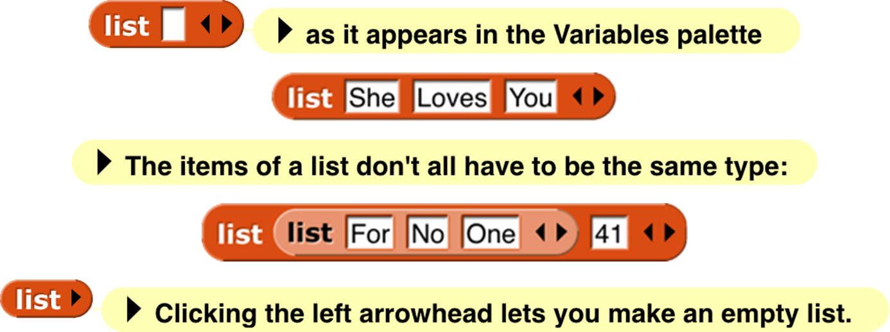{.image-4x}

At the right end of the block are two left-and-right arrowheads
\index{arrowheads}. Clicking on these changes the number of inputs to
list, i.e., the number of elements in the list you are building.
Shift-clicking changes by three at a time.

You can use this block as
input to many other blocks:

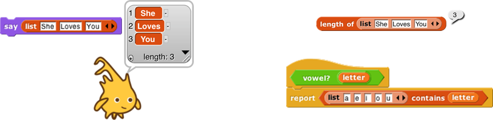{pdf-width="2.84in"}

Snap*!* does not have a “`Make
a list`” button like the one in Scratch \index{Scratch}. If you want a
global “named list,” make a global variable and use the `set` block to put
a list into the variable.

## Lists of Lists

Lists can be inserted as
elements in larger lists. We can easily create ad hoc structures as
needed:

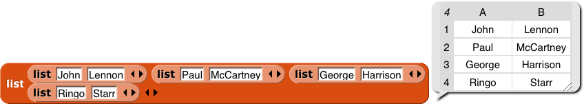{pdf-width="5.89in"}

Notice that this list is presented in a different format from the “She
Loves You” list above. A two-dimensional list is called a *table* and is
by default shown in *table view.* We’ll have more to say about this
later.

We can also build any classic computer science data structure
\index{data structure} out of lists of lists\index{lists of lists}, by
defining *constructors* \index{constructors} (blocks to make an instance
of the structure), *selectors* \index{selectors} (blocks to pull out a
piece of the structure), and *mutators* \index{mutators} (blocks to
change the contents of the structure) as needed. Here we create binary
tree\index{binary tree}s with selectors that check for input of the
correct data type; only one selector is shown but the ones for left and
right children are analogous.

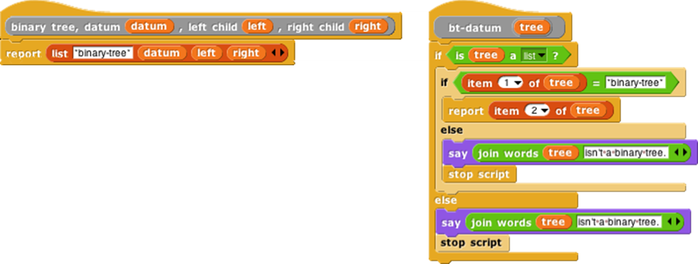{pdf-width="5.89in"}

##  Functional and Imperative List Programming

There are two ways to create a list inside a program. Scratch
\index{Scratch} users will be familiar with the *imperative* programming
style\index{imperative programming style}, which is based on a set of
command blocks that modify a list:

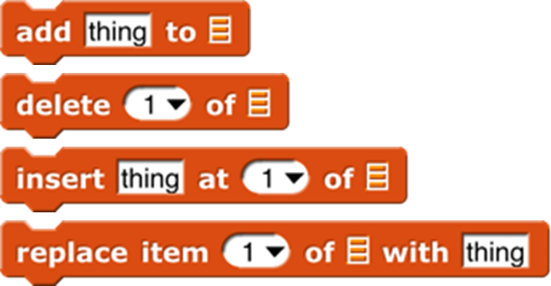{.image-4x}

As an example, here are two blocks that take a list of numbers as input,
and report a new list containing only the even numbers from the original
list:[^primitives]

[^primitives]: Note to users of earlier versions: From the beginning, there has been a tension in our work between the desire to provide tools such as `for` (used in this example) and the higher order functions introduced on the next page as primitives, to be used as easily as other primitives, and the desire to show how readily such tools can be implemented in Snap! itself. This is one instance of our general pedagogic understanding that learners should both use abstractions and be permitted to see beneath the abstraction barrier. Until version 5.0, we used the uneasy compromise of a library of tools written in Snap! and easily, but not easily enough, loaded into a project. By not loading the tools, users or teachers could explore how to program them. In 5.0 we made them true primitives, partly because that’s what some of us wanted all along and partly because of the increasing importance of fast performance as we explore “big data” and media computation. In version 10.0 we introduced “hybrid” primitives, implemented in high speed Javascript but with an “Edit” option that will open, not the primitive implementation, but the version written in Snap*!*. This gives us editable primitives without dramatically slowing users’ projects.

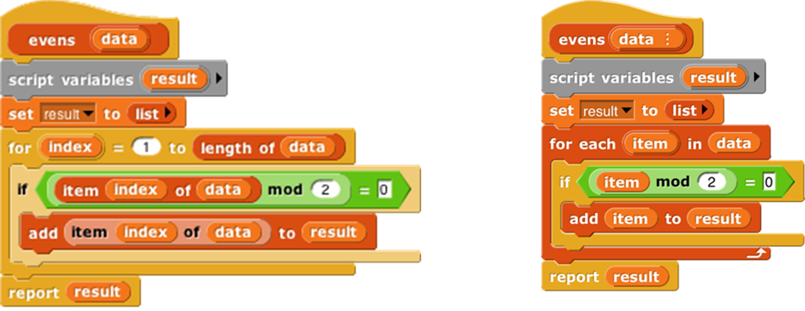{pdf-width="5.89in"}

In these scripts, we first create a temporary variable, then put an empty
list in it, then go through the items of the input list using the `add
... to (result)` block to modify the result list, adding one item at a
time, and finally report the result.

*Functional* programming is a different approach that is becoming
important in “real world” programming because of parallelism
\index{parallelism}, i.e., the fact that different processors can be
manipulating the same data at the same time. This makes the use of
mutation\index{mutation} (changing the value associated with a
variable, or the items of a list) problematic because with parallelism
it’s impossible to know the exact sequence of events, so the result of
mutation may not be what the programmer expected. Even without
parallelism, though, functional programming\index{functional
programming style} is sometimes a simpler and more effective technique,
especially when dealing with recursively defined data structures. It
uses reporter blocks, not command blocks, to build up a list value:

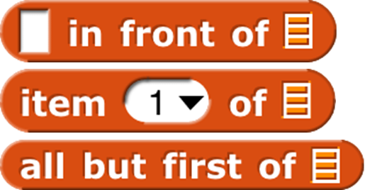{.image-4x}

In a functional program, we often use recursion to construct a list, one
item at a time. The `in front of` block \index{`in front of` block} makes a
list that has one item added to the front of an existing list, *without
changing the value of the original list.* A nonempty list is processed
by dividing it into its first item (`item 1 of`\index{`item 1 of` block})
and all the rest of the items (`all but first of`\index{`all but first of`
block}), which are handled through a recursive call:

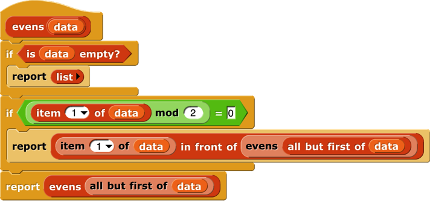{pdf-width="4.75in"}

Snap*!*
uses two different internal representations of lists, one (dynamic
\index{array, dynamic} array\index{dynamic array}) for imperative
programming and the other (linked\index{list, linked} list\index{linked list})
for functional programming. Each representation
makes the corresponding built-in list blocks (commands or reporters,
respectively) most efficient. It’s possible to mix styles in the same
program, but if *the same list* is used both ways, the program will run
more slowly because it converts from one representation to the other
repeatedly. (The `item ( ) of [ ]` block doesn’t change the
representation.) You don’t have to know the details of the internal
representations, but it’s worthwhile to use each list in a consistent
way.

## Higher Order List Operations and Rings

There’s an even easier way to select the even numbers from a list:

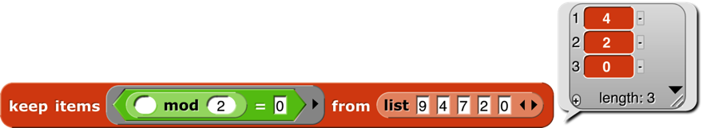

The `keep` block takes a Predicate expression as its first input, and a list
as its second input. It reports a list containing those elements of the
input list for which the predicate returns `true`. Notice two things about
the predicate input: First, it has a grey ring \index{ring, gray} around
it. Second, the `mod` block has an empty input. `Keep` puts each item of its
input list, one at a time, into that empty input before evaluating the
predicate. (The empty input is supposed to remind you of the “box”
notation for variables in elementary school: 🔳+3=7.) The grey ring is
part of the `keep` block as it appears in the palette:

{pdf-width="2.38in"}

What the ring means is that this input is a block (a predicate block, in
this case, because the interior of the ring is a hexagon), rather than
the value reported by that block. Here’s the difference:

<!-- TODO: this image is squished in its original form. -->
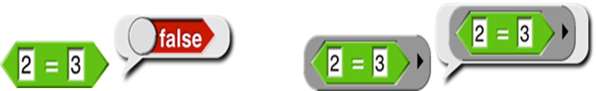

Evaluating the `=` block without a ring reports `true` or `false`; evaluating
the block *with* a ring reports the block itself. This allows `keep` to
evaluate the `=` predicate repeatedly, once for each list item. A block
that takes another block as input is called a *higher order* block (or
higher order procedure, or higher order function\index{higher order
function}).

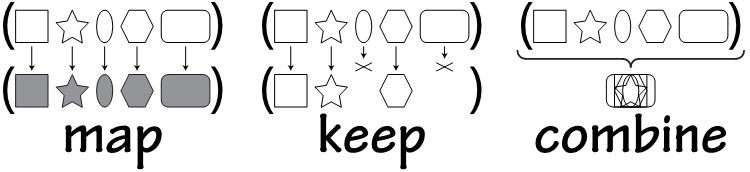{pdf-width="2.38in"}


Snap*!* provides four higher order function blocks for operating on
lists:

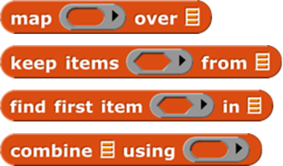{.image-4x}

### The `map` block {#sec-map}

You’ve already seen `keep`. `Find first` is
\index{`find first` block} similar, but it reports just the first item that
satisfies the predicate, not a list of all the matching items. It’s
equivalent to  but faster because it
stops looking as soon as it finds a match. If there are no matching
items, it returns an empty string.

`Map` \index{`map` block} takes a Reporter block and a list as inputs. It
reports a new list in which each item is the value reported by the
Reporter block as applied to one item from the input list. That’s a
mouthful, but an example will make its meaning clear:

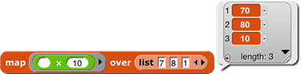

By the way, we’ve been using arithmetic examples, but the list items can
be of any type, and any reporter can be used. We’ll make the plurals of
some words:

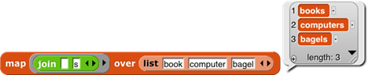{pdf-width="2.38in"}

These examples use small lists, to fit the page, but the higher order
blocks work for any size list.

An *empty* gray ring represents the *identity function,* which just
reports its input. Leaving the ring in `map` empty is the most concise way
to make a shallow copy of a list (that is, in the case of a list of
lists, the result is a new toplevel list whose items are the same
(uncopied) lists that are items of the toplevel input list)
\index{shallow copy of a list}. To make a deep copy of a list
\index{deep copy of a list} (that is, one in which all the sublists,
sublists of sublists, etc. are copied), use the list as input to the
{.image-4x .image-inline pdf-width="0.74in"}  block (one of the variants
of the `sqrt of` block). This works because `id of`\index{`id of` block} is a [hyperblock](#hyperblocks).

The third higher order block, `combine`\index{`combine` block}, computes a
single result from *all* the items of a list, using a *two-input*
reporter as its second input. In practice, there are only a few blocks
you’ll ever use with `combine`:

{pdf-width="2.38in"}

These blocks take the sum of the list items, take their product, string
them into one word, combine them into a sentence (with spaces between
items), see if all items of a list of Booleans are true, see if any of
the items is true, find the smallest, or find the largest.

{pdf-width="3.87in"}
{pdf-width="6.28in"}

Why `+` but not `−`? It only
makes sense to combine list items using an *associative*
\index{function, associative} function\index{associative function}:
one that doesn’t care in what order the items are combined (left to
right or right to left). (2+3)+4 = 2+(3+4), but (2−3)−4 ≠ 2−(3−4).

The functions `map`, `keep`, and
`find first` have an advanced mode with rarely-used features: If their
function input is given [explicit input names](#formal-parameters)
(by clicking the arrowhead
at the right end of the gray ring),
then it will be called for each list item with *three* inputs: the
item’s value (as usual), the item’s position in the input list (its
index), and the entire input list. No more than three input names can be
used in this context.

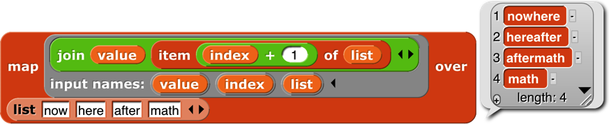{pdf-width="5.81in"}


## Table View\index{table view}  vs. List View\index{list view}

We mentioned earlier that there are two ways of representing lists
visually. For one-dimensional lists (lists whose items are not
themselves lists) the visual differences are small:

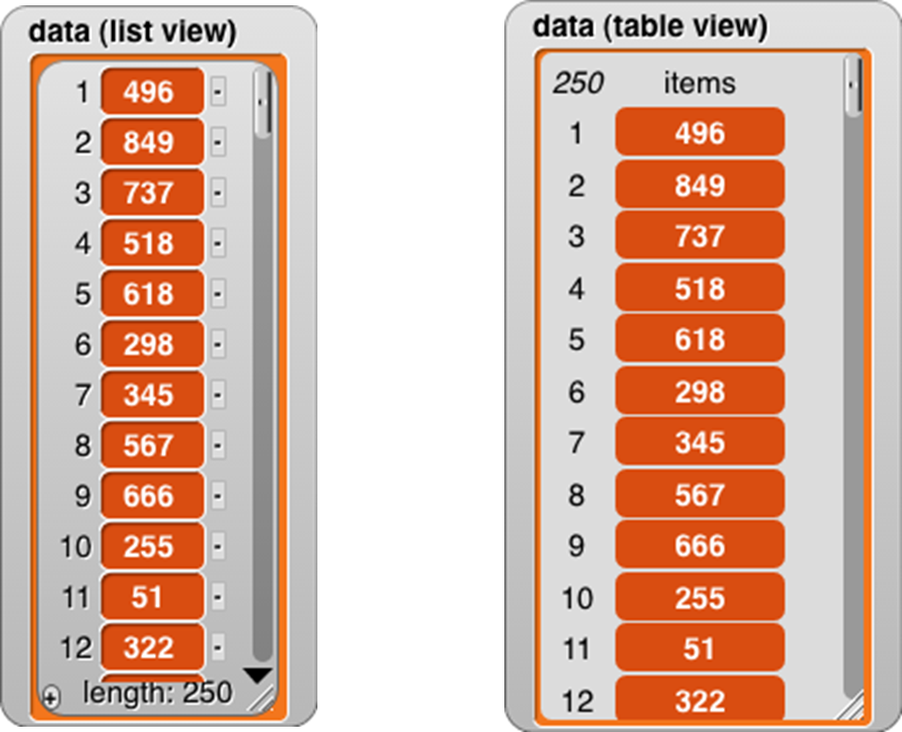{.image-4x}

For one-dimensional lists, it’s not really the appearance that’s
important. What matters is that the *list view* allows very versatile
direct manipulation of the list through the picture: you can edit the
individual items, you can delete items by clicking the tiny buttons next
to each item, and you can add new items at the end by clicking the tiny
plus sign in the lower left corner. (You can just barely see that the
item deletion buttons have minus signs in them.) Even if you have
several watchers for the same list, all of them will be updated when you
change anything. On the other hand, this versatility comes at an
efficiency cost; a list view watcher for a long list would be way too
slow. As a partial workaround, the list view can only contain 100 items
at a time; the downward-pointing arrowhead opens a menu in which you can
choose which 100 to display.

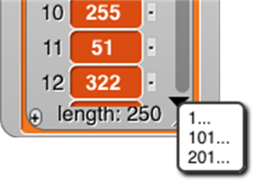{.image-4x}

By contrast, because it doesn’t allow direct editing, the *table view*
watcher can hold hundreds of thousands of items and still scroll through
them efficiently. The table view has flatter graphics for the items to
remind you that they’re not clickable to edit the values.

Right-clicking on a list watcher (in either form) gives you the option
to switch to the other form. The right-click menu also offers an `open in
dialog...` option that opens an *offstage* table view watcher, because the
watchers can take up a lot of stage space that may make it hard to see
what your program is actually doing. Once the offstage dialog box is
open, you can close the stage watcher. There’s an OK button on the
offstage dialog to close it if you want. Or you can right-click it to
make *another* offstage watcher, which is useful if you want to watch
two parts of the list at once by having each watcher scrolled to a
different place.

Table view is the default if
the list has more than 100 items, or if any of the first ten items of
the list are lists, in which case it makes a very different-looking
two-dimensional picture:

{pdf-width="5.89in"}

In this format, the column of red items has been replaced by a
spreadsheet-looking display. For short, wide lists, this display makes
the content of the list very clear. A vertical display, with much of the
space taken up by the “machinery” at the bottom of each sublist, would
make it hard to show all the text at once. (The pedagogic cost is that
the structure is no longer explicit; we can’t tell just by looking that
this is a list of row-lists, rather than a list of column-lists or a
primitive two-dimensional array type. But you can choose list view to
see the structure.)

Beyond such simple cases, in which every item of the main list is a list
of the same length, it’s important to keep in mind that the design of
table view has to satisfy two goals, not always in agreement: (1) a
visually compelling display of two-dimensional arrays, and (2) highly
efficient display generation, so that Snap*!* can handle very large
lists, since “big data” is an important topic of study. To meet the
first goal perfectly in the case of “ragged right” arrays in which
sublists can have different lengths, Snap*!* would scan the entire list
to find the maximum width before displaying anything, but that would
violate the second goal.

Snap*!* uses the simplest possible compromise between the two goals: It
examines only the first ten items of the list to decide on the format.
If none of those are lists, or they’re all lists of one item, and the
overall length is no more than 100, list view is used. If the any of
first ten items is a list, then table view is used, and the number of
columns in the table is equal to the largest number of items among the
first ten items (sublists) of the main list.

Table views open with standard values for the width and height of a
cell, regardless of the actual data. You can change these values by
dragging the column letters or row numbers. Each column has its own
width, but changing the height of a row changes the height for all rows.
(This distinction is based not on the semantics of rows vs. columns, but
on the fact that a constant row height makes scrolling through a large
list more efficient.) Shift-dragging a column label will change the
width of that column.

If you tried out the adjustments in the previous paragraph, you may have
noticed that a column letter turns into a number when you hover over it.
Labeling rows and columns differently makes cell references such as
“cell 4B” unambiguous; you don’t have to have a convention about whether
to say the row first or the column first. (“Cell B4” is the same as
“cell 4B.”) On the other hand, to extract a value from column B in your
program, you have to say `item 2 of`, not `item B of`. So it’s useful to be
able to find out a column number by hovering over its letter.

 Any value that can appear in
a program can be displayed in a table cell:

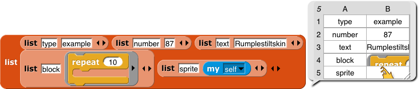{pdf-width="3.82in"}

This display shows that the standard cell dimensions may not be enough
for large value images. By expanding the entire speech balloon and then
the second column and all the rows, we can make the result fit:

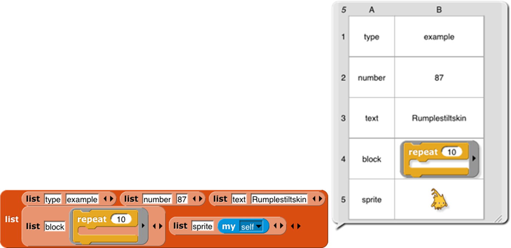{pdf-width="3.34in"}

 But we make an exception for
cases in which the value in a cell is a list (so that the entire table
is three-dimensional). Because lists are visually very big, we don’t try
to fit the entire value in a cell:

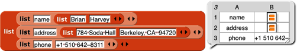{pdf-width="3.34in"}

Even if you expand the size of the cells, Snap*!* will not display
sublists of sublists in table view. There are two ways to see these
inner sublists: You can switch to list view, or you can double-click on
a list icon in the table to open a dialog box showing just that
sub-sub-list in table view.

 One last detail: If the first
item of a list is a list (so table view is used), but a later item
*isn’t* a list, that later item will be displayed on a red background,
like an item of a single-column list:

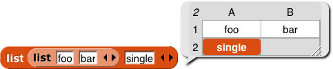{pdf-width="3.35in"}

So, in particular, if only the first item is a list, the display will
look almost like a one-column display.

### Comma-Separated Values {#sec-csv}

Spreadsheet and database programs generally offer the option to export
their data as CSV (comma-separated values)\index{CSV (comma-separated
values)} lists. You can import these files into Snap*!* and turn them
into tables (lists of lists), and you can export tables in CSV format.
[Snap]{.snap} recognizes a CSV file by the extension .csv in its filename.

A CSV file has one line per table row, with the fields separated by
commas within a row:

```csv
John,Lennon,rhythm guitar
Paul,McCartney,bass guitar
George,Harrison,lead guitar
Ringo,Starr,drums
```

Here’s what the corresponding table looks like:

<!-- This image needs work. It shouldn't include the csv in text form, and the two views of the list should be captioned. Ideally this would be two separate captioned pictures on the same line. bh -->

<!--   style="width:3.35417in;height:0.69444in" / -->

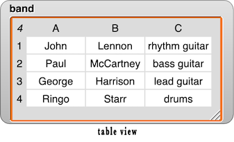
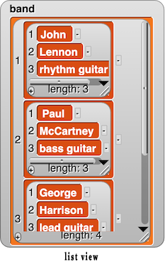

Here’s how to read a spreadsheet into Snap*!*:

1. Make a variable
with a watcher on stage: {pdf-width="1.21in"}

<!-- The background of this picture should be transparent, not white. bh  -->


2. Right-click on the watcher and choose the “`import`” option. (If the
variable’s value is already a list, be sure to click on the outside
border of the watcher; there is a different menu if you click on the
list itself.) Select the file with your csv data.

3. There is no 3; that’s it! Snap*!* will notice that the name of the
file you’re importing is something`.csv` and will turn the text into a
list of lists automatically.

Or, even easier, just drag and drop the file from your desktop onto the
Snap*!* window, and Snap*!* will automatically create a variable named
after the file and import the data into it.

If you actually want to import the raw CSV data into a variable, either
change the file extension to `.txt` before loading it, or choose “`raw
data`” instead of “`import`” in the watcher menu.

If you want to export a list, put a variable watcher containing the list
on the stage, right-click its border, and choose “`Export`.” (Don’t
right-click an item instead of the border; that gives a different menu.)

### Multi-dimensional lists and JSON

CSV format is easy to read, but works only for one- or two-dimensional
lists. If you have a list of lists of lists, Snap*!* will instead export
your list as a JSON (JavaScript Object Notation) file\index{JSON
(JavaScript Object Notation) file} . I modified my list:

{pdf-width="6.33in"}

and then exported again,
getting this file:

``
[["John","Lennon","rhythm guitar"],[["James","Paul"],"McCartney","bass
guitar"],["George","Harrison","lead guitar"],["Ringo","Starr","drums"]]
``

You can also import lists, including tables, from a `.json` file. (And you
can import plain text from a `.txt` file.) Drag and drop works for these
formats also.

##  Hyperblocks\index{Hyperblocks}

A *scalar* is anything other than a list. The name comes from
mathematics, where it means a magnitude without direction, as opposed to
a vector, which points toward somewhere. A scalar function\index{scalar
function} is one whose domain and range are scalars, so all the
arithmetic operations are scalar functions, but so are the text ones
such as `letter` and the Boolean ones such as `not`.

The major new feature in Snap*!* 6.0 is that the domain and range of
most scalar function blocks is extended to multi-dimensional
\index{list, multi-dimensional} lists, with the underlying scalar
function applied termwise:

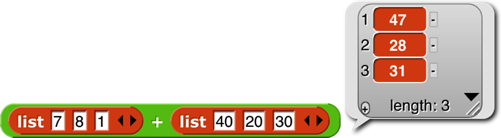{pdf-width="3.34in"}  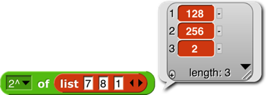{pdf-width="2.56in"}  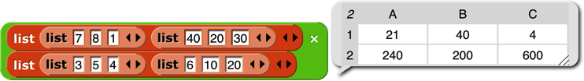{pdf-width="4.94in"}

Mathematicians, note in the last example above that the result is just a termwise
application of the underlying function (7×3, 8×5, etc.), *not* matrix
multiplication. See @sec-appendix-b-apl for that. For a dyadic (two-input) function, if the lengths don’t agree, the length of the result (in each
dimension) is the length of the shorter input:

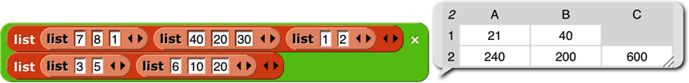{pdf-width="5.74in"}

However, if
the *number of dimensions* differs in the two inputs, then the number of
dimensions in the result agrees with the *higher-*dimensional input; the
lower-dimensional one is used repeatedly in the missing dimension(s):

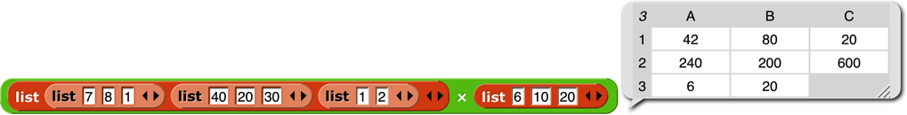{pdf-width="6.79in"}

(7×6, 8×10, 1×20, *40*×*6*, *20*×*10*, etc.). In particular, a *scalar*
input is paired with every scalar in the other input:

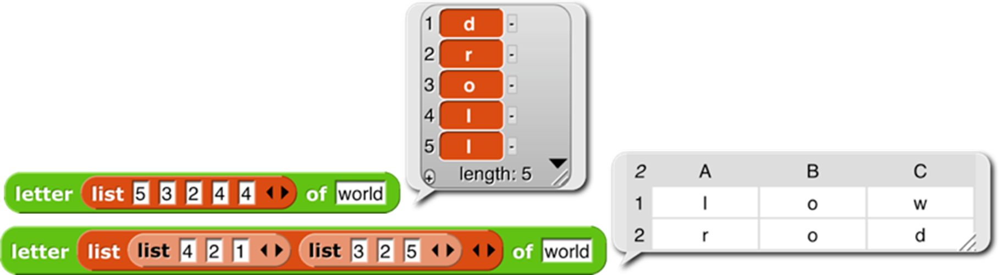{pdf-width="7.48in"}

One important
motivation for this feature is how it simplifies and speeds up media
computation\index{media computation}, as in this shifting of the
Alonzo\index{Alonzo} costume to be bluer:

{pdf-width="7.48in"}


 Each
pixel of the result has ¾ of its original red and green, and three times
its original blue (with its transparency unchanged). By putting some
sliders on the stage, you can play with colors dynamically:

{pdf-width="5.19in"}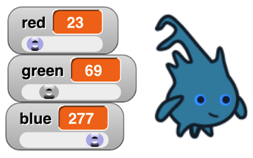{pdf-width="1.69in"}


 There
are a few naturally scalar functions that have already had specific
meanings when applied to lists and therefore are not hyperblocks: `=` and
`identical to` (because they compare entire structures, not just scalars,
always reporting a single Boolean result), `and` and `or` (because they
don’t evaluate their second input at all if the first input determines
the result), `join` (because it converts non-scalar (and other non-text)
inputs to text string form), and `is a (type)` (because it applies to its
input as a whole). Blocks whose inputs are “natively” lists, such as {.image-4x .image-inline pdf-width="0.89in"} and
{pdf-width="1.03in"} , are never hyperblocks.

{.image-inline pdf-width="2.10in"} The
`reshape` block\index{`reshape` block} takes a list (of any depth) as its
first input, and then takes zero or more sizes along the dimensions of
an array. In the example it will report a table (a matrix) of four rows
and three columns. If no sizes are given, the result is an empty list.
Otherwise, the cells of the specified shape are filled with the atomic
values from the input list. If more values are needed than provided, the
block starts again at the head of the list, using values more than once.
If more values are provided than needed, the extras are ignored; this
isn’t an error.

{.image-inline pdf-width="1.76in"}  The
`combinations` block takes any number of lists as input; it reports a list
in which each item is a list whose length is the number of inputs; item
*i* of a sublist is an item of input *i.* Every possible combination of
items of the inputs is included, so the length of the reported list is
the product of the lengths of the inputs.

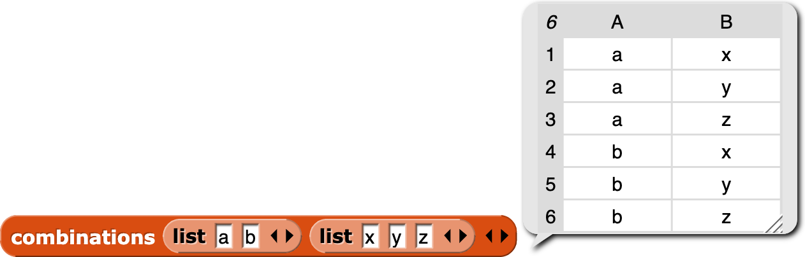{pdf-width="5.24in"}

{.image-inline pdf-width="1.34in"}  The `item of` block
\index{`item of` block} has a special set of rules, designed to preserve
its pre-hyperblock meaning and also provide a useful behavior when given
a list as its first (index) input:

1.  If the index is a number, then `item of` reports the indicated
    top-level item of the list input; that item may be a sublist, in
    which case the entire sublist is reported (the original meaning of
    `item of`):

    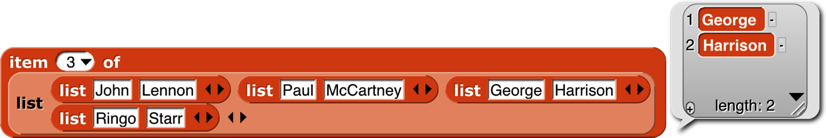{pdf-width="5.51in"}

2.  If the index is a list of numbers (no sublists), then `item of`
    reports a list of the indicated top-level items (rows, in a matrix;
    a straightforward hyperization):
    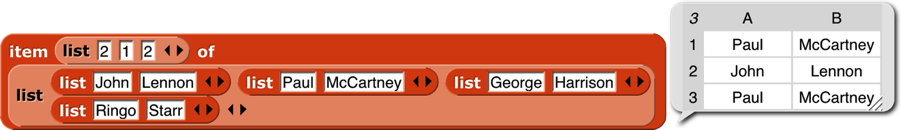{pdf-width="6.01in"}

3.  If the index is a list of lists of numbers, then `item of` reports an
    array of only those scalars whose position in the list input matches
    the index input in all dimensions (as of Snap*!*
    6.6):

    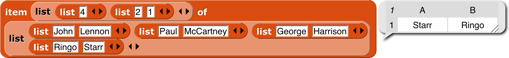{pdf-width="6.01in"}

4.  If a list of list of numbers includes an empty sublist, then all
    items are chosen along that
    dimension:

    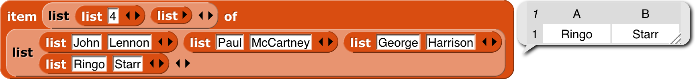{pdf-width="6.01in"}

 To
get a column or columns of a spreadsheet, use an empty list in the row
selector (as of Snap*!* 6.6):

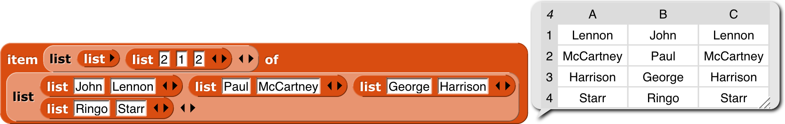{pdf-width="6.60in"}

The `length of` block \index{`length of` block} is extended to provide
various ways of looking at the shape and contents of a list. The options
other than `length` are mainly useful for *lists of lists,* to any depth.
These new options work well with hyperblocks and the APL library.
<!-- (Examples are on the next page.) -➞

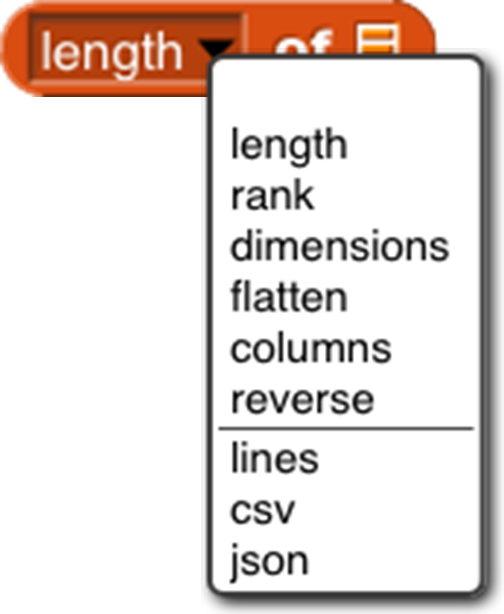{pdf-width="6.60in"}

- `length`: reports the number of (toplevel) items in the list, as always.

- `rank` \index{`rank of` block}: reports the number of *dimensions* of the
list, i.e., the maximum depth of lists of lists of lists of lists. (That
example would be rank 4.)

- `dimensions` \index{`dimensions of` block}: reports a list of numbers, each
of which is the maximum length in one dimension, so a spreadsheet of
1000 records, each with 4 fields, would report the list \[1000 4\].

- `flatten` \index{`flatten of` block}: reports a flat, one-dimensional list
containing the *atomic* (non-list) items anywhere in the input list.

- `columns` \index{`columns of` block}: reports a list in which the rows and
columns of the input list are interchanged, so the shape of the
transpose of a shape \[1000 4\] list would be \[4 1000\]. This option
works only for lists whose rank is at most 2. The name reflects the fact
that the toplevel items of the reported table are the columns of the
original table.

- `reverse`: reports a list in which the (toplevel) items of the input list
are in reverse order.

The remaining three options report a (generally multi-line) text string.
The input list may not include any atomic (non-list) data \index{atomic
data} other than text or numbers. The `lines` \index{`lines of` block}
option is intended for use with rank-one lists of text strings; it
reports a string in which each list item becomes a line of text. You can
think of it as the opposite of the `split by line` block \index{`split by
line` block} . The `csv` \index{`csv of` block} option (comma-separated
values) is intended for rank-two lists that represent a spreadsheet or
other tabular data. Each item of the input list should be a list of
atoms; the block reports a text string in which each item of the big
list becomes a line of text in which the items of that sublist are
separated by commas. The `json` \index{`json of` block} option is for lists
of any rank; it reports a text string in which the list structure is
explicitly represented using square brackets. These are the opposites of
`split by csv` and `split by json`.

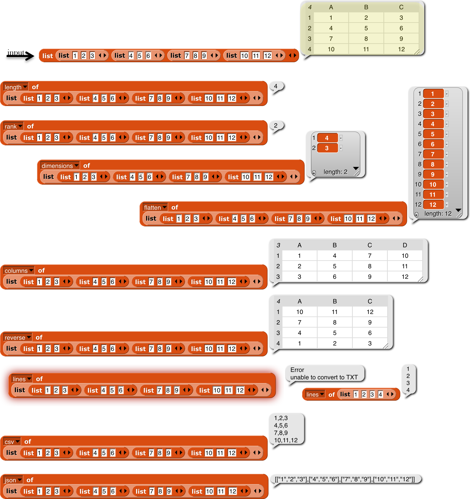{pdf-width="6.60in"}

The idea of extending the domain and range of scalar functions to
include arrays comes from the language APL\index{APL}. (All the great
programming languages are based on mathematical ideas. Our primary
ancestors are Smalltalk\index{Smalltalk}, based on models, and Lisp
\index{Lisp}, based on lambda calculus. Prolog\index{Prolog}, a great
language not (so far) influencing Snap*!*, is based on logic. And APL,
now joining our family, is based on linear algebra, which studies
vectors and matrices. Those *other* programming languages are based on
the weaknesses of computer hardware.) Hyperblocks are not the whole
story about APL, which also has mixed-domain functions and higher order
functions. Some of what’s missing is provided in the APL library. (See
[Appendix B](../14-appendix-b-apl-features).)
