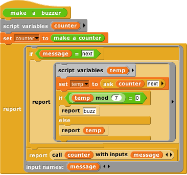

#  OOP with Procedures

The idea of object oriented programming \index{object oriented
programming} is often taught in a way that makes it seem as if a special
object oriented programming language is necessary. In fact, any language
with first class procedures and lexical scope \index{scope:lexical}
allows objects to be implemented explicitly; this is a useful exercise
to help demystify objects.

The central idea of this implementation is that an object is represented
as a \index{dispatch procedure} *dispatch procedure* that takes a
message as input and reports the corresponding method. In this section
we start with a stripped-down example to show how local state works, and
build up to full implementations of class/instance and prototyping OOP.

## Local State with Script Variables

 <!--  style="width:2.23958in;height:1.51042in" / --> This script implements an
object *class*, a type of object, namely the counter class
\index{counter class}. In this first simplified version there is only
one method, so no explicit message passing is necessary. When the make a
counter block is called, it reports a procedure, the ringed script
inside its body. That procedure implements a specific counter object, an
*instance* \index{instance} of the counter class \index{class}. When
invoked, a counter instance increases and reports its count variable.
Each counter has its own local count: \index{objects, building
explicitly}

This example will repay careful study, because it isn’t obvious why each
instance has a separate count. From the point of view of the make a
counter procedure, each invocation causes a new count variable to be
created. Usually such *script variables* are temporary, going out of
existence when the script ends. But this one is special, because make a
counter returns *another script* that makes reference to the count
variable, so it remains active. (The script variables \index{script
variables block} block makes variables local to a script. It can be used
in a sprite’s script area or in the Block Editor. Script variables can
be “exported” by being used in a reported procedure, as here.)

In this approach to OOP, we are representing both classes and instances
as procedures. The make a counter block represents the class, while each
instance is represented by a nameless script created each time make a
counter is called. The script variables created inside the make a
counter block but outside the ring are *instance variables,* belonging
to a particular counter.

## Messages and Dispatch Procedures

 <!--  style="width:4.41667in;height:3.16667in" / --> In the simplified class
above, there is only one method, and so there are no messages; you just
call the instance to carry out its one method. Here is a more refined
version that uses message passing \index{message passing} :

Again, the make a counter block represents the counter class, and again
the script creates a local variable count each time it is invoked. The
large outer ring represents an instance. It is a *dispatch procedure*
\index{dispatch procedure} *:* it takes a message (just a text word) as
input, and it reports a method. The two smaller rings are the methods.
The top one is the next method; the bottom one is the reset method. The
latter requires an input, named value.

In the earlier version, calling the instance did the entire job. In this
version, calling the instance gives access to a method \index{method},
which must then be called to finish the job. We can provide a block to
do both procedure calls in one:

 <!--  style="width:4.01042in;height:0.70772in" / --> 

The ask block \index{ask block} has two required inputs: an object and a
message. It also accepts optional additional inputs, which Snap*!* puts
in a list; that list is named args inside the block. Ask has two nested
call blocks. The inner one calls the object, i.e., the dispatch
procedure. The dispatch procedure always takes exactly one input, namely
the message. It reports a method, which may take any number of inputs;
note that this is the situation in which we drop a list of values onto
the arrowheads of a multiple input (in the outer call block). Note also
that this is one of the rare cases in which we must unringify
\index{unringify} the inner call block, whose *value when called* gives
the method.

## Inheritance via Delegation

So, our objects now have local state variables and message passing. What
about inheritance \index{inheritance} ? We can provide that capability
using the technique of *delegation* \index{delegation}. Each instance
of the child class \index{child class} contains an instance of the
parent class \index{parent class}, and simply passes on the messages it
doesn’t want to specialize:

 <!--  style="width:3.8125in;height:3.58333in" / --> 

This script implements the buzzer class, which is a child of counter.
Instead of having a count (a number) as a local state variable, each
buzzer has a counter (an object) as a local state variable. The class
specializes the next method, reporting what the counter reports unless
that result is divisible by 7, in which case it reports “buzz.” (Yeah,
it should also check for a digit 7 in the number, but this code is
complicated enough already.) If the message is anything other than next,
though, such as reset, then the buzzer simply invokes its counter’s
dispatch procedure. So the counter handles any message that the buzzer
doesn’t handle explicitly. (Note that in the non-next case we call the
counter, not ask it something, because we want to report a method, not
the value that the message reports.) So, if we ask a buzzer to reset to
a value divisible by 7, it will end up reporting that number, not
“buzz.”

## An Implementation of Prototyping OOP

In the class/instance system above, it is necessary to design the
complete behavior of a class before you can make any instances of the
class. This is okay for top-down design, but not great for
experimentation. Here we sketch the implementation of a *prototyping*
\index{prototyping} OOP system: You make an object, tinker with it, make
clones of it, and keep tinkering. Any changes you make in the parent are
inherited by its children. In effect, that first object is both the
class and an instance of the class. In the implementation below,
children share properties (methods and local variables) of their parent
unless and until a child changes a property, at which point that child
gets a private copy. (If a child wants to change something for its
entire family, it must ask the parent to do it.)

Because we want to be able to create and delete properties dynamically,
we won’t use Snap*!* variables to hold an object’s variables or methods.
Instead, each object has two *tables,* called methods and data, each of
which is an \index{association list} *association list:* a list of
two-item lists, in which each of the latter contains a *key* and a
corresponding *value.* We provide a lookup procedure to locate the
key-value pair \index{key-value pair} corresponding to a given key in a
given table.

 <!--  style="width:3.21528in;height:2.36111in" / --> 

 <!--  style="width:2.625in;height:0.78125in" / --> 

 <!--  style="width:5.60417in;height:1.15625in" / -->  <!--  style="width:5.60417in;height:1.15625in" / --> 

There are also commands to insert and delete entries:

 <!--  style="width:3.71875in;height:1.82639in" / -->  <!--  style="width:3.22917in;height:2.12831in" / --> 

As in the class/instance version, an object is represented as a dispatch
procedure \index{dispatch procedure} that takes a message as its input
and reports the corresponding method. When an object gets a message, it
will first look for that keyword in its methods table \index{methods
table} . If it’s found, the corresponding value is the method we want.
If not, the object looks in its data table \index{data table}. If a
value is found there, what the object returns is *not* that value, but
rather a reporter method that, when called, will report the value. This
means that what an object returns is *always* a method.

If the object has neither a method nor a datum with the desired name,
but it does have a parent, then the parent (that is, the parent’s
dispatch procedure) is invoked with the message as its input.
Eventually, either a match is found, or an object with no parent is
found; the latter case is an error, meaning that the user has sent the
object a message not in its repertoire.

Messages can take any number of inputs, as in the class/instance system,
but in the prototyping version, every method automatically gets the
object to which the message was originally sent as an extra first input.
We must do this so that if a method is found in the parent (or
grandparent, etc.) of the original recipient, and that method refers to
a variable or method, it will use the child’s variable or method if the
child has its own version.

 <!--  style="width:4.375in;height:7.46944in" / --> The
clone of block \index{clone of block} below takes an object as its input
and makes a child object. It should be considered as an internal part of
the implementation; the preferred way to make a child of an object is to
send that object a clone message.

 <!--  style="width:1.57292in;height:0.6875in" / --> Every
object is created with predefined methods for set, method, delete-var,
delete-method, and clone. It has one predefined variable, parent.
Objects without a parent are created by calling new object:

As before, we provide procedures to call an object’s dispatch procedure
and then call the method. But in this version, we provide the desired
object as the first method input. We provide one procedure for Command
methods and one for Reporter methods:

(Remember that the “Input list:” variant of the run and call blocks is
made by dragging the input expression over the arrowheads rather than
over the input slot.)

The script below demonstrates how this prototyping system can be used to
make counters. We start with one prototype counter, called counter1. We
count this counter up a few times, then create a child counter2 and give
it its own count variable, but *not* its own total variable. The next
method always sets counter1’s total variable, which therefore keeps
count of the total number of times that *any* counter is incremented.
Running this script should \[say\] and (think) the following lists:

 <!--  style="width:4.20833in;height:4.39583in" / --> \[1 1\] \[2 2\] \[3 3\] \[4
4\] (1 5) (2 6) (3 7) \[5 8\] \[6 9\] \[7 10\] \[8 11\]

