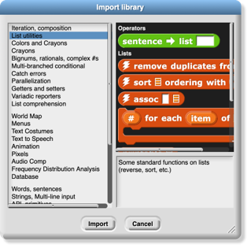
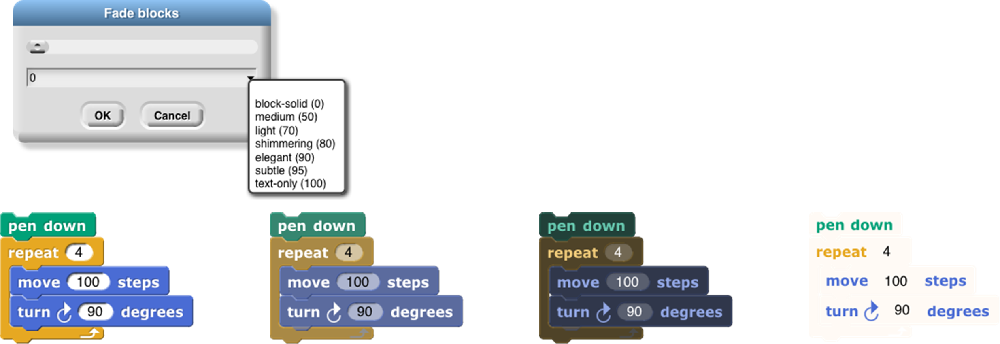
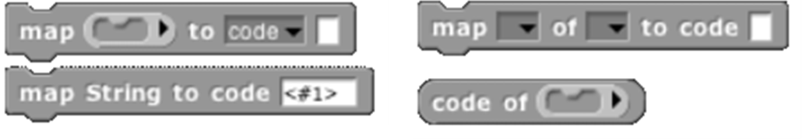
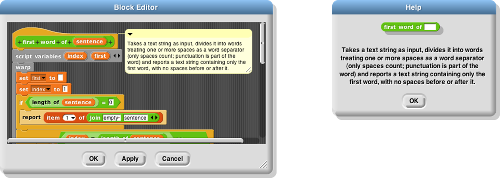
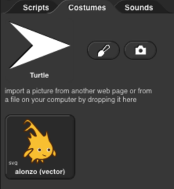
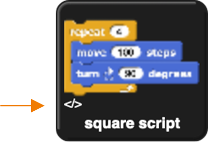

# User Interface Elements \index{user interface elements} 

In this chapter we describe in detail the various buttons, menus, and
other clickable elements of the Snap*!* user interface. Here again is
the map of the Snap*!* window:

 <!--  style="width:7.49442in;height:4.66319in" / --> 

## Tool Bar Features

Holding down the Shift key \index{tool bar features} while clicking
\index{shift-clicking} on any of the menu buttons gives access to an
extended menu with options, shown in red, that are experimental or for
use by the developers. We’re not listing those extra options here
because they change frequently and you shouldn’t rely on them. But
they’re not secrets \index{secrets}.

### The Snap*!* Logo Menu

The Snap*!* logo \index{Snap! logo menu} at the left end of the tool bar
is clickable. It shows a menu of options about Snap*!* itself:

 <!--  style="width:2.32922in;height:1.02in" / --> 

The About option \index{About option} displays information about Snap*!*
itself, including version numbers for the source modules, the
implementors, and the license \index{license} (AGPL \index{AGPL} : you
can do anything with it except create proprietary versions, basically).

The Reference manual option \index{Reference manual option} downloads a
copy of the latest revision of this manual in PDF format.

The Snap! website option \index{Snap! website option} opens a browser
window pointing to snap.berkeley.edu \index{snap.berkeley.edu}, the web
site for Snap*!*.

The Download source option \index{Download source option} opens a
browser window displaying the Github repository of the source files for
Snap*!*. \index{source files for Snap!} At the bottom of the page are
links to download the latest official release. Or you can navigate
around the site to find the current development version. You can read
the code to learn how Snap*!* is implemented, host a copy on your own
computer (this is one way to keep working while on an airplane), or make
a modified version with customized features. (However, access to cloud
accounts is limited to the official version hosted at Berkeley.)

### The File Menu

The  <!--  style="width:0.31944in;height:0.18056in" / -->  file icon \index{file
icon menu} shows a menu mostly about saving and loading projects. You
may not see all these options, if you don’t have multiple sprites,
scenes, custom blocks, and custom categories.

The Notes option \index{Project notes option} opens a window in which
you can type notes about the project: How to use it, what it does, whose
project you modified to create it, if any, what other sources of ideas
you used, or any other information about the project. This text is saved
with the project, and is useful if you share it with other users.

The New option \index{New option} starts a new, empty project. Any
project you were working on before disappears, so you are asked to
confirm that this is really what you want. (It disappears only from the
current working Snap*!* window; you should save the current project, if
you want to keep it, before using New.)

Note the ^N at the end of the line. This indicates that you can type
control-N as a shortcut for this menu item. Alas, this is not the case
in every browser. Some Mac browsers require command-N (⌘N) instead,
while others open a new browser window instead of a new project. You’ll
have to experiment. In general, the keyboard shortcuts
\index{shortcuts:keyboard} in Snap*!* are the standard ones you expect
in other software.

The Open… option \index{Open…
option} shows a project open dialog box in which you can choose a
project to open:

 <!--  style="width:2.88958in;height:2.09792in" / --> 

In this dialog, the three large buttons at the left select a source of
projects: Cloud \index{Cloud button} means your Snap*!* account’s cloud
storage. Examples \index{Examples button} means a collection of sample
projects we provide. Computer is for projects saved on your own
computer; when you click it, this dialog is replaced with your
computer’s system dialog for opening files. The text box to the right of
those buttons is an alphabetical listing of projects from that source;
selecting a project by clicking shows its thumbnail (a picture of the
stage when it was saved) and its project notes at the right.

The search bar \index{search
bar} at the top can be used to find a project by name or text in the
project notes. So in this example:

 <!--  style="width:2.72431in;height:1.97778in" / --> 

I was looking for my ice
cream \index{ice cream} projects and typed “crea” in the search bar,
then wondered why “ferris” matched. But then when I clicked on ferris I
saw this:

 <!--  style="width:2.72361in;height:1.97778in" / --> 

My search matched the word “re*crea*te” in the project notes.

The six buttons at the bottom select an action to perform on the
selected project. In the top row, Recover looks in your cloud account
for older versions of the chosen project. ***If your project is damaged,
don’t keep saving broken versions! Use Recover first thing.*** You will
see a list of saved versions; choose one to open it. Typically, you’ll
see the most recent version before the last save, and the newest version
saved before today. Then come buttons Share/Unshare and
Publish/Unpublish. The labelling of the buttons depends on your
project’s publication status. If a project is neither shared nor
published (the ones in lightface type in the project list), it is
private and nobody can see it except you, its owner. If it is shared
(boldface in the project list), then when you open it you’ll see a URL
like this one:

https://snap.berkeley.edu/snapsource/snap.html#present:Username=bh&ProjectName=count%20change

but with your username and project name. (“%20” in the project name
represents a space, which can’t be part of a URL.) Anyone who knows this
URL can see your project. Finally, if your project is published (***bold
italic*** in the list), then your project is shown on the Snap*!* web
site for all the world to see. (In all of these cases, you are the only
one who can *write* to (save) your project.) If another user saves it, a
separate copy will be saved in that user’s account. Projects remember
the history of who created the original version and any other “remix”
versions along the way.

In the second row, the first button, Open, loads the project into
Snap*!* and closes the dialog box. The next button (if Cloud is the
source) is Delete, and if clicked it deletes the selected project.
Finally, the Cancel button closes the dialog box without opening a
project. (It does not undo any sharing, unsharing, or deletion you’ve
done.)

Back to the File menu, the Save menu option \index{Save option} saves
the project to the same source and same name that was used when opening
the project. (If you opened another user’s shared project or an example
project, the project will be saved to your own cloud account. You must
be logged in to save to the cloud.)

 The Save as… menu option
\index{Save as… option} opens a dialog box in which you can specify
where to save the project:

 <!--  style="width:3.23611in;height:2.34931in" / -->

This is much like the Open dialog, except for the horizontal text box at
the top, into which you type a name for the project. You can also
publish, unpublish, share, unshare, and delete projects from here. There
is no Recover button.

The Import… menu option \index{Import… option} is for bringing some
external resource into the current project, or it can load an entirely
separate project, from your local disk. You can import costumes (any
picture format that your browser supports), sounds (again, any format
supported by your browser), and block libraries or sprites (XML format,
previously exported from Snap*!* itself). Imported costumes and sounds
will belong to the currently selected sprite; imported blocks are global
(for all sprites). Using the Import option is equivalent to dragging the
file from your desktop onto the Snap*!* window.

Depending on your browser, the Export project… option either directly
saves to your disk or \index{Export project… option} opens a new browser
tab containing your complete project in XML notation (a plain text
format). You can then use the browser’s Save feature to save the project
as an XML file, which should be named *something*.xml so that Snap*!*
will recognize it as a project when you later drag it onto a Snap*!*
window. This is an alternative to saving the project to your cloud
account: keeping it on your own computer. It is equivalent to choosing
Computer from the Save dialog described earlier.

The Export summary… option \index{Export project… option} creates a web
page, in HTML, with all of the information about your project: its name,
its project notes, a picture of what’s on its stage, definitions of
global blocks, and then per-sprite information: name, wardrobe (list of
costumes), and local variables and block definitions. The page can be
converted to PDF by the browser; it’s intended to meet the documentation
requirements of the Advanced Placement Computer Science Principles
\index{Computer Science Principles} create task.

The Export blocks… option \index{Export blocks… option} is used to
create a block library \index{block library}. It presents a list of all
the global (for all sprites) blocks in your project, and lets you select
which to export. It then opens a browser tab with those blocks in XML
format, or stores directly to your local disk, as with the Export
project option. Block libraries can be imported with the Import option
or by dragging the file onto the Snap*!* window. This option is shown
only if you have defined custom blocks.

The Unused blocks… option \index{Unused blocks… option} presents a
listing of all the global custom blocks in your project that aren’t used
anywhere, and offers to delete them. As with Export blocks, you can
choose a subset to delete with checkboxes. This option is shown only if
you have defined custom blocks.

The Hide blocks… option \index{Hide blocks… option} shows *all* blocks,
including primitives, with checkboxes. This option does not remove any
blocks from your project, but it does hide selected block in your
palette. The purpose of the option is to allow teachers to present
students with a simplified Snap*!* with some features effectively
removed. The hiddenness of primitives is saved with each project, so
students can load a shared project and see just the desired blocks. But
users can always unhide blocks by choosing this option and unclicking
all the checkboxes. (Right-click in the background of the dialog box to
get a menu from which you can check all boxes or uncheck all boxes.)

The New category… option \index{New category… option} allows you to add
your own categories to the palette. It opens a dialog box in which you
specify a name *and a color* for the category. (A lighter version of the
same color will be used for the zebra coloring feature.)

The Remove a category… option \index{Remove a category… option} appears
only if you’ve created custom categories. It opens a very small,
easy-to-miss menu of category names just under the file icon in the menu
bar. If you remove a category that has blocks in it, all those blocks
are also removed.

The next group of options
concern the *scenes* \index{scenes} feature, new in Snap*!* 7.0. A scene
is a complete project, with its own stage, sprites, and code, but
several can be merged into one project, using the  <!--  style="width:1.16667in;height:0.19792in" / -->  block to bring another
scene onscreen. The Scenes… option \index{Scenes… option} presents a
menu of all the scenes in your project, where the File menu was before
you clicked it. The New scene option \index{New scene option} creates a
new, empty scene, which you can rename as you like from its context
menu. Add scene… \index{Add scene… option} is like Import… but for
scenes. (A complete project can be imported as a scene into another
project, so you have to specify that you’re importing the project *as a
scene* rather than replacing the current project.)

The Libraries… option \index{Libraries… option} presents a menu of
useful, optional block libraries:

 <!--  style="width:1.16667in;height:0.19792in" / --> 

- The library menu is divided into five broad categories. The first is,
broadly, utilities: blocks that might well be primitives. They might be
useful in all kinds of projects.

- The second category is blocks related to media computation: ones that
help in dealing with costumes and sounds (a/k/a Jens libraries). There
is some overlap with “big data” libraries, for dealing with large lists
of lists.

- The third category is, roughly, specific to non-media applications
(a/k/a Brian libraries). Three of them are imports from other
programming languages: words and sentences from Logo, array functions
from APL, and streams from Scheme. Most of the others are to meet the
needs of the BJC curriculum.

- The fourth category is major packages provided by users.

- The fifth category provides support for hardware devices such as robots,
through general interfaces, replacing specific hardware libraries in
versions before 7.0.

When you click on the one-line description of a library, you are shown
the actual blocks in the library and a longer explanation of its
purpose. You can browse the libraries to find one that will satisfy your
needs. The libraries are described in detail in Section I.H, page
[25](#libraries).

 The Costumes… option
\index{Costumes… option} opens a browser into the costume library:

 <!--  style="width:4.28125in;height:3.23958in" / -->

You can import a single costume by clicking it and then clicking the
Import button. Alternatively, you can import more than one costume by
double-clicking each one, and then clicking Cancel when done. Notice
that some costumes are tagged with “svg” in this picture; those are
vector-format costumes that are not (yet) editable within Snap*!*.

If you have the stage selected in the sprite corral, rather than a
sprite, the Costumes… option changes to a Backgrounds… option
\index{Backgrounds… option}, with different choices in the browser:

 <!--  style="width:4.28125in;height:3.23958in" / --> 

The costume and background
libraries include both bitmap \index{bitmap} (go jagged if enlarged) and
vector \index{vector} (enlarge smoothly) images. Thanks to Scratch
2.0/3.0 for most of these images! Some older browsers refuse to import a
vector image, but instead convert it to bitmap.

The Sounds… option \index{Sounds… option} opens the third kind of media
browser:

 <!--  style="width:4.28125in;height:3.23958in" / --> 

The Play buttons can be used
to preview the sounds.

Finally, the Undelete sprites… option \index{Undelete sprites… option}
appears only if you have deleted a sprite; it allows you to recover a
sprite that was deleted by accident (perhaps intending to delete only a
costume).

### The Cloud Menu

 The cloud icon \index{cloud
icon}   <!--  style="width:0.29167in;height:0.16667in" / -->  <!--  style="width:0.29167in;height:0.16667in" / --> shows a menu of options relating to your Snap*!* cloud account. If
you are not logged in, you see the outline icon   <!--  style="width:0.29167in;height:0.16667in" / --> and get this menu:

 <!--  style="width:1.43681in;height:0.75972in" / -->

Choose Login… \index{Login… option} if you have a Snap*!* account and
remember your password. Choose Signup… \index{Signup… option} if you
don’t have an account. Choose Reset Password… \index{Reset Password…
option} if you’ve forgotten your password or just want to change it. You
will then get an email, at the address you gave when you created your
account, with a new temporary password. Use that password to log in,
then you can choose your own password, as shown below. Choose Resend
Verification Email… if you have just created a Snap*!* account but can’t
find the email we sent you with the link to verify that it’s really your
email. (If you still can’t find it, check your spam folder. If you are
using a school email address, your school may block incoming email from
outside the school.) The Open in Community Site option \index{Open in
Community Site option} appears only if you have a project open; it takes
you to the community site page about that project.

 If you are already logged in,
you’ll see the solid icon  <!--  style="width:0.29167in;height:0.16667in" / -->  and get this menu:

 <!--  style="width:1.61111in;height:0.65278in" / -->

Logout \index{Logout option} is obvious, but has the additional benefit
of showing you who’s logged in. Change password… \index{Change password…
option} will ask for your old password (the temporary one if you’re
resetting your password) and the new password you want, entered twice
because it doesn’t echo. Open in Community Site is the same as above.

###  The Settings Menu

The settings icon  <!--  style="width:0.29167in;height:0.16667in" / -->
\index{settings icon} shows a menu of Snap*!* options, either for the
current project or for you permanently, depending on the option:

 <!--  style="width:1.24792in;height:2.58333in" / -->  

The Language… option \index{Language… option} lets you see the Snap*!*
user interface (blocks and messages) in a language other than English.
(Note: Translations \index{translation} have been provided by Snap*!*
users. If your native language is missing, send us an email!)

The Zoom blocks... option \index{Zoom blocks... option} lets you change
the size of blocks, both in the palettes and in scripts. The standard
size is 1.0 units. The main purpose of this option is to let you take
very high-resolution pictures of scripts for use on posters. It can also
be used to improve readability when projecting onto a screen while
lecturing, but bear in mind that it doesn’t make the palette or script
areas any wider, so your computer’s command-option-+ feature may be more
practical. Note that a zoom of 2 is gigantic! Don’t even try 10.

The Fade blocks… option \index{Fade blocks… option} opens a dialog in
which you can change the appearance of blocks:

 <!--  style="width:0.29167in;height:0.16667in" / -->

Mostly this is a propaganda aid to use on people who think that text
languages are somehow better or more grown up than block languages, but
some people do prefer less saturated block colors. You can use the
pulldown menu for preselected fadings, use the slider to see the result
as you change the fading amount, or type a number into the text box once
you’ve determined your favorite value.

The Stage size… option \index{Stage size… option} lets you set the size
of the *full-size* stage in pixels. If the stage is in half-size or
double-size (presentation mode), the stage size values don’t change;
they always reflect the full-size stage.

The Microphone resolution… option sets the buffer size used by the
microphone block in Settings. “Resolution” is an accurate name if you
are getting frequency domain samples; the more samples, the narrower the
range of frequencies in each sample. In the time domain, the buffer size
determines the length of time over which samples are collected.

The remaining options let you turn various features on and off. There
are three groups of checkboxes. The first is for temporary settings not
saved in your project nor in your user preferences.

The JavaScript extensions option \index{JavaScript extensions option}
enables the use of the JavaScript function block \index{JavaScript
function block} . Because malicious projects could use JavaScript to
collect private information about you, or to delete or modify your saved
projects, you must enable JavaScript *each time* you load a project that
uses it.

The
Extension blocks option \index{Extension blocks option} adds two blocks
to the palette:

 <!--  style="width:1.18958in;height:0.18958in" alt="Graphical user interface, application Description automatically generated" / --> 
 <!--  style="width:1.22986in;height:0.25972in" alt="Graphical user interface, text, application Description automatically generated" / -->

These blocks provide assorted capabilities to official libraries that
were formerly implemented with the JavaScript function block. This
allows these libraries to run without requiring the JavaScript
extensions option. Details are subject to change.

Input sliders \index{Input
sliders option} provides an alternate way to put values in numeric input
slots; if you click in such a slot, a slider appears that you can
control with the mouse:

 <!--  style="width:1.63889in;height:0.41319in" / --> 

The range of the slider will be from 25 less than the input’s current
value to 25 more than the current value. If you want to make a bigger
change than that, you can slide the slider all the way to either end,
then click on the input slot again, getting a new slider with a new
center point. But you won’t want to use this technique to change the
input value from 10 to 1000, and it doesn’t work at all for non-integer
input ranges. This feature was implemented because software keyboard
input on phones and tablets didn’t work at all in the beginning, and
still doesn’t work perfectly on Android devices, so sliders provide a
workaround. It has since found another use in providing “lively”
response to input changes; if Input sliders is checked, reopening the
settings menu will show an additional option called Execute on slider
change \index{Execute on slider change option}. If this option is also
checked, then changing a slider in the scripting area automatically runs
the script in which that input appears. The project live-tree in the
Examples collection shows how this can be used; it features a fractal
tree custom block with several inputs, and you can see how each input
affects the picture by moving a slider.

 <!--  style="width:1.10486in;height:2.08333in" / --> 

Turbo mode \index{Turbo mode option} makes many projects run much
faster, at the cost of not keeping the stage display up to date.
(Snap*!* ordinarily spends most of its time drawing sprites and updating
variable watchers, rather than actually carrying out the instructions in
your scripts.) So turbo mode isn’t a good idea for a project with glide
block \index{glide block} s or one in which the user interacts with
animated characters, but it’s great for drawing a complicated fractal,
or computing the first million digits of 𝜋, so that you don’t need to
see anything until the final result. While in turbo mode, the button
that normally shows a green flag instead shows a green lightning bolt.
(But when ⚑ clicked hat blocks still activate when the button is
clicked.)

Visible stepping \index{visible stepping option} enables the slowed-down
script evaluation described in Chapter I. Checking this option is
equivalent to clicking the footprint button above the scripting area.
You don’t want this on except when you’re actively debugging, because
even the fastest setting of the slider is still slowed a lot.

Log pen vectors tells
Snap*!* to remember lines drawn by sprites as exact vectors, rather than
remember only the pixels that the drawing leaves on the stage. This
remembered vector picture can be used in two ways: First, right-clicking
on a pen trails block gives an option to relabel it into a pen vectors
block which, when run, reports the logged lines as a vector (svg)
costume. Second, right-clicking on the stage when there are logged
vectors shows an extra option, svg…, that exports a picture of the stage
in vector format. Only lines are logged, not color regions made with the
fill block.

The next group of four are user preference options, preserved when you
load a new project. Long form input dialog \index{Long form input dialog
option} , if checked, means that whenever a custom block input name is
created or edited, you immediately see the version of the input name
dialog that includes the type options, default value setting, etc.,
instead of the short form with just the name and the choice between
input name and title text. The default (unchecked) setting is definitely
best for beginners, but more experienced Snap*!* programmers may find it
more convenient always to see the long form.

Plain prototype labels \index{Plain prototype labels option} eliminates
the plus signs between words in the Block Editor prototype block. This
makes it harder to add an input to a custom block; you have to hover the
mouse where the plus sign would have been, until a single plus sign
appears temporarily for you to click on. It’s intended for people making
pictures of scripts in the block editor for use in documentation, such
as this manual. You probably won’t need it otherwise.

Clicking sound \index{Clicking sound option} causes a really annoying
sound effect whenever one block snaps next to another in a script.
Certain very young children, and our colleague Dan Garcia, like this,
but if you are such a child you should bear in mind that driving your
parents or teachers crazy will result in you not being allowed to use
Snap*!*. It might, however, be useful for visually impaired users.

Flat design \index{Flat design option} changes the “skin” of the Snap*!*
window to a really hideous design with white and pale-grey background,
rectangular rather than rounded buttons, and monochrome blocks (rather
than the shaded, somewhat 3D-looking normal blocks). The monochrome
blocks are the reason for the “flat” in the name of this option. The
only thing to be said for this option is that, because of the white
background, it may blend in better with the rest of a web page when a
Snap*!* project is run in a frame in a larger page. (I confess I used it
to make the picture of blocks faded all the way to just text two pages
ago, though.)

The final group of settings change the way Snap*!* interprets your
program; they are saved with the project, so anyone who runs your
project will experience the same behavior. Thread safe scripts
\index{Thread safe scripts option} changes the way Snap*!* responds when
an event (clicking the green flag, say) starts a script, and then, while
the script is still running, the same event happens again. Ordinarily,
the running process stops where it is, ignoring the remaining commands
in the script, and the entire script starts again from the top. This
behavior is inherited from Scratch, and some converted Scratch projects
depend on it; that’s why it’s the default. It’s also sometimes the right
thing, especially in projects that play music in response to mouse
clicks or keystrokes. If a note is still playing but you ask for another
one, you want the new one to start right then, not later after the old
process finishes. But if your script makes several changes to a database
and is interrupted in the middle, the result may be that the database is
inconsistent. When you select Thread safe scripts, the same event
happening again in the middle of running a script is simply ignored.
(This is arguably still not the right thing; the event should be
remembered and the script run again as soon as it finishes. We’ll
probably get around to adding that choice eventually.) Keyboard events
(when \_\_ key pressed) are always thread-safe.

Flat line ends \index{flat line ends option} affects the drawing of
thick lines (large pen width). Usually the ends are rounded, which looks
best when turning corners. With this option selected, the ends are flat.
It’s useful for drawing a brick wall or a filled rectangle.

Codification support \index{codification support option} enables a
feature that can translate a Snap*!* project to a text-based
\index{text-based language} (rather than block-based) programming
language. The feature doesn’t know about any particular other language;
instead, you can provide a translation for each primitive block using
these special blocks \index{map to code block} :

 <!--  style="width:1.10486in;height:2.08333in" / --> 

Using these primitive blocks, you can build a block library to translate
into any programming language. Watch for such libraries to be added to
our library collection (or contribute one). To see some examples, open
the project “Codification” in the Examples project list. Edit the blocks
map to Smalltalk, map to JavaScript, etc., to see examples of how to
provide translations for blocks.

 <!--  style="width:1.38in;height:4.79in" alt="Graphical user interface, application, Teams Description automatically generated" / --> 
 <!--  style="width:2.20972in;height:4.96944in" alt="Graphical user interface, text, application, chat or text message Description automatically generated" / --> 

The
Single palette option \index{Single palette option} puts all blocks,
regardless of category, into a single palette. It’s intended mainly for
use by curriculum developers building *Parsons problems* \index{Parsons
problems} *:* projects in which only a small set of blocks are provided,
and the task is to arrange those blocks to achieve a set goal. In that
application, this option is combined with the hiding of almost all
primitive blocks. (See page [119](#context-menus-for-palette-blocks).)
When Single palette is turned on, two additional options (initially on)
appear in the settings menu; the Show categories option \index{Show
categories option} controls the appearance of the palette category names
such as
 <!--  style="width:0.36in;height:0.16in" / -->  and
 <!--  style="width:0.33in;height:0.18in" alt="A picture containing logo Description automatically generated" / --> ,
while the Show buttons option \index{Show buttons option} controls the
appearance of the
 <!--  style="width:0.61in;height:0.16in" / -->  and
 <!--  style="width:0.53in;height:0.16in" / --> 
buttons in the palette.

The HSL pen color model option \index{HSL pen color model option}
changes the set pen, change pen, and pen blocks to provide menu options
hue, saturation, and lightness \index{lightness option} instead of hue,
saturation, and brightness (a/k/a value). Note: the name “saturation”
means something different in HSL from in HSV! See Appendix A for all the
information you need about colors. \index{pen block}

The Disable click-to-run option tells Snap*!* to ignore user mouse
clicks on blocks and scripts if it would ordinarily run the block or
script. (Right-clicking and dragging still work, and so does clicking in
an input slot to edit it.) This is another Parsons problem feature; the
idea is that there will be buttons displayed that run code only in
teacher-approved ways. But kids can uncheck the checkbox. ☺︎
\index{Disable click-to-run option}

### Visible Stepping Controls

After the menu
buttons you’ll see the project name. After that comes the footprint
button  <!--  style="width:0.37917in;height:0.21667in" alt="Macintosh HD:Users:bh:Desktop:pix:footprints.png" / -->  \index{footprint button} used to turn on visible stepping
\index{visible stepping} and, when it’s on, the slider to control the
speed of stepping.

### Stage Resizing Buttons

Still in the tool bar, but
\index{Stage resizing buttons} above the left edge of the stage, are two
buttons that change the size of the stage. The first is the shrink/grow
button \index{shrink/grow button}. Normally it looks like this:  <!--  style="width:0.37917in;height:0.21667in" / -->
Clicking the button displays the stage at half-normal size horizontally
and vertically (so it takes up ¼ of its usual area). When the stage is
half size the button looks like this:  <!--  style="width:0.37917in;height:0.21667in" / -->  and clicking it returns the stage
to normal size. The main reason you’d want a half size stage is during
the development process, when you’re assembling scripts with wide input
expressions and the normal scripting area isn’t wide enough to show the
complete script. You’d typically then switch back to normal size to try
out the project. The next presentation mode button \index{presentation
mode button} normally looks like this:  <!--  style="width:0.37917in;height:0.21667in" / -->  Clicking the button makes the
stage double size in both dimensions and eliminates most of the other
user interface elements (the palette, the scripting area, the sprite
corral, and most of the tool bar). When you open a shared project using
a link someone has sent you, the project starts in presentation mode.
While in presentation mode, the button looks like this:  <!--  style="width:0.37917in;height:0.21667in" / -->  Clicking it
returns to normal (project development) mode.

### Project Control Buttons

Above \index{project control buttons} the right edge of the stage are
three buttons that control the running of the project.

Technically,
the green flag  <!--  style="width:0.38in;height:0.22in" / -->  \index{green flag button} is no more a project control
than anything else that can trigger a hat block: typing on the keyboard
or clicking on a sprite. But it’s a convention that clicking the flag
should start the action of the project from the beginning. It’s only a
convention; some projects have no flag-controlled scripts at all, but
respond to keyboard controls instead. Clicking the green flag also
deletes temporary clones.

Whenever
any script is running (not necessarily in the current sprite), the green
flag is lit:  <!--  style="width:0.35in;height:0.2in" / --> .

Shift-clicking
the button enters Turbo mode, and the button then looks like a lightning
bolt:  <!--  style="width:0.35in;height:0.2in" / -->  . Shift-clicking again turns Turbo mode off.

Scripts can simulate clicking
the green flag by broadcasting the special message
 <!--  style="width:0.30556in;height:0.30556in" / --> .

The pause button  <!--  style="width:0.37917in;height:0.21667in" / -->  \index{pause
button} suspends running all scripts. If clicked while scripts are
running, the button changes shape to become a play button:  <!--  style="width:0.37917in;height:0.21667in" / --> Clicking it
while in this form resumes the suspended scripts. There is also a pause
all block \index{pause all block} in the Control palette that can be
inserted in a script to suspend all scripts; this provides the essence
of a breakpoint \index{breakpoint} debugging \index{debugging}
capability. The use of the pause button is slightly different in visible
stepping mode, described in Chapter I.

The stop button  <!--  style="width:0.37917in;height:0.21667in" / --> \index{stop
button} stops all scripts, like the stop all block \index{stop all
block} . It does *not* prevent a script from starting again in response
to a click or keystroke; the user interface is always active. There is
one exception: generic when blocks  <!--  style="width:0.54861in;height:0.17708in" / -->  will not fire after a stop until some
non-generic event starts a script. The stop button also deletes all
temporary clones.

##  The Palette Area

At the top of the palette area \index{palette area} are the eight
buttons that select which palette (which block category) is shown:
Motion, Looks, Sound, Pen, Control, Sensing, Operators, and Variables
(which also includes the List and Other blocks). There are no menus
behind these buttons.

### Buttons in the Palette

 Under the
eight palette selector buttons, at the top of the actual palette, are
two semi-transparent buttons. The first is the *search* button  <!--  style="width:0.26042in;height:0.26042in" alt="Macintosh HD:Users:bh:Desktop:pix:search-button.png" / -->
\index{search button}, which is equivalent to typing control-F: It
replaces the palette with a search bar into which you can type part of
the title text of the block you’re trying to find. To leave this search
mode, click one of the eight palette selectors, or type the Escape key.

The other
button  <!--  style="width:0.26042in;height:0.26042in" alt="Macintosh HD:Users:bh:Desktop:pix:make-button.png" / --> is equivalent to the “Make a block” button \index{Make a block
button} , except that the dialog window that it opens has the current
palette (color) preselected.

### Context Menus for Palette Blocks

 Most elements \index{context
menus for palette blocks} of the Snap*!* display can be
control-clicked/right-clicked to show a *context menu* \index{context
menu} *,* with items relevant to that element. If you
control-click/right-click a *primitive* block in the palette, you see
this menu:

 <!--  style="width:0.86111in;height:0.45903in" / -->

The help… option \index{help… option} displays a box with documentation
about the block. Here’s an example:

 <!--  style="width:3.32222in;height:2.42778in" / --> 
 
If you
control-click/right-click a *custom* (user-defined) block in the
palette, you see this menu:

 <!--  style="width:1.62292in;height:0.88889in" / -->

The help… option for a custom block \index{help… option for custom
block} displays the comment, if any, attached to the custom block’s hat
block in the Block Editor. Here is an example of a block with a comment
and its help display:

 <!--  style="width:1.62292in;height:0.88889in" / -->

If the help text includes a URL, it is clickable and will open the page
in a new tab.

The delete block definition… option \index{delete block definition…
option} asks for confirmation, then deletes the custom block and removes
it from any scripts in which it appears. (The result of this removal may
not leave a sensible script; it’s best to find and correct such scripts
*before* deleting a block.) Note that there is no option to *hide* a
custom block; this can be done in the Block Editor by right-clicking on
the hat block.

The duplicate block definition… option \index{duplicate block
definition… option} makes a *copy* of the block and opens that copy in
the Block Editor. Since you can’t have two custom blocks with the same
title text and input types, the copy is created with “(2)” (or a higher
number if necessary) at the end of the block prototype.

The export block definition… option \index{export block definition…
option} writes a file in your browser’s downloads directory containing
the definition of this block and any other custom blocks that this block
invokes, directly or indirectly. So the resulting file can be loaded
later without the risk of red Undefined! blocks because of missing
dependencies. \index{Undefined! blocks}

The edit… option \index{edit… option} opens a Block Editor with the
definition of the custom block.

### Context Menu for the Palette Background

Right-click/control-click on
\index{context menu for the palette background} the grey *background* of
the palette area shows this menu:

 <!--  style="width:0.98958in;height:0.58958in" / --> 

 The
find blocks… option \index{find blocks… option} does the same thing as
the magnifying-glass button. The hide blocks… option \index{hide blocks
option} opens a dialog box in which you can choose which blocks (custom
as well as primitive) should be hidden. (Within that dialog box, the
context menu of the background allows you to check or uncheck all the
boxes at once.)

 <!--  style="width:1.6in;height:2.15972in" alt="Graphical user interface, text, application, chat or text message Description automatically generated" / -->

The make a category… option \index{show primitives option}, which is
intended mainly for authors of snap extensions, lets you add custom
*categories* to the palette. It opens a small dialog window in which you
specify a name *and a color* for the new category:

 <!--  style="width:1.53in;height:1.13in" alt="Graphical user interface, text Description automatically generated" / --> 

Pick
a dark color, because it will be lightened for zebra coloring when users
nest blocks of the same category. Custom categories are shown below the
built-in categories in the category selector:

 <!--  style="width:1.42986in;height:2.90972in" alt="Graphical user interface, application Description automatically generated" / -->

This
example comes from Eckart \index{Modrow, Eckart} Modrow’s SciSnap*!*
\index{SciSnap!} library. Note that the custom category list has its own
scroll bar, which appears if you have more than six custom categories.
Note also that the buttons to select a custom category occupy the full
width of the palette area, unlike the built-in categories, which occupy
only half of the width. Custom categories are listed in alphabetical
order; this is why Prof. Modrow chose to start each category name with a
number, so that he could control their order.

If there are no blocks visible in a category, the category name is
dimmed in the category selector:

 <!--  style="width:1.35in;height:1.83958in" alt="Graphical user interface, text, application, chat or text message Description automatically generated" / --> 

Here we see that category foo has blocks in it, but categories bar and
garply are empty. The built-in categories are also subject to dimming,
if all of the blocks of a category are hidden.

**Palette Resizing**

At the right end of the palette area, just to the left of the scripting
area, is a resizing handlethat can be dragged
rightward to increase the width of the palette area. This is useful if
you write custom blocks with very long names. You can’t reduce the width
of the palette below its standard value.

 <!--  style="width:1.41667in;height:1.51389in" / -->  

## The Scripting Area

The scripting area \index{scripting area} is the middle vertical region
of the Snap*!* window, containing scripts and also some controls for the
appearance and behavior of a sprite. There is always a *current sprite*
\index{current sprite} *,* whose scripts are shown in the scripting
area. A dark grey rounded rectangle in the sprite corral shows which
sprite (or the stage) is current. Note that it’s only the visible
*display* of the scripting area that is “current” for a sprite; all
scripts of all sprites may be running at the same time. Clicking on a
sprite thumbnail \index{thumbnail} in the sprite corral makes it
current. The stage itself can be selected as current, in which case the
appearance is different, with some primitives not shown.

### Sprite Appearance and Behavior Controls

At the top of the scripting area \index{sprite appearance and behavior
controls} are a picture of the sprite and some controls for it:

 <!--  style="width:3.48611in;height:1.04167in" / --> 

Note that the sprite picture reflects its rotation, if any. There are
three things that can be controlled here:

1. The three circular buttons \index{rotation buttons} in a column at
the left control the sprite’s *rotation* behavior. Sprite costumes are
designed to be right-side-up when the sprite is facing toward the right
(direction = 90). If the topmost button is lit, the default as shown in
the picture above, then the sprite’s costume rotates as the sprite
changes direction. If the middle button is selected, then the costume is
reversed left-right when the sprite’s direction is roughly leftward
(direction between 180 and 359, or equivalently, between -180 and -1).
If the bottom button is selected, the costume’s orientation does not
change regardless of the sprite’s direction.

2. The sprite’s *name* can be changed in the text box \index{name box}
that, in this picture, says “Sprite.”

3. Finally, if the draggable checkbox \index{draggable checkbox} is
checked, then the user can move the sprite on the stage by clicking and
dragging it. The common use of this feature is in game projects, in
which some sprites are meant to be under the player’s control but others
are not.

### Scripting Area Tabs

Just
below the sprite controls are three *tabs* that determine what is shown
in the scripting area:

 <!--  style="width:3.09722in;height:0.25in" / -->

### Scripts and Blocks Within Scripts

Most of what’s described in this section also applies to blocks and
scripts in a Block Editor.

Clicking on a script (which includes a single unattached block) runs it.
If the script starts with a hat block, clicking on the script
\index{clicking on a script} runs it even if the event in the hat block
doesn’t happen. (This is a useful debugging technique when you have a
dozen sprites and they each have five scripts with green-flag hat
blocks, and you want to know what a single one of those scripts does.)
The script will have a green “halo” \index{green halo} around it while
it’s running. If the script is shared with clones, then while it has the
green halo it will also have a count of how many instances of the script
are running. Clicking a script with such a halo \index{halo} *stops* the
script. (If the script includes a warp block \index{warp block}, which
might be inside a custom block used in the script, then Snap*!* may not
respond immediately to clicks.)

If a script is shown with a
*red* halo \index{red halo}, that means that an error was caught in
that script, such as using a list where a number was needed, or vice
versa. Clicking the script will turn off the halo.

If any blocks have been
dragged into the scripting area, then in its top right corner you’ll see
an *undo*  <!--  style="width:0.33333in;height:0.26042in" / -->  and/or *redo*  <!--  style="width:0.33333in;height:0.26042in" / -->  button \index{undo button} that can be used to
undo or redo block and script drops. When you undo a drop into an input
slot, whatever used to be in the slot is restored. The redo button
appears once you’ve used undo.

The third button  <!--  style="width:0.3125in;height:0.23958in" alt="Macintosh HD:Users:bh:Desktop:pix:keyboard-button.png" / -->  starts keyboard editing \index{keyboard editing button}
mode (Section D, page [130](#keyboard-editing)).

Control-click/right-clicking a primitive block within a script
\index{primitive block within a script} shows a menu like this one:

command block: 
 <!--  style="width:0.62639in;height:1.09028in" / --> 

reporter block:
 <!--  style="width:0.62083in;height:1.0625in" / -->

The help… option \index{help… option} shows the help screen for the
block, just as in the palette. The other options appear only when a
block is right-clicked/control-clicked in the scripting area.

Not
every primitive block has a relabel… option \index{relabel… option}.
When present, it allows the block to be replaced by another, similar
block, keeping the input expressions in place. For example, here’s what
happens when you choose relabel… for an arithmetic operator:

 <!--  style="width:1.53in;height:2.13in" / -->

Note that the inputs to the existing – block are displayed in the menu
of alternatives also. Click a block in the menu to choose it, or click
outside the menu to keep the original block. Note that the last three
choices are not available in the palette; you must use the relabel
feature to access them.

Not every reporter has a compile option \index{compile menu option}; it
exists only for the higher order functions. When selected, a lightning
bolt \index{lightning bolt symbol} appears before the block name:
 <!--  style="width:1.40278in;height:0.20139in" alt="Macintosh HD:Users:bh:Desktop:lightning.png" / -->  and Snap*!* tries
to compile the function inside the ring to JavaScript, so it runs at
primitive speed. This works only for simple functions (but the higher
order function still works even if the compilation doesn’t). The
function to be compiled must be quick, because it will be
uninterruptable; in particular, if it’s an infinite loop, you may have
to quit your browser to recover. Therefore, **save your project before**
you experiment with the compilation feature. The right-click menu for a
compiled higher order function will have an uncompile option. This is an
experimental feature.

The duplicate option \index{duplicate option} for a command block makes
a copy of the *entire script* starting from the selected block. For a
reporter, it copies only that reporter and its inputs. The copy is
attached to the mouse, and you can drag it to another script (or even to
another Block Editor window), even though you are no longer holding down
the mouse button. Click the mouse to drop the script copy.

The block picture \index{block picture option} underneath the word
duplicate for a command block is another duplication option, but it
duplicates only the selected block, not everything under it in the
script. Note that if the selected block is a C-shaped control block, the
script inside its C-shaped slot is included. If the block is at the end
of its script, this option does not appear. (Use duplicate instead.)

The extract option \index{extract option} removes the selected block
from the script and leaves you holding it with the mouse. In other
words, it’s like the block picture option, but it doesn’t leave a copy
of the block in the original script. If the block is at the end of its
script, this option does not appear. (Just grab the block with the
mouse.) A shorthand for this operation is to *shift-click*
\index{shift-click on block} and drag out the block.

The delete option \index{delete option} deletes the selected block from
the script.

The add comment option \index{add comment option} creates a comment,
like the same option in the background of the scripting area, but
attaches it to the block you clicked.

The script pic… \index{script pic… option} option saves a picture of the
entire script \index{picture of script}, not just from the selected
block to the end, into your download folder; or, in some browsers, opens
a new browser tab containing the picture. In the latter case, you can
use the browser’s Save feature to put the picture in a file. This is a
super useful feature if you happen to be writing a Snap*!* manual
\index{Snap! manual} ! (If you have a Retina display, consider turning
off Retina support before making script pictures; if not, they end up
huge.) For reporters not inside a script, there is an additional result
pic… option \index{result pic… option} that calls the reporter and
includes a speech balloon \index{picture with speech balloon} with the
result in the picture. Note: The downloaded file is a “smart picture
\index{smart picture} ”: It also contains the code of the script, as if
you’d exported the project. If you later drag the file into the costumes
tab, it will be loaded as a costume. But if you drag it into the
*scripts* tab, it will be loaded as a script, which you can drop
wherever you want it in the scripting area.

If the script does *not* start with a hat block, or you clicked on a
reporter, then there’s one more option: ringify \index{ringify option}
(and, if there is already a grey ring around the block or script,
unringify) \index{unringify option}. Ringify surrounds the block
(reporter) or the entire script (command) with a grey ring, meaning that
the block(s) inside the ring are themselves data, as an input to a
higher order procedure, rather than something to be evaluated within the
script. See Chapter VI, Procedures as Data.

Clicking a *custom* block in
a script \index{custom block in a script} gives a similar but different
menu:

 <!--  style="width:0.97361in;height:1.29861in" / --> 

The relabel… option \index{relabel… option} for custom blocks shows a
menu of other same-shape custom blocks with the same inputs. At present
you can’t relabel a custom block to a primitive block or vice versa. The
two options at the bottom, for custom blocks only, are the same as in
the palette. The other options are the same as for primitive commands.

 If a reporter block is in the
scripting area, possibly with inputs included, but not itself serving as
input to another block, then the menu is a little different again:

 <!--  style="width:0.88125in;height:1.08333in" / -->

What’s new here is the result pic… option \index{result pic… option}.
It’s like script pic… but it includes in the picture a speech balloon
with the result of calling the block.

Broadcast and broadcast and wait block \index{broadcast and wait block}
s in the scripting area have an additional option: receivers…
\index{receivers… option}. When clicked, it causes a momentary (be
looking for it when you click!) halo around the picture in the sprite
corral of those sprites that have a when I receive hat block for the
same message. Similarly, when I receive blocks have a senders… option
\index{senders… option} that light up the sprite corral icons of sprites
that broadcast the same message.

**Scripting Area Background Context Menu**

Control-click/right-click on
\index{scripting area background context menu} the grey striped
background of the scripting area gives this menu:

 <!--  style="width:1.28958in;height:1.27778in" / --> 

The undrop option \index{undrop option} is a sort of “undo” feature for
the common case of dropping a block somewhere other than where you meant
it to go. It remembers all the dragging and dropping you’ve done in this
sprite’s scripting area (that is, other sprites have their own separate
drop memory), and undoes the most recent, returning the block to its
former position, and restoring the previous value in the relevant input
slot, if any. Once you’ve undropped something, the redrop option
\index{redrop option} appears, and allows you to repeat the operation
you just undid. These menu options are equivalent to the and buttons
described earlier.

The clean up option \index{clean up option} rearranges the position of
scripts so that they are in a single column, with the same left margin,
and with uniform spacing between scripts. This is a good idea if you
can’t read your own project!

 The add comment option
\index{add comment option} puts a comment box, \index{comment box} like
the picture below, in the scripting area. It’s attached to the
mouse, as with duplicating scripts, so you position the mouse where you
want the comment and click to release it. You can then edit the text in
the comment as desired.

 <!--  style="width:1.38889in;height:0.70833in" / -->

You can drag the bottom right
corner of the comment box to resize it. Clicking the arrowhead at the
top left changes the box to a single-line compact form, 
 <!--  style="width:1.38889in;height:0.23611in" / --> , so that you
can have a number of collapsed comments in the scripting area and just
expand one of them when you want to read it in full.

If you drag a comment over a block in a script, the comment will be
attached to the block with a yellow line:

 <!--  style="width:3.33333in;height:0.93333in" / -->

 Comments have their own
context menu, with obvious meanings:

 <!--  style="width:1.48611in;height:0.84722in" / -->

Back to the options in the menu for the background of the scripting area
(picture on the previous page):

The scripts pic… option saves, or \index{scripts pic… option} opens a
new browser tab with, a picture of *all* scripts in the scripting area,
just as they appear, but without the grey striped background. Note that
“all scripts in the scripting area” means just the top-level scripts of
the current sprite, not other sprites’ scripts or custom block
definitions. This is also a “smart picture”; if you drag it into the
scripting area, it will *create a new sprite* with those scripts in its
scripting area.

Finally, the make a block… option \index{make a block… option} does the
same thing as the “Make a block” button in the palettes. It’s a shortcut
\index{shortcut} so that you don’t have to keep scrolling down the
palette if you make a lot of blocks.

### Controls in the Costumes Tab

If you click \index{Costumes
tab} on the word “Costumes” under the sprite controls, you’ll see
something like this:

 <!--  style="width:1.96319in;height:2.13194in" / --> 

The Turtle costume
\index{turtle costume} is always present in every sprite; it is costume
number 0. Other costumes can be painted within Snap*!* or imported from
files or other browser tabs if your browser supports that. Clicking on a
costume selects it; that is, the sprite will look like the selected
costume. Clicking on the paint brush icon  <!--  style="width:0.29167in;height:0.16667in" / --> \index{paint brush icon}   
opens the *Paint Editor* \index{Paint Editor} *,* in which you can
create a new costume. Clicking on the camera icon  <!--  style="width:0.37917in;height:0.21667in" alt="Macintosh HD:Users:bh:Desktop:pix:camera.png" / -->  \index{camera icon}
opens a window in which you see what your computer’s camera is seeing,
and you can take a picture (which will be the full size of the stage
unless you shrink it in the Paint Editor). This works only if you give
Snap*!* permission to use the camera, and maybe only if you opened
Snap*!* in secure (HTTPS \index{HTTPS} ) mode, and then only if your
browser loves you.

 <!--  style="width:3.56944in;height:3.18056in" alt="Macintosh HD:Users:bh:Desktop:pix:camera-dialog.png" / -->  
*Brian’s bedroom when he’s staying at Paul’s house.*

Control-clicking/right-clicking on the turtle picture gives this menu:

 <!--  style="width:1.05556in;height:0.90278in" / --> 

In this menu, you choose the
turtle’s *rotation point* \index{turtle’s rotation point} *,* which is
also the point from which the turtle draws lines. The two pictures below
show what the stage looks like after drawing a square in each mode; tip
\index{tip option} (otherwise known as “Jens mode”) is on the left in
the pictures below, middle \index{middle option} (“Brian mode”) on the
right:

 <!--  style="width:1.05556in;height:0.90278in" / --> 

As you see, “tip” means the front tip of the arrowhead; “middle” is not
the middle of the shaded region, but actually the middle of the four
vertices, the concave one. (If the shape were a simple isosceles
triangle instead of a fancier arrowhead, it would mean the midpoint of
the back edge.) The advantage of tip mode is that the sprite is less
likely to obscure the drawing. The advantage of middle mode is that the
rotation point of a sprite is rarely at a tip, and students are perhaps
less likely to be confused about just what will happen if you ask the
turtle to turn 90 degrees from the position shown. (It’s also the
traditional rotation point of the Logo turtle, which originated this
style of drawing.)

Costumes other than the
turtle have a different context menu:

 <!--  style="width:0.98333in;height:1.31944in" / --> 

The edit option \index{edit option} opens the Paint Editor on this
costume. The rename option \index{rename option} opens a dialog box in
which you can rename the costume. (A costume’s initial name comes from
the file from which it was imported, if any, or is something like
costume5.) Duplicate \index{duplicate option} makes a copy of the
costume, in the same sprite. (Presumably you’d do that because you
intend to edit one of the copies.) Delete \index{delete option} is
obvious. The get blocks option \index{get blocks option} appears only
for a smart costume, and brings its script to the scripting area. The
export option \index{export option} saves the costume as a file on your
computer, in your usual downloads folder.

You can drag costumes up and down in the Costumes tab in order to
renumber them, so that next costume will behave as you prefer.

If you drag a *smart picture* of a script into the Costumes tab, its
icon will display the text “\</\>” in the corner to remind you that it
includes code:

 <!--  style="width:0.98333in;height:1.31944in" / --> 

Its right-click menu will have an extra get blocks option \index{get
blocks option} that switches to the Scripts tab with the script ready to
be dropped there.

### The Paint Editor

Here is a picture of a Paint
Editor window \index{Paint Editor window} :

 <!--  style="width:3.93889in;height:2.57778in" / --> 

If you’ve used any painting program, most of this will be familiar to
you. Currently, costumes you import can be edited only if they are in a
bitmap format (png, jpeg, gif, etc.). There is a vector editor, but it
works only for creating a costume, not editing an imported vector (svg)
picture. Unlike the case of the Block Editor, only one Paint Editor
window can be open at a time.

The ten square buttons in two rows of five near the top left of the
window are the *tools.* The top row, from left to right, are the
paintbrush tool \index{paintbrush tool}, the outlined rectangle tool
\index{rectangle tool}, the outlined ellipse tool \index{ellipse tool}, the eraser tool \index{eraser tool}, and the rotation point tool
\index{rotation point tool}. The bottom row tools are the line drawing
tool \index{line drawing tool}, the solid rectangle tool \index{solid
rectangle tool} , the solid ellipse tool \index{solid ellipse tool},
the floodfill tool, \index{floodfill tool,} and the eyedropper tool
\index{eyedropper tool}. Below the tools is a row of four buttons that
immediately change the picture. The first two change its overall size;
the next two flip the picture around horizontally or vertically. Below
these are a color palette \index{color palette}, a greyscale tape, and
larger buttons for black, white, and transparent paint. Below these is a
solid bar displaying the currently selected color. Below that is a
picture of a line showing the brush width for painting and drawing, and
below that, you can set the width either with a slider or by typing a
number (in pixels) into the text box. Finally, the checkbox constrains
the line tool to draw horizontally or vertically, the rectangle tools to
draw squares, and the ellipse tools to draw circles. You can get the
same effect temporarily by holding down the shift key, which makes a
check appear in the box as long as you hold it down. (But the Caps Lock
key doesn’t affect it.)

You can correct errors with the undo button \index{undo button}, which
removes the last thing you drew, or the clear button \index{clear
button} , which erases the entire picture. (Note, it does *not* revert
to what the costume looked like before you started editing it! If that’s
what you want, click the Cancel button \index{Cancel button} at the
bottom of the editor.) When you’re finished editing, to keep your
changes, click OK.

Note that the ellipse tool \index{ellipse tool} s work more intuitively
than ones in other software you may have used. Instead of dragging
between opposite corners of the rectangle circumscribing the ellipse you
want, so that the endpoints of your dragging have no obvious connection
to the actual shape, in Snap*!* you start at the center of the ellipse
you want and drag out to the edge. When you let go of the button, the
mouse cursor will be on the curve. If you drag out from the center at 45
degrees to the axes, the resulting curve will be a circle; if you drag
more horizontally or vertically, the ellipse will be more eccentric. (Of
course if you want an exact circle you can hold down the shift key or
check the checkbox.) The rectangle tools, though, work the way you
expect: You start at one corner of the desired rectangle and drag to the
opposite corner.

Using the eyedropper tool \index{eyedropper tool}, you can click
anywhere in the Snap*!* window, even outside the Paint Editor, and the
tool will select the color at the mouse cursor for use in the Paint
Editor. You can only do this once, because the Paint Editor
automatically selects the paintbrush when you choose a color. (Of course
you can click on the eyedropper tool button again.)

The only other non-obvious tool is the rotation point tool
\index{rotation point tool}. It shows in the Paint Editor where the
sprite’s current rotation center is (the point around which it turns
when you use a turn block); if you click or drag in the picture, the
rotation point will move where you click. (You’d want to do this, for
example, if you want a character to be able to wave its arm, so you use
two sprites connected together. You want the rotation point of the arm
sprite to be at the end where it joins the body, so it remains attached
to the shoulder while waving.)

The vector editor
\index{vector editor} ’s controls are much like those in the bitmap
editor. One point of difference is that the bitmap editor has two
buttons for solid  <!--  style="width:0.21528in;height:0.21528in" / -->  and outline  <!--  style="width:0.21528in;height:0.21528in" / -->  rectangles, and similarly for ellipses,
but in the vector editor there is always an edge color \index{edge
color} and a fill color \index{fill color}, even if the latter is
“transparent paint \index{transparent paint},” and so only one button
per shape is needed. Since each shape that you draw is a separate layer
(like sprites on the stage), there are controls to move the selected
shape up (frontward) or down (rearward) relative to other shapes. There
is a selection tool  <!--  style="width:0.21528in;height:0.21528in" / -->  to drag out a rectangular area and select all the
shapes within that area.

 <!--  style="width:3.83611in;height:2.54861in" / --> 

### Controls in the Sounds Tab

There is no
Sound Editor \index{controls in the Sounds tab} in Snap*!*, and also no
current sound the way there’s a current costume for each sprite. (The
sprite always has an appearance unless hidden, but it doesn’t sing
unless explicitly asked.) So the context menu for sounds has only
rename, delete, and export options, and it has a clickable button
labeled Play or Stop as appropriate. There is a sound *recorder,* which
appears if you click the red record button ( <!--  style="width:0.35in;height:0.2in" alt="Macintosh HD:Users:bh:Desktop:record-button.png" / --> ):

 <!--  style="width:2.325in;height:1.03333in" alt="Macintosh HD:Users:bh:Desktop:sound-recorder.png" / --> 

The first,
round button starts recording. The second, square button stops
recording. The third, triangular button plays back a recorded sound. If
you don’t like the result, click the round button again to re-record.
When you’re satisfied, push the Save button. If you need a sound editor,
consider the free (both senses)
[https://audacity.sourceforge.net](http://audacity.sourceforge.net).

## Keyboard Editing

An ongoing area of research is how to make visual programming languages
usable by people with visual or motoric disabilities. As a first step in
this direction, we provide a keyboard editor, so that you can create and
edit scripts without tracking the mouse. So far, not every user
interface element is controllable by keyboard, and we haven’t even begun
providing *output* support, such as interfacing with a speech
synthesizer. This is an area in which we know we have a long way to go!
But it’s a start. The keyboard editor may also be useful to anyone who
can type faster than they can drag blocks.

### Starting and stopping the keyboard editor

There are three ways to start the keyboard editor \index{keyboard
editor} . Shift-clicking \index{Shift-click (keyboard editor)} anywhere
in the scripting area will start the editor at that point: either
editing an existing script or, if you shift-click on the background of
the scripting area, editing a new script at the mouse position.
Alternatively, typing shift-enter \index{shift-enter (keyboard editor)}
will start the editor on an existing script, and you can use the tab key
to switch to another script. Or you can click the keyboard button at the
top of the scripting area.

When the script editor is running, its position is represented by a
blinking white bar:

 <!--  style="width:2.20833in;height:1.59375in" / --> 

To leave the keyboard editor,
type the escape key \index{escape key (keyboard editor)}, or just click
on the background of the scripting area.

### Navigating in the keyboard editor

To move to a different script, type the tab key \index{tab key (keyboard
editor)} . Shift-tab \index{Shift-tab (keyboard editor)} to move through
the scripts in reverse order.

A script is a vertical stack of command blocks. A command block may have
input slots, and each input slot may have a reporter block in it; the
reporter may itself have input slots that may have other reporters. You
can navigate through a script quickly by using the up arrow \index{up
arrow (keyboard editor)} and down arrow \index{down arrow (keyboard
editor)} keys to move between command blocks. Once you find the command
block that you want to edit, the left \index{left arrow (keyboard
editor)} and right arrow \index{right arrow (keyboard editor)} keys move
between editable items within that command. (Left and right arrow when
there are no more editable items within the current command block will
move up or down to another command block, respectively.) Here is a
sequence of pictures showing the results of repeated right arrow keys
starting from the position shown above:

 <!--  style="width:2.20833in;height:1.59375in" / --> 

You can rearrange scripts within the scripting area from the keyboard.
Typing shift-arrow keys \index{shift-arrow keys (keyboard editor)}
(left, right, up, or down) will move the current script. If you move it
onto another script, the two won’t snap together; the one you’re moving
will overlap the one already there. This means that you can move across
another script to get to a free space.

### Editing a script

Note that the keyboard editor *focus,* the point shown as a white bar or
halo, is either *between* two command blocks or *on* an input slot. The
editing keys do somewhat different things in each of those two cases.

The backspace key \index{backspace key (keyboard editor)} deletes a
block. If the focus \index{focus (keyboard editor)} is between two
commands, the one *before* (above) the blinking bar is deleted. If the
focus is on an input slot, the reporter in that slot is deleted. (If
that input slot has a default value, it will appear in the slot.) If the
focus is on a *variadic* input (one that can change the number of inputs
by clicking on arrowheads), then *one* input slot is deleted. (When you
right-arrow into a variadic input, the focus first covers the entire
thing, including the arrowheads; another right-arrow focuses on the
first slot within that input group. The focus is “on the variadic input”
when it covers the entire thing.)

The enter key does nothing if the focus is between commands, or on a
reporter. If the focus is on a variadic input, the enter key
\index{enter key (keyboard editor)} adds one more input slot. If the
focus is on a white input slot (one that doesn’t have a reporter in it),
then the enter key selects that input slot for *editing;* that is, you
can type into it, just as if you’d clicked on the input slot. (Of
course, if the focus is on an input slot containing a reporter, you can
use the backspace key to delete that reporter, and then use the enter
key to type a value into it.) When you finish typing the value, type the
enter key again to accept it and return to navigation, or the escape key
if you decide not to change the value already in the slot.

The space key is used to see a menu of possibilities for the input slot
in focus. It does nothing unless the focus is on a single input slot. If
the focus is on a slot with a pulldown menu of options, then the space
key \index{space key (keyboard editor)} shows that menu. (If it’s a
block-colored slot, meaning that only the choices in the menu can be
used, the enter key will do the same thing. But if it’s a white slot
with a menu, such as in the turn blocks, then enter lets you type a
value, while space shows the menu.) Otherwise, the space key shows a
menu of variables available at this point in the script. In either case,
use the up and down arrow keys to navigate the menu, use the enter key
to accept the highlighted entry, or use the escape key to leave the menu
without choosing an option.

Typing any other character
key (not special keys on fancy keyboards that do something other than
generating a character) activates the *block search palette.* This
palette, which is also accessible by typing control-F or command-F
outside the keyboard editor, or by clicking the search button floating
at the top of the palette, has a text entry field at the top, followed
by blocks whose title text includes what you type. The character key you
typed to start the block search palette is entered into the text field,
so you start with a palette of blocks containing that character. Within
the palette, blocks whose titles *start* with the text you type come
first, then blocks in which *a word* of the title starts with the text
you type, and finally blocks in which the text appears inside a word of
the title. Once you have typed enough text to see the block you want,
use the arrow keys to navigate to that block in the palette, then enter
to insert that block, or escape to leave the block search palette
without inserting the block. (When not in the keyboard editor, instead
of navigating with the arrow keys, you drag the block you want into the
script, as you would from any other palette.)

 <!--  style="width:1.53472in;height:1.69444in" / --> 

 If you type an arithmetic
operator (+-\*/) or comparison operator (\<=\>) into the block search
text box, you can type an arbitrarily complicated expression, and a
collection of arithmetic operator blocks will be constructed to match:

 <!--  style="width:2.83333in;height:0.84097in" / -->

As the example shows, you can also use parentheses for grouping, and
non-numeric operands are treated as variables or primitive functions. (A
variable name entered in this way may or may not already exist in the
script. Only round and the ones in the pulldown menu of the sqrt block
can be used as function names.)

### Running the selected script

Type control-shift-enter \index{control-shift-enter (keyboard editor)}
to run the script with the editor focus, like clicking the script.

## Controls on the Stage \index{controls on the stage} 

The stage is the area in the top right of the Snap*!* window in which
sprites move.

### Sprites

Most sprites can be moved by
clicking and dragging them. (If you have unchecked the draggable
checkbox \index{draggable checkbox} for a sprite, then dragging it has
no effect.) Control-clicking/right-clicking a sprite shows this context
menu:

 <!--  style="width:0.60139in;height:1.08333in" / --> 

The duplicate option \index{duplicate option} makes another sprite with
copies of the same scripts, same costumes, etc., as this sprite. The new
sprite starts at a randomly chosen position different from the original,
so you can see quickly which is which. The new sprite is *selected:* It
becomes the current sprite, the one shown in the scripting area. The
clone option makes a permanent clone of this sprite, with some shared
attributes, and selects it.

The delete option \index{delete option} deletes the sprite. It’s not
just hidden; it’s gone for good. (But you can undelete it by clicking
the wastebasket just below the right edge of the stage.) The edit option
\index{edit option} selects the sprite. It doesn’t actually change
anything about the sprite, despite the name; it’s just that making
changes in the scripting area will change this sprite.

The move
option \index{move option} shows a “move handle” inside the sprite (the
diagonal striped square in the middle):

 <!--  style="width:0.65278in;height:0.88889in" alt="Macintosh HD:Users:bh:Desktop:pix:move-handle.png" / --> 

You can ordinarily just grab and move the sprite without this option,
but there are two reasons you might need it: First, it works even if the
“draggable” checkbox above the scripting area is unchecked. Second, it
works for part sprites relative to their anchor; ordinarily, dragging a
part moves the entire nested sprite.

The rotate option displays a rotation menu:

 <!--  style="width:0.93333in;height:1.58333in" / --> 

You can choose one of the
four compass directions in the lower part (the same as in the point in
direction block) or use the mouse to rotate the handle on the dial in
15° increments.

The pivot
option \index{pivot option} shows a crosshair inside the sprite:

 <!--  style="width:0.65278in;height:0.84722in" alt="Macintosh HD:Users:bh:Desktop:pix:pivot-handle.png" / --> 

You can click and drag the crosshair anywhere onstage to set the
costume’s pivot point. (If you move it outside the sprite, then turning
the sprite will revolve as well as rotate it around the pivot.) When
done, click on the stage not on the crosshair. Note that, unlike moving
the pivot point in the Paint Editor, this technique does not visibly
move the sprite on the stage. Instead, the values of x position and y
position will change.

The edit option \index{edit option} makes this the selected sprite,
highlighting it in the sprite corral and showing its scripting area. If
the sprite was a temporary clone \index{temporary clone}, it becomes
permanent.

The export… option \index{export option} saves, or opens a new browser
tab containing, the XML text representation of the sprite. (Not just its
costume, but all of its costumes, scripts, local variables and blocks,
and other properties.) You can save this tab into a file on your
computer, and later import the sprite into another project. (In some
browsers, the sprite is directly saved into a file.)

### Variable watchers

Right-clicking on a variable watcher shows this menu:

 <!--  style="width:0.95833in;height:1.44792in" alt="Macintosh HD:Users:bh:Desktop:watcher-menu.png" / --> 

The first section of the menu lets you choose one of three
visualizations of the watcher:

 <!--  style="width:0.95833in;height:1.44792in" alt="Macintosh HD:Users:bh:Desktop:watcher-menu.png" / --> 

The first (normal) \index{normal option} visualization is for debugging.
The second (large) \index{large option} is for displaying information to
the user of a project, often the score in a game. And the third (slider)
\index{slider option} is for allowing the user to control the program
behavior interactively. When the watcher is displayed as a slider, the
middle section of the menu allows you to control the range of values
possible in the slider. It will take the minimum value \index{slider
min… option} when the slider is all the way to the left, the maximum
value \index{slider max… option} when all the way to the right.

The third section of the menu allows data to be passed between your
computer and the variable. The import… option \index{import… option}
will read a computer text file. Its name must end with .txt, in which
case the text is read into the variable as is, or .csv \index{.csv file}
or .json \index{.json file}, in which case the text is converted into a
list structure, which will always be a two-dimensional array for csv
(comma-separated values) data, but can be any shape for json data. The
raw data… option \index{raw data… option} prevents that conversion to
list form. The export… option \index{export… option} does the opposite
conversion, passing a text-valued variable value into a .txt file
\index{.txt file} unchanged, but converting a list value into csv format
if the list is one- or two-dimensional, or into json format if the list
is more complicated. (The scalar values within the list must be numbers
and/or text; lists of blocks, sprites, costumes, etc. cannot be
exported.)

An alternative to using the import… option is simply to drag the file
onto the Snap*!* window, in which case a variable will be created if
necessary with the same name as the file (but without the extension).

If the value of the variable is a list, then the menu will include an
additional blockify option \index{blockify option}; clicking it will
generate an expression with nested list blocks that, if evaluated, will
reconstruct the list. It’s useful if you imported a list and then want
to write code that will construct the same list later.

###  The stage itself

Control-clicking/right-clicking on the stage background (that is,
anywhere on the stage except on a sprite or watcher) shows the stage’s
own context menu:

 <!--  style="width:0.82153in;height:0.84722in" / --> 

The stage’s edit option
\index{edit option} selects the stage, so the stage’s scripts and
backgrounds are seen in the scripting area. Note that when the stage is
selected, some blocks, especially the Motion ones, are not in the
palette area because the stage can’t move.

The show all option \index{show all option} makes all sprites visible,
both in the sense of the show block and by bringing the sprite onstage
if it has moved past the edge of the stage.

The pic… option saves, or \index{pic… option} opens a browser tab with,
a picture of everything on the stage: its background, lines drawn with
the pen, and any visible sprites. What you see is what you get. (If you
want a picture of just the background, select the stage, open its
costumes tab, control-click/right-click on a background, and export it.)

The pen trails option \index{pen trails option} creates a new costume
for the currently selected sprite consisting of all lines drawn on the
stage by the pen of any sprite. The costume’s rotation center will be
the current position of the sprite.

If you previously turned on the log pen vectors option, and there are
logged vectors, the menu includes an extra option, svg… \index{svg…
option} , that exports a picture of the stage in vector format. Only
lines are logged, not color regions made with the fill block.

## The Sprite Corral \index{sprite corral}  and Sprite Creation Buttons \index{sprite creation buttons} 

Between the stage and the
sprite corral at the bottom right of the Snap*!* window is a dark grey
bar containing three buttons at the left and one at the right. The first
three are used to create a new sprite. The first button   <!--  style="width:0.29167in;height:0.16667in" / -->  makes a sprite
with just the turtle costume, with a randomly chosen position and pen
color. (If you hold down the Shift key while clicking, the new sprite’s
direction will also be random.) The second button  <!--  style="width:0.29167in;height:0.16667in" / --> makes a sprite and
opens the Paint Editor so that you can make your own costume for it. (Of
course you could click the first button and then click the paint button
in its costumes tab; this paint button is a shortcut \index{shortcut}
for all that.) Similarly, the third button  <!--  style="width:0.37917in;height:0.20556in" alt="Macintosh HD:Users:bh:Desktop:pix:camera.png" / --> uses your camera, if
possible, to make a costume for the new sprite.

The trash can button  <!--  style="width:0.29167in;height:0.17361in" / -->  at the right has two uses.
You can drag a sprite thumbnail onto it from the sprite corral to delete
that sprite, or you can click it to undelete a sprite you deleted by
accident.

In the sprite corral, you click on a sprite’s “thumbnail” picture to
select that sprite (to make it the one whose scripts, costumes, etc. are
shown in the scripting area). You can drag sprite thumbnails (but not
the stage one) to reorder them; this has no special effect on your
project, but lets you put related ones next to each other, for example.
Double-clicking a thumbnail flashes a halo around the actual sprite on
the stage.

You can right-click/control-click a sprite’s thumbnail to get this
context menu:

 <!--  style="width:0.67708in;height:1.10903in" / --> 

The show option \index{show
option} makes the sprite visible, if it was hidden, and also brings it
onto the stage, if it had moved past the stage boundary. The next three
options are the same as in the context menu of the actual sprite on the
stage, discussed above.

The parent… option \index{parent… option} displays a menu of all other
sprites, showing which if any is this sprite’s parent, and allowing you
to choose another sprite (replacing any existing parent). The release
option \index{release option} is shown only if this sprite is a
(permanent \index{permanent clone}, or it wouldn’t be in the sprite
corral) clone; it changes the sprite to a temporary clone. (The name is
supposed to mean that the sprite is released from the corral.) The
export… option \index{export… option} exports the sprite, like the same
option on the stage.

The context menu for the stage thumbnail has only one option, pic…
\index{pic… option}, which takes a picture of everything on the stage,
just like the same option in the context menu of the stage background.
If pen trails are being logged, there will also be an svg… option.

If your project includes scenes \index{scenes}, then under the stage
icon in the sprite corral will be the *scene corral:*

 <!--  style="width:3.33333in;height:1.70833in" alt="Macintosh HD:Users:bh:Desktop:scene-corral.png" / --> 

Clicking on a
scene will select it; right-clicking will present a menu in which you
can rename, delete, or export the scene.

## Preloading a Project \index{preloading a project}  when Starting Snap*!*

There are several ways to include a pointer to a project in the URL when
starting Snap*!* \index{starting Snap!} in order to load a project
automatically. You can think of such a URL as just running the project
rather than as running Snap*!*, especially if the URL says to start in
presentation mode and click the green flag. The general form is

https://snap.berkeley.edu/run#***verb***:***project***&***flag***&***flag***…

The “verb” above can be any of open \index{open (startup option)}, run
\index{run (startup option)}, cloud \index{cloud (startup option)},
present \index{present (startup option)}, or dl \index{dl (startup
option)} . The last three are for shared projects in the Snap*!* cloud;
the first two are for projects that have been exported and made
available anywhere on the Internet.

Here’s an example that loads a project stored at the Snap*!* web site
(not the Snap*!* cloud!):

https://snap.berkeley.edu/run#open:https://snap.berkeley.edu/snapsource/Examples/vee.xml

The project file will be opened, and Snap*!* will start in edit mode
(with the program visible). Using \#run: instead of \#open: will start
in presentation mode (with only the stage visible) and will “start” the
project by clicking the green flag. (“Start” is in quotation marks
because there is no guarantee that the project includes any scripts
triggered by the green flag. Some projects are started by typing on the
keyboard or by clicking a sprite.)

If the verb is run, then you can also use any subset of the following
flags:

- &editMode \index{editMode (startup option)} : Start in edit mode, not
presentation mode.

- &noRun \index{noRun (startup option)} : Don’t click the green flag.

- &hideControls \index{hideControls (startup option)} : Don’t show the row
of buttons above the stage (edit mode, green flag, pause, stop).

- &lang= \index{lang= (startup option)} : fr Set language to (in this
example) French.

- &noCloud : Don’t allow cloud operations from this project (for running
projects from unknown sources that include JavaScript code)

- &noExitWarning \index{noExitWarning (startup option)} : When closing the
window or loading a different URL, don’t show the browser “are you sure you want to leave this page” message.

- &blocksZoom=n : Like the Zoom blocks option in the Settings menu.

The last of these flags is intended for use on a web page in which a
Snap*!* window is embedded.

Here’s an example that loads a shared (public) project from the Snap*!*
cloud:

https://snap.berkeley.edu/run#present:Username=jens&ProjectName=tree%20animation

(Note that “Username” and “ProjectName” are TitleCased, even though the
flags such as “noRun” are camelCased. Note also that a space in the
project name must be represented in Unicode as %20.) The verb present
behaves like run: it ordinarily starts the project in presentation mode,
but its behavior can be modified with the same four flags as for run.
The verb cloud (yes, we know it’s not a verb in its ordinary use)
behaves like open except that it loads from the Snap*!* cloud rather
than from the Internet in general. The verb dl (short for “download”)
does not start Snap*!* but just downloads a cloud-saved project to your
computer as an .xml file. This is useful for debugging; sometimes a
defective project that Snap*!* won’t run can be downloaded, edited, and
then re-saved to the cloud.

## Mirror Sites

If the site snap.berkeley.edu is ever unavailable, you can load Snap*!*
at the following mirror sites \index{mirror sites} :

- https://bjc.edc.org \index{bjc.edc.org} /snapsource/snap.html

- https://cs10.org \index{cs10.org} /snap

