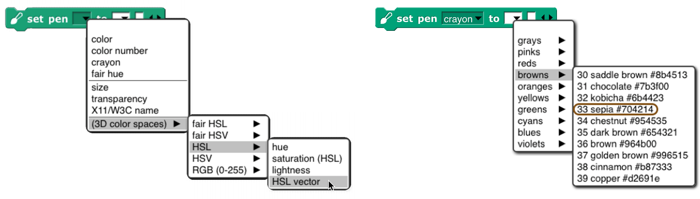
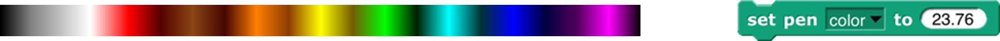
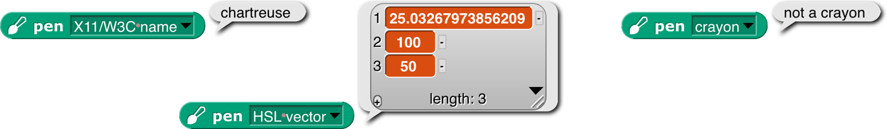
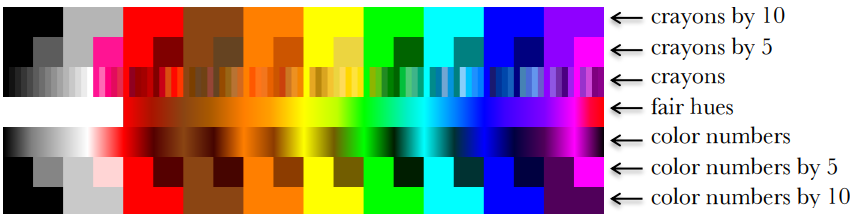
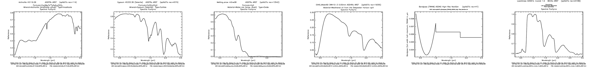
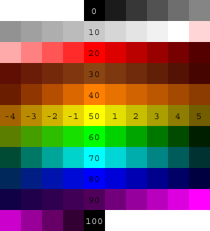

#  Appendix A. Snap*!* color library

The Colors and Crayons library \index{Colors and Crayons library}
provides several tools for manipulating color. Although its main purpose
is controlling a sprite’s pen color, it also establishes colors as a
first class data type:

 <!--  style="width:3.13333in;height:0.51667in" alt="Macintosh HD:Users:bh:Desktop:crayon-Pen.png" / --> 

For people who just
want colors in their projects without having to be color experts, we
provide two simple mechanisms: a *color number* \index{color numbers}
scale with a broad range of continuous color variation and a set of 100
*crayons* organized by color family (ten reds, ten oranges, etc.) The
crayons \index{crayons} include the block colors:

 <!--  style="width:3.13333in;height:0.51667in" alt="Macintosh HD:Users:bh:Desktop:crayon-Pen.png" / --> 

For experts, we
provide color selection by RGB, HSL, HSV, X11/W3C names, and variants on
those scales.

 <!--  style="width:7.16667in;height:1.1in" alt="Macintosh HD:Users:bh:Desktop:hsl-from-x11.png" / --> 

### Introduction to Color

Your computer
monitor can display millions of colors, but you probably can’t
distinguish that many. For example, here’s red 57, green 180, blue 200:  <!--  style="width:0.23611in;height:0.23611in" alt="Macintosh HD:Users:bh:Desktop:Google Chrome002.png" / -->
And here’s red 57, green *182,* blue 200:   <!--  style="width:0.23611in;height:0.23611in" alt="Macintosh HD:Users:bh:Desktop:Google Chrome001.png" / --> You might be able to tell them
apart if you see them side by side:  <!--  style="width:0.23611in;height:0.23611in" alt="Macintosh HD:Users:bh:Desktop:Google Chrome002.png" / -->  <!--  style="width:0.23611in;height:0.23611in" alt="Macintosh HD:Users:bh:Desktop:Google Chrome001.png" / --> but maybe not even then.

Color space \index{color space} —the collection of all possible
colors—is three-dimensional, but there are many ways to choose the
dimensions. RGB \index{RGB} (red-green-blue), the one most commonly used
in computers, matches the way TVs and displays produce color. Behind
every dot on the screen are three tiny lights: a red one, a green one,
and a blue one. But if you want to print colors on paper, your printer
probably uses a different set of three colors: CMY \index{CMY}
(cyan-magenta-yellow). You may have seen the abbreviation CMYK
\index{CMYK}, which represents the common technique of adding black ink
to the collection. (Mixing cyan, magenta, and yellow in equal amounts is
supposed to result in black ink, but typically it comes out a muddy
brown instead, because chemistry.) Other systems that try to mimic human
perception are HSL \index{HSL} (hue-saturation-lightness) and HSV
\index{HSV} (hue-saturation-value). There are many, many more, each
designed for a particular purpose.

If you are a color professional—a printer, a web designer, a graphic
designer, an artist—then you need to understand all this. It can also be
interesting to learn about. For example, there are colors that you can
see but your computer display can’t generate. If that intrigues you,
look up [color theory](https://en.wikipedia.org/wiki/Color_theory)
\index{color theory} in Wikipedia.

### Crayons and Color Numbers

But if you just want some colors in your project, we provide a simple,
one-dimensional subset of the available colors. Two subsets, actually:
*crayons* and *color numbers.* Here’s the difference:

 <!--  style="width:0.23611in;height:0.23611in" alt="Macintosh HD:Users:bh:Desktop:Google Chrome002.png" / -->

 The first row
shows 100 distinct colors. They have names; this is pumpkin   <!--  style="width:0.23611in;height:0.23611in" alt="Macintosh HD:Users:bh:Desktop:Google Chrome003.png" / -->
\index{pumpkin}, and this is denim  <!--  style="width:0.23611in;height:0.23611in" alt="Macintosh HD:Users:bh:Desktop:Google Chrome004.png" / --> \index{denim}. You’re supposed to
think of them as a big box of 100 crayons \index{crayons}. They’re
arranged in families: grays, pinks, reds, browns, oranges, etc. But
they’re not consistently ordered within a family; you’d be unlikely to
say “next crayon” in a project. (But look at the crayon spiral on page
[145](#spirals).) Instead, you’d think “I want this to look like a
really old-fashioned photo” and so you’d find sepia  <!--  style="width:0.23611in;height:0.23611in" alt="Macintosh HD:Users:bh:Desktop:Google Chrome005.png" / --> \index{sepia} as
crayon number 33. You don’t have to memorize the numbers! You can find
them in a menu with a submenu for each family. \index{set pen block}

 <!--  style="width:5.79306in;height:0.3in" / -->

Or, if you
know the crayon name, just  <!--  style="width:2.15972in;height:0.25694in" alt="Macintosh HD:Users:bh:Desktop:set-crayon-name.png" / -->.

 The
crayon numbers are chosen so that skipping by 10 gives a sensible box of
ten crayons \index{box of ten crayons} :

 <!--  style="width:5.79306in;height:0.3in" / -->

Alternatively, skipping by 5 gives a still-sensible set of twenty
crayons \index{box of twenty crayons} :

 <!--  style="width:5.8in;height:0.3in" / --> 

The set of *color numbers* is arranged so that each color number is
visually near each of its neighbors. Bright and dark colors alternate
for each family. Color numbers \index{color numbers} range from 0 to 99,
like crayon numbers, but you can use fractional numbers to get as tiny a
step as you like:

 <!--  style="width:5.79306in;height:0.3in" / -->

(“As tiny as you like” isn’t *quite* true because in the end, your color
has to be rounded to integer RGB values for display.)

Both of these scales include the range of shades of gray \index{gray},
from black to white. Since black is the initial pen color, and black
isn’t a hue, Scratch and Snap*!* users would traditionally try to use
set color to escape from black, and it wouldn’t work. By including black
in the same scale as other colors, we eliminate the Black Hole problem
\index{Black Hole problem} if people use only the recommended color
scales.

We are making a point of saying “color number” for what was sometimes
called just “color” in earlier versions of the library, because we now
reserve the name “color” for an actual color, an instance of the color
data type.  

**How to Use the Library**

There are three library blocks specifically about controlling the pen.
They have the same names as three of the primitive Pen blocks:

 <!--  style="width:5.79306in;height:0.3in" / -->

The first (Pen block-colored) input slot is used to select which color
scale you want to use. (These blocks also allow reading or setting two
block properties that are not colors: the pen size and its
transparency.) The pen reporter \index{pen block} requires no other
inputs; it reports the state of the pen in whatever dimension you
choose.

 <!--  style="width:5.79306in;height:0.3in" / -->

As the last example shows, you can’t ask for the pen color in a scale
incompatible with how you set it, unless the block can deduce what you
want from what it knows about the current pen color.

The change pen block \index{change pen block} applies only to numeric
scales (including vectors of three or four numbers). It adds its numeric
or list input to the current pen value(s), doing vector (item-by-item)
addition for vector scales.

The set pen block \index{set pen block} changes the pen color to the
value(s) you specify. The meaning of the white input slots depends on
which attribute of the pen you’re setting:

 <!--  style="width:5.79306in;height:0.3in" / -->

In the last example, the number 37 sets the *transparency,* on the scale
0=opaque, 100=invisible. (All color attributes are on a 0–100 scale
except for RGB components, which are 0–255.) A transparency
\index{transparency} value can be combined with any of these attribute
scales.

The library also includes two constructors and a selector for colors as
a data type:

 <!--  style="width:5.79306in;height:0.3in" / -->

The latter two
are inverses of each other, translating between colors and their
attributes. The color from block’s \index{color from block} attribute
menu has fewer choices than the similar set pen block because you can,
for example, set the Red value of the existing pen color leaving the
rest unchanged, but when creating a color out of nothing you have to
provide its entire specification, e.g., all of Red, Green, and Blue, or
the equivalent in other scales. (As you’ll see on the next page, we
provide two *linear* (one-dimensional) color scales that allow you to
specify a color with a single number, at the cost of including only a
small subset of the millions of colors your computer can generate.) If
you have a color and want another color that’s the same except for one
number, as in the Red example, you can use this block: 

 <!--  style="width:1.80556in;height:0.19444in" alt="Macintosh HD:Users:bh:Desktop:color-from-and.png" / --> 

Finally, the library includes the mix block \index{mix block} and a
helper:

 <!--  style="width:5.79306in;height:0.3in" / -->

We’ll have more to say about these after a detour through color theory.

That’s all you have to know about colors! *Crayons* for specific
interesting ones, *color numbers* for gradual transformation from one
color to the next. But there’s a bit more to say, if you’re interested.
If not, stop here. (But look at the samples of the different scales on
page [145](#spirals).)  

**More about Colors: Fair Hues and Shades**

Several of the three-dimensional arrangements of colors use the concept
of “hue \index{hue},” which more or less means where a color would
appear in a rainbow \index{rainbow} (magenta \index{magenta}, near the
right, is [a long story](https://en.wikipedia.org/wiki/Magenta)):

 <!--  style="width:5.80667in;height:0.30667in" / --> 

These are called “spectral \index{spectral colors} ” colors, after the
*spectrum* of rainbow colors. But these colors aren’t equally
distributed. There’s an awful lot of green, hardly any yellow, and just
a sliver of orange. And no brown at all.

And this is already a handwave, because the range of colors that can be
generated by RGB monitors doesn’t include some of the *true* spectral
colors. See [Spectral
color](https://en.wikipedia.org/wiki/Spectral_color) in Wikipedia for
all the gory details.

This isn’t a problem with the physics of rainbows. It’s in the human eye
and the human brain that certain ranges of wavelength of light waves are
lumped together as named colors. The eye is just “tuned” \index{rods and
cones} to recognize a wide range of colors as green. (See [Rods and
Cones](https://en.wikipedia.org/w/index.php?title=Rods_and_cones).) And
different human cultures give names to different color ranges.
Nevertheless, in old Scratch projects, you’d say change pen color by 1
and it’d take forever to reach a color that wasn’t green.

For color professionals,
there are good reasons to want to work with the physical rainbow hue
layout. But for amateurs using a simplified, one-dimensional color
model, there’s no reason not to use a more programmer-friendly hue
scale:

 <!--  style="width:5.99444in;height:0.29931in" / --> 

 <!--  style="width:1.45972in;height:1.35833in" / --> 

In this scale, each of the
seven rainbow colors and brown get an equal share. (Red’s looks too
small, but that’s because it’s split between the two ends: hue 0 is pure
red, brownish reds are to its right, and purplish reds are wrapped
around to the right end.) We call this scale “fair hue \index{fair hue}
” because each color family gets a fair share of the total hue range.
(By the way, you were probably taught “… green, blue, indigo
\index{indigo}, violet” in school, but it turns out that color names
were different in Isaac Newton’s day, and the color he called “blue” is
more like modern cyan, while his “indigo” is more like modern blue. See
Wikipedia [Indigo](https://en.wikipedia.org/wiki/Indigo).)

Our *color number* scale
is based on fair hues, adding a range of grays from black (color number
0 ) to white (color number 14) and also adding *shades* of the spectral
colors. (In color terminology, a *shade* is a darker version of a color;
a lighter version is called a *tint.*) Why do we add shades
\index{shade} but not tints \index{tint} ? Partly because I find shades
more exciting. A shade of red  <!--  style="width:0.23611in;height:0.23611in" alt="Macintosh HD:Users:bh:Desktop:red.png" / --> can be dark candy apple red  <!--  style="width:0.23611in;height:0.23611in" alt="Macintosh HD:Users:bh:Desktop:candy.png" / --> \index{dark
candy apple red} or maroon  <!--  style="width:0.23611in;height:0.23611in" alt="Macintosh HD:Users:bh:Desktop:maroon.png" / -->  \index{maroon}, but a tint is just some kind
of pink  <!--  style="width:0.23611in;height:0.23611in" alt="Macintosh HD:Users:bh:Desktop:pink.png" / -->  \index{pink}. This admitted prejudice is supported by an
objective fact: Most projects are made on a white background
\index{white background}, so dark colors stand out better than light
ones.

So, in our color number scale, color numbers 0 to 14 are kinds of gray
\index{gray}; the remaining color numbers go through the fair hues, but
alternating full-strength colors with shades.

crayons by 10

crayons by 5

crayons

fair hues

color numbers

color numbers by 5

color numbers by 10

 <!--  style="width:0.23611in;height:0.23611in" alt="Macintosh HD:Users:bh:Desktop:pink.png" / --> 

This chart shows how the color scales \index{color scales} discussed so
far are related. Note that all scales range from 0 to 100; the fair hues
scale has been compressed in the chart so that similar colors line up
vertically. (Its dimensions are different because it doesn’t include the
grays at the left. Since there are eight color families, the pure, named
fair hues are at multiples of 100/8=12.5, starting with red=0.)

White
is crayon 14 and color number 14. This value was deliberately chosen
*not* to be a multiple of 5 so that the every-fifth-crayon and
every-tenth-crayon selections don’t include it, so that all of the
crayons in those smaller boxes are visible against a white \index{white}
stage background.

 <!--  style="width:1.85in;height:1.07986in" alt="Macintosh HD:Users:bh:Desktop:Prism_compare_rainbow_01.png" / --> 

Among purples \index{purple}, the official spectral violet
\index{violet} (crayon 90) is the end of the spectrum. Magenta
\index{magenta}, brighter than violet, isn’t a spectral color at all.
(In the picture at the left,
the top part is the spectrum of white light spread out through a prism;
the middle part is a photograph of a rainbow, and the bottom part is a
digital simulation of a rainbow.) Magenta is a mixture of red and blue.
(attribution: Wikipedia user Andys. CC BY-SA.)

The light gray at color number 10 is slightly different from crayon 10
just because of roundoff in computing crayon values. Color number 90 is
different from crayon 90 because the official RGB violet (equal parts
red and blue) is actually lighter than spectral violet. The purple
family is also unusual because magenta, crayon and color number 95, is
lighter than the violet at 90. In other families, the color numbers,
crayons, and (scaled) fair hues all agree at multiples of ten. These
multiple-of-ten positions are the standard RGB primary and secondary
colors, e.g., the yellow at color number 50 is (255, 255, 0) in RGB.
(Gray, brown, and orange don’t have such simple RGB settings.)

The color numbers at odd multiples of five are generally darker shades
than the corresponding crayons. The latter are often official named
shades, e.g., teal \index{teal}, crayon 65, is a half-intensity shade
of cyan \index{cyan}. The odd-five *color numbers,* though, are often
darker, since they are chosen to be the darkest color in a given family
that’s visibly different from black. The pink at color number 15,
though, is quite different from crayon 15, because the former is a pure
tint of red, whereas the crayon, to get a more interesting pink, has a
little magenta mixed in. Color numbers at multiples of five are looked
up in a table; other color values are determined by linear interpolation
in RGB space. (*Crayons* are of course all found by table lookup.)

The from color block \index{from color block} behaves specially when you
ask for the *color number* of a color. Most colors don’t exactly match a
color number, and for other attributes of a color (crayon number, X11
name) you don’t get an answer unless the color exactly matches one of
the names or numbers in that attribute. But for color number, the block
tries to find the *nearest color number* \index{nearest color number} to
the color you specify. The result will be only approximate; you can’t
use the number you get to recreate the input color. But you can start
choosing nearby color numbers as you animate the sprite.

### Perceptual Spaces: HSV and HSL

 <!--  style="width:0.73611in;height:0.72222in" alt="Macintosh HD:Users:bh:Desktop:blues.png" / --> 

RGB is the right way to
think about colors if you’re building or programming a display monitor;
CMYK is the right way if you’re building or programming a color printer.
But neither of those coordinate systems is very intuitive if you’re
trying to understand what color *you see* if, for example, you mix 37%
red light, 52% green, and 11% blue. The *hue* scale is one dimension of
most attempts at a perceptual scale. The square at the right has pale
blues along the top edge, dark blues along the right edge, various
shades of gray toward the left, black at the bottom, and pure spectral
blue in the top right corner. Although no other point in the square is
pure blue, you can tell at a glance that no other spectral color is
mixed with the blue.

 <!--  style="width:2.69167in;height:1.19028in" / --> 

Aside from hue, the other two
dimensions of a color space have to represent how much white and/or
black is mixed with the spectral color. (Bear in mind that “mixing
black” is a metaphor when it comes to monitors. There really is black
paint, but there’s no such thing as black light.) One such space, HSV
\index{HSV}, has one dimension for the amount of color (vs. white),
called *saturation,* and one for the amount of black, imaginatively
called *value.* HSV stands for Hue-Saturation \index{saturation} -Value
\index{value}. (Value is also called *brightness.*) The *value* is
actually measured backward from the above description; that is, if value
is 0, the color is pure black; if value is 100, then a saturation of 0
means all white, no spectral color; a saturation of 100 means no white
at all. In the square in the previous paragraph, the *x* axis is the
saturation and the *y* axis is the value. The entire bottom edge is
black, but only the top left corner is white. HSV is the traditional
color space used in Scratch and Snap*!.* Set pen color set the hue; set
pen shade set the value. There was originally no Pen block to set the
saturation, but there’s a set brightness effect Looks block to control
the saturation of the sprite’s costume. (I speculate that the Scratch
designers, like me, thought tints were less vivid than shades against a
white background, so they made it harder to control tinting.)

attribution: Wikipedia user SharkD, CC BY-SA 3.0

But if you’re looking
at colors on a computer display, HSV isn’t really a good match for human
perception. Intuitively, black and white should be treated
symmetrically. This is the HSL \index{HSL} (hue-saturation-lightness
\index{lightness} ) color space. 

 <!--  style="width:0.76389in;height:0.76389in" alt="Macintosh HD:Users:bh:Desktop:HSL-blue.png" / -->

*Saturation,* in HSL, is a measure of
the *grayness* or *dullness* of a color (how close it comes to being on
a black-and-white scale) and *lightness* measures *spectralness* with
pure white at one end, pure black at the other end, and spectral color
in the middle. The *saturation* number is actually the opposite of
grayness: 0 means pure gray, and 100 means pure spectral color, provided
that the *lightness* is 50, midway between black and white. Colors with
lightness other than 50 have some black or white mixed in, but
saturation 100 means that the color is as fully saturated as it can be,
given the amount of white or black needed to achieve that lightness.
Saturation less than 100 means that *both white and black* are mixed
with the spectral color. (Such mixtures are called *tones* of the
spectral color.) Perceptually, colors with saturation 100% don’t look
gray:  <!--  style="width:1.55556in;height:0.26597in" / -->  but colors with saturation 75% do:  <!--  style="width:1.56389in;height:0.29306in" / --> 

Note that HSV and HSL both have a dimension called “saturation,” but
*they’re not the same thing!* In HSV, “saturation” means non-whiteness,
whereas in HSL it means non-grayness (vividness).

More fine print: It’s misleading to talk about the spectrum of light
wavelengths as if it were the same as perceived hue. If your computer
display is showing you a yellow area, for example, it’s doing it by
turning on its red and green LEDs over that area, and what hits your
retina *is still two wavelengths of light, red and green, superimposed.*
You could make what’s perceptually the same yellow by using a single
intermediate wavelength. Your eye and brain don’t distinguish between
those two kinds of yellow. Also, your brain automatically adjusts
perceived hue to correct for differences in illumination. When you place
a monochrome object so that it’s half in sunlight and half in the shade,
you see it as one even though what’s reaching your eyes from the two
regions differs a lot. And, sadly, it’s HSL whose use of “saturation”
disagrees with the official international color vocabulary
standardization committee. I learned all this from [this
tutorial](http://www.huevaluechroma.com/011.php), which you might find
more coherent than jumping around Wikipedia if you’re interested.

 <!--  style="width:1.64375in;height:0.84167in" / --> 

Although traditional Scratch
and Snap*!* use HSV in programs, they use HSL in the color picker
\index{color picker}. The horizontal axis is hue (fair hue \index{fair
hue} , in this version) and the vertical axis is *lightness,* the scale
with black at one end and white at the other end. It would make no sense
to have only the bottom half of this selector (HSV Value) or only the
top half (HSV Saturation). And, given that you can only fit two
dimensions on a flat screen, it makes sense to pick HSL saturation
(vividness) as the one to keep at 100%. (In this fair-hue picker, some
colors appear twice: “spectral” (50% lightness) browns as shades (≈33%
lightness) of red or orange, and shades of those browns.)

Software that isn’t
primarily about colors (so, *not* including Photoshop, for example)
typically use HSV or HSL, with web-based software more likely to use HSV
because that’s what’s built into the JavaScript \index{JavaScript}
programming language provided by browsers. But if the goal is to model
human color perception, neither of these color spaces is satisfactory,
because they assume that all full-intensity spectral colors are equally
bright. But if you’re like most people, you see spectral yellow  <!--  style="width:0.18889in;height:0.18889in" alt="Macintosh HD:Users:bh:Desktop:yellow.png" / --> as much
brighter than spectral blue  <!--  style="width:0.20278in;height:0.20278in" / --> . There are better perceptual color spaces
with names like L\*u\*v\* \index{L\*u\*v\*} and L\*a\*b\*
\index{L\*a\*b\*} that are based on research with human subjects to
determine true perceived brightness. Wikipedia explains all this and
more at [HSL and HSV](https://en.wikipedia.org/wiki/HSL_and_HSV), where
they recommend ditching both of these simplistic color spaces. ☺

###  Mixing Colors

Given first class colors, the next question is, what operations apply to
them, the way arithmetic operators apply to numbers and higher order
functions apply to lists? The equivalent to adding numbers is mixing
colors, but unfortunately there isn’t a simple answer to what that
means.

The easiest kind of color mixing to understand is *additive* mixing,
which is what happens when you shine two colored lights onto a (white)
wall. It’s also what happens in your computer screen, where each dot
(pixel) of an image is created by a tiny red light, a tiny green light,
and a tiny blue light that can be combined at different strengths to
make different colors. Essentially, additive mixing \index{additive
mixing} of two colors is computed by adding the two red components, the
two green components, and the two blue components. It’s not *quite* that
simple only because each component of the result must be in the range 0
to 255. So, red (255, 0, 0) mixed with green (0, 255, 0) gives (255,
255, 0), which is yellow. But red (255, 0, 0) plus yellow (255, 255, 0)
can’t give (510, 255, 0). Just limiting the red in the result to 255
would mean that red plus yellow is yellow, which doesn’t make sense.
Instead, if the red value has to be reduced by half (from 510 to 255),
then *all three* values must be reduced by half, so the result is (255,
128, 0), which is orange. (Half of 255 is 127.5, but each RGB value must
be an integer.)

 <!--  style="width:0.20278in;height:0.20278in" / --> 

A different kind of color mixing based on light is done when different
colored transparent plastic sheets are held in front of a white light,
as is done in theatrical lighting. In that situation, the light that
gets through both filters is what remains after some light is filtered
out by the first one and some of what’s left is filtered out by the
second one. In red-green-blue terms, a red filter filters out green and
blue; a yellow filter allows red and green through, filtering out blue.
But there isn’t any green light for the yellow filter to pass; it was
filtered out by the red filter. Each filter can only remove light, not
add light, so this is called *subtractive* mixing:

 <!--  style="width:0.20278in;height:0.20278in" / --> 

Perhaps confusingly, the numerical computation of subtractive mixing
\index{subtractive mixing} is done by *multiplying* the RGB values,
taken as fractions of the maximum 255, so red (1, 0, 0) times yellow (1,
1, 0) is red again.

Those are both straightforward to compute. Much, much more complicated
is trying to simulate the result of mixing *paints* \index{mixing
paints} *.* It’s not just that we’d have to compute a more complicated
function of the red, green, and blue values; it’s that RGB values (or
any other three-dimensional color space) are inadequate to describe the
behavior of paints \index{paints}. Two paints can look identical, and
have the same RGB values, but may still behave very differently when
mixed with other colors. The differences are mostly due to the chemistry
of the paints, but are also affected by exactly how the colors are
mixed. The mixing is mostly subtractive; red paint *absorbs* most of the
colors other than red, so what’s reflected off the surface is whatever
isn’t absorbed by the colors being mixed. But there can be an additive
component also.

The proper mathematical abstraction to describe a paint is a
*reflectance* graph \index{reflectance graph}, like this:

 <!--  style="width:0.20278in;height:0.20278in" / --> 

(These aren’t paints, but minerals, and one software-generated spectrum,
from the US Geological Survey’s [Spectral
Library](https://www.usgs.gov/labs/spec-lab/capabilities/spectral-library).
The details don’t matter, just the fact that a graph like these gives
much more information than three RGB numbers.) To mix two paints
properly, you multiply the *y* values (as fractions) at each matching
*x* coordinate of the two graphs.

Having said all that, the mix block takes the colors it is given as
inputs and converts them into what we hope are *typical* paint
reflectance spectra that would look like those colors, and then mixes
those spectra and converts back to RGB.

 <!--  style="width:4.34028in;height:0.65278in" alt="Macintosh HD:Users:bh:Desktop:5R-3G-paint.png" / -->

But unlike the other two kinds of mixing, in this case we can’t say that
these colors are “the right answer”; what would happen with real paints
depends on their chemical composition and how they’re mixed. There are
three more mixing options, but these three are the ones that correspond
to real-world color mixing.

The mix block will
accept any number of colors, and will mix them in equal proportion. If
(for any kind of mixing) you want more of one color than another, use
the color at weight block \index{color at weight block} to make a
“weighted color”:

 <!--  style="width:5.16667in;height:0.43056in" alt="Macintosh HD:Users:bh:Desktop:4R-1G-paint.png" / --> 

This mixes four
parts red paint to one part green paint. All colors in a mixture can be
weighted:

 <!--  style="width:4.34028in;height:0.65278in" alt="Macintosh HD:Users:bh:Desktop:5R-3G-paint.png" / --> 

(Thanks to [Scott Burns \index{Burns, Scott}
](http://scottburns.us/subtractive-color-mixture/) for his help in
understanding paint mixing, along with [David Briggs \index{ Briggs,
David} ](http://www.huevaluechroma.com/061.php)’s tutorial. Remaining
mistakes are bh’s.)

### tl;dr

For normal people \index{normal people}, Snap*!* provides three simple,
one-dimensional scales: *<u>crayons</u>* for specific interesting
colors, *<u>color numbers</u>* for a continuum of high-contrast colors
with a range of hues and shading, and *<u>fair hues</u>* for a continuum
without shading. For color nerds \index{color nerds}, it provides
three-dimensional color spaces RGB, HSL, HSV, and fair-hue variants of
the latter two. We recommend
“fair HSL \index{fair HSL} ” for zeroing in on a desired color.

<!--   style="width:1.53472in;height:1.84722in" alt="Macintosh HD:Users:bh:Desktop:squiral-script.png" / --> 

 <!--  style="width:4.34028in;height:0.65278in" alt="Macintosh HD:Users:bh:Desktop:5R-3G-paint.png" / --> 

###  Subappendix: Geeky details on fair hue

 <!--  style="width:4.34028in;height:0.65278in" alt="Macintosh HD:Users:bh:Desktop:5R-3G-paint.png" / --> 

The left graph shows that, unsurprisingly, all of the brown fair hue
\index{fair hue} s make essentially no progress in real hue, with the
orange-brown section actually a little retrograde, since browns are
really shades of orange and so the real hues overlap between fair browns
and fair oranges. Green makes up some of the distance, because there are
too many green real hues and part of the goal of the fair hue scale is
to squeeze that part of the hue spectrum. But much of the catching up
happens very quickly, between pure magenta at fair hue 93.75 and the
start of the purple-red section at fair hue 97. This abrupt change is
unfortunate, but the alternatives involve either stealing space from red
or stealing space from purple (which already has to include both
spectral violet and RGB magenta). The graph has discontinuous derivative
at the table-lookup points, of which there are two in each color family,
one at the pure-named-RGB colors at multiples of 12.5, and the other
*roughly* halfway to the next color family, except for the purple
family, which has lookup points at 87.5 (approximate spectral violet),
93.75 (RGB magenta), and 97 (turning point toward the red family). (In
the color picker, blue captures cyan and purple space in dark shades.
This, too, is an artifact of human vision.)

The right graph shows the HSV saturation and value for all the fair
hues. Saturation is at 100%, as it should be in a hue scale, except for
a very slight drop in part of the browns. (Browns are shades of orange,
not tints, so one would expect full saturation, except that some of the
browns are actually mixtures with related hues.) But value, also as
expected, falls substantially in the browns, to a low of about 56%
(halfway to black) for the “pure” brown at 45° (fair hue 12.5). But the
curve is smooth, without inflection points other than that minimum-value
pure brown.

“Fair saturation \index{fair saturation} ” and “fair value \index{fair
value} ” are by definition 100% for the entire range of fair hues. This
means that in the browns, the real saturation and value are the product
(in percent) of the innate shading of the specific brown fair hue and
the user’s fair saturation/value setting. When the user’s previous color
setting was in a real scale and the new setting is in a fair scale, the
program assumes that the previous saturation and value were entirely
user-determined; when the previous color setting was in a brown fair hue
and the new setting is also in a fair scale, the program remembers the
user’s intention from the previous setting. (Internal calculations are
based on HSV, even though we recommend HSL to users, because HSV comes
to us directly from the JavaScript color management implementation.)
This is why the set pen block includes options for “fair saturation” and
so on.

For the extra-geeky, here are
the exact table lookup points (fair hue \index{fair hue table},
\[0,100\]):

 <!--  style="width:5.9875in;height:0.37847in" / --> 

and here are the RGB settings at those points:

 <!--  style="width:5.98403in;height:1.37361in" / -->  

### Subappendix: Geeky details on color numbers

 <!--  style="width:2.08333in;height:2.29167in" alt="Macintosh HD:Users:bh:Desktop:integers.png" / --> 

Here is a picture of
integer color numbers, but remember that color numbers are continuous.
(As usual, “continuous” values are ultimately converted to integer RGB
values, so there’s really some granularity.) Color numbers 0-14 are
continuously varying grayscale, from 0=black to 14=white. Color numbers
14+ε to 20 are linearly varying shades of pink, with RGB Red at color
number 20.

Beyond that point, in each color family, the multiple of ten color
number in the middle is the RGB standard color of that family, in which
each component is either 255 or 0. (Exceptions are brown, which is of
course darker than any of those colors; orange, with its green component
half-strength: \[255, 127, 0\]; and violet, discussed below.) The
following multiple of five is the number of the darkest color in that
family, although not necessarily the same hue as the multiple of ten
color number. Color numbers between the multiple of ten and the
following multiple of five are shades of colors entirely within the
family. Color numbers in the four *before* the multiple of ten are
mixtures of this family and the one before it. So, for example, in the
green family, we have

- 55 Darkest yellow.

- (55, 60) shades of yellow-green mixtures. As the color number increases,
both the hue and the lightness (or value, depending on your religion)
increase, so we get brighter and greener colors.

- 60 Canonical green, \[0, 255, 0\], whose W3C color name is “lime,” not
“green.”

- (60, 65) Shades of green. No cyan mixed in.

- 65 Darkest green.

- (65,70) Shades of green-cyan mixtures.

In the color number chart \index{color chart}, all the dark color
numbers look a lot like black, but they’re quite different. Here are the
darkest colors in each color number family.

 <!--  style="width:1.38889in;height:1.38889in" alt="Macintosh HD:Users:bh:Desktop:darkest.png" / --> 

Darkest yellow doesn’t
look entirely yellow. You might see it as greenish or brownish. As it
turns out, the darkest color that really looks yellow is hardly dark at
all. This color was hand-tweaked to look neither green nor brown to me,
but ymmv.

In some families, the center+5 *crayon* is an important named darker
version of the center color: In the red family, \[128, 0, 0\] is
“maroon.” In the cyan family, \[0, 128, 128\] is “teal.” An early
version of the color number scale used these named shades as the
center+5 color number also. But on this page we use the word “darkest”
advisedly: You can’t find a darker shade of this family anywhere in the
color number scale, but you *can* find lighter shades. Teal is color
number 73.1, ($70 + 5 \bullet \frac{255 - 128}{255 - 50}$), because
darkest cyan, color 75, is \[0, 50, 50\]. The color number for maroon is
left as an exercise for the reader.

The purple family is different from the others, because it has to
include both spectral violet and extraspectral RGB magenta. Violet is
usually given as RGB \[128, 0, 255\], but that’s much brighter than the
violet in an actual spectrum (see page [142](#rainbow)). We use \[80, 0,
90\], a value hand-tweaked to look as much as possible like the violet
in rainbow photos, as color number 90. (*Crayon* 90 is \[128, 0, 255\].)
Magenta, \[255, 0, 255\], is color number 95. This means that the colors
get *brighter,* not darker, between 90 and 95. The darkest violet is
actually color number 87.5, so it’s bluer than standard violet, but
still plainly a purple and not a blue. It’s \[39,0,76\]. It’s *not*
hand-tweaked; it’s a linear interpolation between darkest blue, \[0, 0,
64\], and the violet at color number 90. I determined by experiment that
color number 87.5 is the darkest one that’s still unambiguously purple.
(According to Wikipedia, “violet” names only the spectral color, while
“purple” is the name of the whole color family.)

Here are the reference points for color numbers that are multiples of
five, except for item 4, which is used for color 14, not color 15:

 <!--  style="width:4.58333in;height:1.27778in" / --> 

The very pale three-input list blocks are for color numbers that are odd
multiples of five, generally the “darkest” members of each color family.
(The block colors were adjusted in Photoshop; don’t ask how to get
blocks this color in Snap*!*.)

