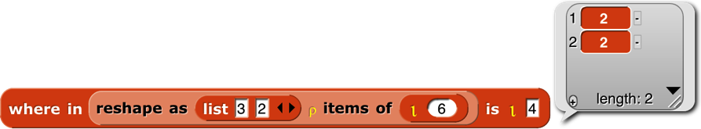
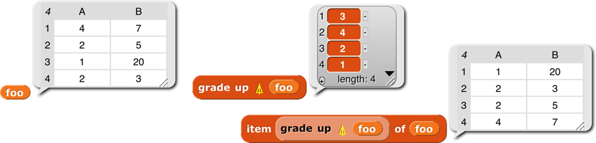
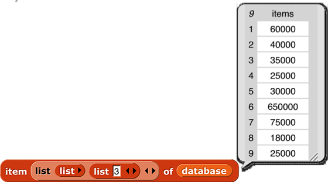
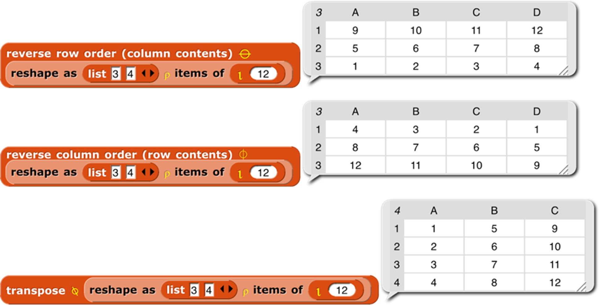
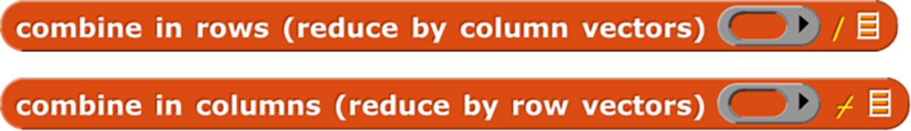
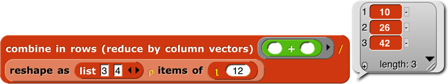

#  Appendix B. APL features

The book *A Programming Language* \index{A Programming Language} was
published by mathematician Kenneth E. Iverson \index{Iverson, Kenneth
E.} in 1962. He wanted a formal language that would look like what
mathematicians write on chalkboards. The then-unnamed language would
later take its name from the first letters of the words in the book’s
title. It was little-known until 1964, when a formal description of the
just-announced IBM System/360 \index{IBM System/360} in the *IBM Systems
Journal* used APL \index{APL} notation. (Around the same time, Iverson’s
associate Adin Falkoff \index{Falkoff, Adin} gave a talk on APL to a New
York Association for Computing Machinery chapter, with an excited
14-year-old Brian Harvey in the audience.) But it wasn’t until 1966 that
the first public implementation of the language for the System/360 was
published by IBM. (It was called “APL\360 \index{APL\360} ” because the
normal slash character / represents the “reduce” operator in APL, while
backslash is “expand.”)

The crucial idea behind APL is that mathematicians
\index{mathematicians} think about collections of numbers,
one-dimensional *vectors* \index{vectors} and two-dimensional *matrices*
\index{matrices} *,* as valid objects in themselves, what computer
scientists later learned to call “first class data \index{first class
data} .” A mathematician who wants to add two vectors writes
***v*1** + ***v*2**, not “for i = 1 to length(v1),
result\[i\]=v1\[i\]+v2\[i\].” Same for a programmer using APL.

There are three kinds of function in APL: scalar functions \index{scalar
function} , mixed functions \index{mixed function}, and operators
\index{operator (APL)}. A *scalar function* is one whose natural domain
is individual numbers or text characters. A *mixed function* is one
whose domain includes arrays (vectors, matrices, or higher-dimensional
collections). In Snap*!*, scalar functions are generally found in the
green Operators palette, while mixed functions are in the red Lists
palette. The third category, confusingly for Snap*!* users, is called
*operators* in APL, but corresponds to what we call higher order
functions \index{function, higher order} : functions whose domain
includes functions.

Snap*!* hyperblocks \index{hyperblocks} are scalar functions that behave
like APL scalar functions: they can be called with arrays as inputs, and
the underlying function is applied to each number in the arrays. (If the
function is *monadic,* meaning that it takes one input, then there’s no
complexity to this idea. Take the square root of an array, and you are
taking the square root of each number in the array. If the function is
*dyadic,* taking two inputs, then the two arrays must have the same
shape. Snap*!* is more forgiving than APL; if the arrays don’t agree in
number of dimensions, called the *rank* of the array, the lower-rank
\index{rank} array is matched repeatedly with subsets of the higher-rank
one; if they don’t agree in length along one dimension, the result has
the shorter length and some of the numbers in the longer-length array
are ignored. An exception in both languages is that if one of the two
inputs is a scalar, then it is matched with every number in the other
array input.)

As explained in Section IV.F, this termwise extension \index{termwise
extension} of scalar functions is the main APL-like feature built into
Snap*!* itself. We also include an extension of the item block
\index{item block} to address multiple dimensions, an extension to the
length block \index{length block} with five list functions from APL, and
a new primitive reshape block \index{reshape block}. The APL library
\index{APL library} extends the implementation of APL features to
include a few missing scalar functions and several missing mixed
functions and operators.

Programming in APL really is *very* different in style from programming
in other languages, even Snap*!*. This appendix can’t hope to be a
complete reference for APL, let alone a tutorial. If you’re interested,
find one of those in a library or a (probably used) bookstore, read it,
and *do the exercises.* Sorry to sound like a teacher, but the notation
is sufficiently weird as to take a lot of practice before you start to
think in APL.

A note on versions: There is a widely standardized APL2, several
idiosyncratic extensions, and a successor language named J. The latter
uses plain ASCII characters, unlike the ones with APL in their names,
which use the mathematician’s character set, with Greek letters,
typestyles (boldface and/or italics in books; underlined, upper case, or
lower case in APL) as loose type declarations, and symbols not part of
anyone’s alphabet, such as ⌊ for floor and ⌈ for ceiling. To use the
original APL, you needed expensive special computer terminals. (This was
before you could download fonts in software. Today the more unusual APL
characters \index{APL character set} are in Unicode \index{Unicode} at
U+2336 to U+2395.) The character set was probably the main reason APL
didn’t take over the world. APL2 \index{APL2} has a lot to recommend it
for Snap*!* users, mainly because it moves from the original APL idea
that all arrays must be uniform in dimension, and the elements of arrays
must be numbers or single text characters, to our idea that a list can
be an element of another list, and that such elements don’t all have to
have the same dimensions. Nevertheless, its mechanism for allowing both
old-style APL arrays and more general “nested arrays” is complicated and
hard for an APL beginner (probably all but two or three Snap*!* users)
to understand. So we are starting with plain APL. If it turns out to be
wildly popular, we may decide later to include APL2 features.

Here are some of the guiding ideas in the design of the APL library:

- Goal:  Enable interested
**Snap*!*** users to learn the feel and style of APL programming. It’s
really worth the effort. For example, we didn’t hyperize the = block
because Snap*!* users expect it to give a single yes-or-no answer about
the equality of two complete structures \index{equality of complete
structures} , whatever their types and shapes. In APL, = is a scalar
function; it compares two numbers or two characters. How could APL users
live without the ability to ask if two *structures* are equal? Because
in APL you can say **∧**/,a=b to get that answer. Reading from right to
left, a=b reports an array of Booleans (represented in APL as 0 for
False, 1 for True); the comma operator turns the shape of the array into
a simple vector; and **∧**/ means “reduce with and”; “reduce” is our
combine function. That six-character program is much less effort than
the equivalent  <!--  style="width:4.45139in;height:0.52083in" / --> in Snap*!*. Note in passing
that if you wanted to know *how many* corresponding elements of the two
arrays are equal, you’d just use +/ instead of **∧**/. Note also that
our APLish blocks are a little verbose, because they include up to three
notations for the function: the usual Snap*!* name (e.g., flatten), the
name APL programmers use when talking about it (ravel \index{ravel
block} ), and, in yellow type, the symbol used in actual APL code (,).
We’re not consistent about it;  <!--  style="width:0.99306in;height:0.20833in" / -->  seems self-documenting. And LCM (and) is
different even though it has two names; it turns out that if you
represent Boolean values as 0 and 1, then the algorithm to compute the
least common multiple of two integers computes the and function if the
two inputs happen to be Boolean. Including the APL symbols serves two
purposes: the two or three Snap*!* users who’ve actually programmed in
APL will be sure what function they’re using, but more importantly, the
ones who are reading an APL tutorial while building programs in Snap*!*
will find the block that matches the APL they’re reading.  
  
- Goal:  Bring the best and most general APL ideas into “mainstream”
**Snap*!*** programming style. Media computation \index{media
computation} , in particular, becomes much simpler when scalar functions
can be applied to an entire picture or sound. Yes, map provides
essentially the same capability, but the notation gets complicated if
you want to map over columns rather than rows. Also, Snap*!* lists are
fundamentally one-dimensional, but real data often have more dimensions.
A Snap*!* programmer has to be thinking all the time about the
convention that we represent a matrix as a list of rows, each of which
is a list of individual cells. That is, row 23 of a spreadsheet
\index{spreadsheet} is item 23 of spreadsheet, but column 23 is map
(item 23 of \_) over spreadsheet. APL treats rows and columns more
symmetrically.  
  
- Non-goal:  Allow programs written originally in APL to run in
**Snap*!*** essentially unchanged.  For example, in APL the atomic text
unit is a single character, and strings of characters are lists. We
treat a text string as scalar, and that isn’t going to change. Because
APL programmers rarely use conditionals, instead computing functions
involving arrays of Boolean values to achieve the same effect, the
notation they do have for conditionals is primitive (in the sense of
Paleolithic \index{Paleolithic}, not in the sense of built in). We’re
not changing ours.  
  
- Non-goal:  Emulate the terse APL syntax. It’s too bad, in a way; as
noted above, the terseness of expressing a computation affects APL
programmers’ sense of what’s difficult and what isn’t. But you can’t say
“terse” and “block language” in the same sentence. Our whole *raison
d’être* is to make it possible to build a program without having to
memorize the syntax or the names of functions, and to allow those names
to be long enough to be self-documenting. And APL’s syntax has its own
issues, of which the biggest is that it’s hard to use functions with
more than two inputs; because most mathematical dyadic functions use
infix notation (the function symbol between the two inputs), the notion
of “left argument” and “right argument” is universal in APL
documentation. The thing people most complain about, that there is no
operator precedence (like the multiplication-before-addition rule in
normal arithmetic notation), really doesn’t turn out to be a problem.
Function grouping is strictly right to left, so 2×3+4 means two times
seven, not six plus four. That takes some getting used to, but it really
doesn’t take long if you immerse yourself in APL. The reason is that
there are too many infix operators for people to memorize a precedence
table. But in any case, block notation eliminates the problem,
especially with Snap*!*’s zebra coloring. You can see and control the
grouping by which block is inside which other block’s input slot.
Another problem with APL’s syntax is that it bends over backward not to
have reserved words, as opposed to Fortran, its main competition back
then. So the dyadic **○** “circular functions” function uses the left
argument to select a trig function. 1**○**x is sin(x), 2**○**x is
cos(x), and so on. **‾**1**○**x is arcsin(x). What’s 0**○**x? Glad you
asked; it’s$\\\sqrt{1 - x^{2}}$.

### Boolean values

Snap*!* uses distinct Boolean values true and false that are different
from other data types. APL uses 1 and 0, respectively. The APL style of
programming depends heavily on doing arithmetic on Booleans, although
their conditionals insist on only 0 or 1 in a Boolean input slot, not
other numbers. Snap*!* *arithmetic* functions treat false as 0 and true
as 1, so our APL library tries to report Snap*!* Boolean values from
predicate functions.

### Scalar functions

 <!--  style="width:5.73333in;height:1.10667in" / --> 

These are the
scalar functions \index{scalar function} in the APL library. Most of
them are straightforward to figure out. The scalar = block \index{scalar
= block} provides an APL-style version of = (and other exceptions) as a
hyperblock that extends termwise to arrays. Join, the only non-predicate
non-hyper scalar primitive, has its own scalar join block \index{scalar
join block} . 7 deal \index{deal block} 52 reports a random vector of
seven numbers from 1 to 52 with no repetitions, as in dealing a hand of
cards. Signum \index{signum block} of a number reports 1 if the number
is positive, 0 if it’s zero, or -1 if it’s negative. Roll \index{roll
block} 6 reports a random roll of a six-sided die. To roll 8 dice, use  <!--  style="width:2.56667in;height:0.21667in" alt="Macintosh HD:Users:bh:Desktop:roll-8-dice.png" / --> ,
which would look much more pleasant as ?8⍴6. But perhaps our version is
more instantly readable by someone who didn’t grow up with APL. All the
library functions have help messages available.

### Mixed functions

Mixed functions include lists in their natural domain or range. That is,
one or both of its inputs *must* be a list, or it always reports a list.
Sometimes both inputs are naturally lists; sometimes one input of a
dyadic mixed function is naturally a scalar, and the function treats a
list in that input slot as an implicit map, as for scalar functions.
This means you have to learn the rule for each mixed function
\index{function, mixed} individually.

 <!--  style="width:1.06667in;height:0.18333in" alt="Macintosh HD:Users:bh:Desktop:shape-of.png" / --> The shape of function
\index{shape of block} takes any input and reports a vector of the
maximum size of the structure along each dimension. For a vector, it
returns a list of length 1 containing the length of the input. For a
matrix, it returns a two-item list of the number of rows and number of
columns of the input. And so on for higher dimensions. If the input
isn’t a list at all, then it has zero dimensions, and shape of reports
an empty vector. Equivalent to the dimensions of primitive, as of 6.6.

 <!--  style="width:4.275in;height:1.1in" alt="Macintosh HD:Users:bh:Desktop:shape-example.png" / -->

 <!--  style="width:1.04167in;height:0.18333in" alt="Macintosh HD:Users:bh:Desktop:rank.png" / --> Rank of
\index{rank of block} isn’t an actual APL primitive, but the composition ⍴⍴
(shape of shape of a structure), which reports the number of dimensions
of the structure (the length of its shape vector), is too useful to
omit. (It’s very easy to type the same character twice on the APL
keyboard, but less easy to drag blocks together.) Equivalent to the rank
of primitive, as of 6.6.

 <!--  style="width:2.03333in;height:0.18333in" alt="Macintosh HD:Users:bh:Desktop:reshape.png" / --> 

Reshape
\index{reshape block} takes a shape vector (such as shape might report)
on the left and any structure on the right. It ignores the shape of the
right input, stringing the atomic elements into a vector in row-major
order (that is, all of the first row left to right, then all of the
second row, etc.). (The primitive reshape takes the inputs in the other
order.) It then reports an array with the shape specified by the first
input containing the items of the second:

 <!--  style="width:7.325in;height:0.83333in" alt="Macintosh HD:Users:bh:Desktop:reshape-ex.png" / --> 

If the right
input has more atomic elements than are required by the left-input shape
vector, the excess are ignored without reporting an error. If the right
input has too *few* atomic elements, the process of filling the reported
array starts again from the first element. This is most useful in the
specific case of an atomic right input, which produces an array of any
desired shape all of whose atomic elements are equal. But other cases
are sometimes useful too:

 <!--  style="width:6.575in;height:1.04167in" alt="Macintosh HD:Users:bh:Desktop:identity-matrix.png" / -->

 <!--  style="width:6.575in;height:1.04167in" alt="Macintosh HD:Users:bh:Desktop:identity-matrix.png" / -->

 <!--  style="width:1.43333in;height:0.18333in" alt="Macintosh HD:Users:bh:Desktop:ravel.png" / --> Flatten \index{flatten
block} takes an arbitrary structure as input and reports a vector of its
atomic elements in row-major order. Lispians call this flattening the
structure, but APLers call it “ravel” because of the metaphor of pulling
on a ball of yarn, so what they really mean is “unravel.” (But the
snarky sound of that is uncalled-for, because a more advanced version
that we might implement someday is more like raveling.) One APL idiom is
to apply this to a scalar in order to turn it into a one-element vector,
but we can’t use it that way because you can’t type a scalar value into
the List-type input slot. Equivalent to the primitive flatten of block.

 <!--  style="width:1.43333in;height:0.18333in" alt="Macintosh HD:Users:bh:Desktop:ravel.png" / -->

Catenate
\index{catenate block} is like our primitive append, with two
differences: First, if either input is a scalar, it is treated like a
one-item vector. Second, if the two inputs are of different rank, the
catenate function is recursively mapped over the higher-rank input:

 <!--  style="width:7.20417in;height:0.58333in" alt="Macintosh HD:Users:bh:Desktop:catenate-ex.png" / -->

Catenate vertically
\index{catenate vertically block} is similar, but it adds new rows
instead of adding new columns.

 <!--  style="width:0.53333in;height:0.25in" alt="Macintosh HD:Users:bh:Desktop:iota.png" / --> 

Integers
\index{integers block} (I think that’s what it stands for, although
APLers just say “iota”) takes a positive integer input and reports a
vector of the integers from 1 to the input. This is an example of a
function classed as “mixed” not because of its domain but because of its
range. The difference between this block and the primitive numbers from
block is in its treatment of lists as inputs. Numbers from is a
hyperblock, applying itself to each item of its input list:

 <!--  style="width:6.34167in;height:1.04167in" alt="Macintosh HD:Users:bh:Desktop:numbers-ex.png" / --> 

 Iota \index{iota
block} has a special meaning for list inputs: The input must be a shape
vector; the result is an array with that shape in which each item is a
list of the indices of the cell along each dimension. A picture is worth
103 words, but Snap*!* isn’t so good at displaying arrays
with more than two dimensions, so here we reduce each cell’s index list
to a string:

 <!--  style="width:6.025in;height:0.83333in" alt="Macintosh HD:Users:bh:Desktop:iota-list-ex.png" / -->

 <!--  style="width:1.475in;height:0.25in" alt="Macintosh HD:Users:bh:Desktop:dyadic-iota.png" / -->  Dyadic iota is like
the index of \index{index of block (APL)} primitive except for its
handling of multi-dimensional arrays. It looks only for atomic elements,
so a vector in the second input doesn’t mean to search for that vector
as a row of a matrix, which is what it means to index of, but rather to
look separately for each item of the vector, and report a list of the
locations of each item. If the first input is a multi-dimensional array,
then the location of an item is a vector with the indices along each
row.

 <!--  style="width:5.95in;height:1.1in" alt="Macintosh HD:Users:bh:Desktop:dy-iota-ex.png" / -->

In this example, the 4 is in the second row, second column. (This is
actually an extension of APL iota, which is more like a hyperized index
of.) Generalizing, if the rank of the second input is less than the rank
of the first input by two or more, then iota looks for the entire second
input in the first input. The reported position is a vector whose length is
equal to the difference between the two ranks. If the rank of the second
input is one less than the rank of the first, the reported value is a
scalar, the index of the entire second input in the first.

 <!--  style="width:5.84167in;height:0.35in" alt="Macintosh HD:Users:bh:Desktop:dy-iota-ex2.png" / --> 

However, if the two ranks are equal, then the block is hyperized; each
item of the second input is located in the first input. As the next
example shows, only the first instance of each item is found (e.g., the
1 in position 2, not the 1 in position 4); if an item does not occur in
the left input, what is reported is one more than the length of the left
input (here, 8).

 <!--  style="width:5.38333in;height:1.1in" alt="Macintosh HD:Users:bh:Desktop:dy-iota-ex3.png" / --> 

Why the strange design decision to report length+1 when something isn’t
found, instead of a more obvious flag value such as 0 or false? Here’s
why:

 <!--  style="width:5.38333in;height:1.1in" alt="Macintosh HD:Users:bh:Desktop:dy-iota-ex3.png" / --> 

Note that code has
27 items, not 26. The asterisk at the end is the ciphertext is the
translation of all non-alphabet characters (spaces and the apostrophe in
“doesn’t”). This is a silly example, because it makes up a random cipher
every time it’s called, and it doesn’t report the cipher, so the
recipient can’t decipher the message. And you wouldn’t want to make the
spaces in the message so obvious. But despite being silly, the example
shows the benefit of reporting length+1 as the position of items not
found.

 <!--  style="width:2.175in;height:0.225in" alt="Macintosh HD:Users:bh:Desktop:contained.png" / -->

The contained in
block \index{contained in block} is like a hyperized contains with the
input order reversed. It reports an array of Booleans the same shape as
the left input. The shape of the right input doesn’t matter; the block
looks only for atomic elements.

 <!--  style="width:7.48542in;height:0.65972in" alt="Macintosh HD:Users:bh:Desktop:contained-ex.png" / -->

 <!--  style="width:7.48542in;height:0.65972in" alt="Macintosh HD:Users:bh:Desktop:contained-ex.png" / -->The blocks grade up \index{grade up block} and grade down \index{grade
down block} are used for sorting data. Given an array as input, it
reports a vector of the indices in which the items (the rows, if a
matrix) should be rearranged in order to be sorted. This will be clearer
with an example:

 <!--  style="width:7.48542in;height:0.65972in" alt="Macintosh HD:Users:bh:Desktop:contained-ex.png" / -->

The result from grade up tells us that item 3 of **foo** comes first in
sorted order, then item 4, then 2, then 1. When we actually select items
of **foo** based on this ordering, we get the desired sorted version.
The result reported by grade down is almost the reverse of that from
grade up, but not quite, if there are equal items in the list. (The sort
is stable, so if there are equal items, then whichever comes first in
the input list will also be first in the sorted list.)

Why this two-step process? Why not just have a sort primitive in APL?
One answer is that in a database application you might want to sort one
array based on the order of another array:

 <!--  style="width:5.48333in;height:2.2in" alt="Macintosh HD:Users:bh:Desktop:database.png" / --> 

This is the list of employees of a small company. (Taken from *Structure
and Interpretation of Computer Programs* by Abelson and Sussman.
Creative Commons licensed.) Each of the smaller lists contains a
person's name, job title, and yearly salary.
We would like to sort
the employees’ names in big-to-small order of salary. First we extract
column 3 of the database, the salaries:

 <!--  style="width:3.55903in;height:1.97639in" / --> 

Then we use grade down to get the reordering indices:

 <!--  style="width:4.97847in;height:2.23333in" / -->

At this point we *could* use
the index vector to sort the salaries:

 <!--  style="width:5.33333in;height:2.37333in" / -->  

But
what we actually want is a list of *names,* sorted by salary:

 <!--  style="width:5.59333in;height:2.3in" / --> 

By taking the
index vector from grade down of column 3 and telling item to apply it to
column 1, we get what we set out to find. As usual the code is more
elegant in APL: database\[⍒database\[;3\];1\].

In case you’ve forgotten,  <!--  style="width:2.30833in;height:0.275in" alt="Macintosh HD:Users:bh:Desktop:row-select.png" / --> or   <!--  style="width:2.91667in;height:0.325in" alt="Macintosh HD:Users:bh:Desktop:column-select.png" / -->  would select the third *row* of the
database; we need the list 3 in the second input slot of the outer list
to select by columns rather than by rows.

  <!--  style="width:2.91667in;height:0.325in" alt="Macintosh HD:Users:bh:Desktop:column-select.png" / --> 

Select (if take \index{take block} ) or select all but (if drop
\index{drop block} ) the first (if *n*\>0) or last (if *n*\<0) |*n*|
items from a vector, or rows from a matrix. Alternatively, if the left
input is a two-item vector, select rows with the first item and columns
with the second.

  <!--  style="width:2.91667in;height:0.325in" alt="Macintosh HD:Users:bh:Desktop:column-select.png" / --> 

The compress block \index{compress block} selects a subset of its right
input based on the Boolean values in its left input, which must be a
vector of Booleans whose length equals the length of the array (the
number of rows, for a matrix) in the right input. The block reports an
array of the same rank as the right input, but containing only those
rows whose corresponding Boolean value is true. The columns version
**⌿** is the same but selecting columns rather than selecting rows.

A word about the possibly confusing names of these blocks: There are two
ways to think about what they do. Take the standard / version, to avoid
talking about both at once. One way to think about it is that it selects
some of the rows. The other way is that it shortens the columns. For
Lispians, which includes you since you’ve learned about keep, the
natural way to think about / is that it keeps some of the rows. Since we
represent a matrix as a list of rows, that also fits with how this
function is implemented. (Read the code; you’ll find a keep inside.) But
APL people think about it the other way, so when you read APL
documentation, / is described as operating on the last dimension (the
columns), while **⌿** is described as operating on rows. We were more
than a month into this project before I understood all this. You get
long block names so it won’t take you a month!

 <!--  style="width:2.99444in;height:0.23333in" / -->
 <!--  style="width:3.175in;height:0.18333in" / -->  
 <!--  style="width:1.11181in;height:0.23333in" alt="Macintosh HD:Users:bh:Desktop:transpose.png" / --> Don’t confuse this
block with the reduce block \index{reduce block}, whose APL symbol is
also a slash. In that block, what comes to the left of the slash is a
dyadic combining function; it’s the APL equivalent of combine. This
block is more nearly equivalent to keep. But keep takes a predicate
function as input, and calls the function for each item of the second
input. With compress, the predicate function, if any, has already been
called on all the items of the right input in parallel, resulting in a
vector of Boolean values. This is a typical APL move; since hyperblocks
are equivalent to an implicit map, it’s easy to make the vector of
Booleans, because any scalar function, including predicates, can be
applied to a list instead of to a scalar. The reason both blocks use the
/ character is that both of them reduce the size of the input array,
although in different ways.

The reverse row order \index{reverse block}, reverse column order
\index{reverse columns block}, and transpose blocks \index{transpose
block} form a group: the group of reflections of a matrix. The APL
symbols are all a circle with a line through it; the lines are the
different axes of reflection. So the reverse row order block reverses
which row is where; the reverse column order block reverses which column
is where; and the transpose block turns rows into columns and vice
versa:

 <!--  style="width:1.11181in;height:0.23333in" alt="Macintosh HD:Users:bh:Desktop:transpose.png" / -->

Except for reverse row order, these work only on full arrays, not
ragged-right lists of lists, because the result of the other two would
be an array in which some rows had “holes”: items 1 and 3 exist, but not
item 2. We don’t have a representation for that. (In APL, all arrays are
full, so it’s even more restrictive.)

### Higher order functions

The final category of function is operators \index{operator (APL)} —APL
higher order functions \index{higher order function}. APL has no
explicit map function, because the hyperblock capability serves much the
same need. But APL2 did add an explicit map, which we might get around
to adding to the library next time around. Its symbol is **¨**
(diaeresis or umlaut).

The APL equivalent of keep is compress, but it’s not a higher order
function. You create a vector of Booleans (0s and 1s, in APL) before
applying the function to the array you want to compress.

But APL does have a higher order version of combine:

 <!--  style="width:1.11181in;height:0.23333in" alt="Macintosh HD:Users:bh:Desktop:transpose.png" / -->

The reduce block
\index{reduce block} works just like combine, taking a dyadic function
and a list. The / version translates each row to a single value; the
**⌿** version translates each column to a single value. That’s the only
way to think about it from the perspective of combining individual
elements: you are adding up, or whatever the function is, the numbers in
a single row (/) or in a single column (**⌿**). But APLers think of a
matrix as made up of vectors, either row vectors or column vectors. And
if you think of what these blocks do as adding vectors, rather than
adding individual numbers, it’s clear that in

 <!--  style="width:6.68333in;height:1.04167in" alt="Macintosh HD:Users:bh:Desktop:matrix.png" / --> 

 <!--  style="width:5.83333in;height:1.1in" alt="Macintosh HD:Users:bh:Desktop:add-matrix.png" / --> 

 the *vector*
(10, 26, 42) is the sum of *column vectors* (1, 5, 9)+(2, 6, 10)+(3, 7,
11)+(4, 8, 12). In pre-6.0 Snap*!*, we’d get the same result this way:

 <!--  style="width:4.80833in;height:1.1in" alt="Macintosh HD:Users:bh:Desktop:non-apl-combine.png" / -->

mapping over the *rows* of the matrix, applying combine to each row.
Combining rows, reducing column vectors.  

 <!--  style="width:2.16667in;height:0.24167in" alt="Macintosh HD:Users:bh:Desktop:outer.png" / --> The outer product block \index{outer product block} takes two arrays
(vectors, typically) and a dyadic scalar function as inputs. It reports
an array whose rank is the sum of the ranks of the inputs (so, typically
a matrix), in which each item is the result of applying the function to
an atomic element of each array. The third element of the second row of
the result is the value reported by the function with the second element
of the left input and the third element of the right input. (The APL
symbol ◦. is pronounced “jot dot.”) The way to think about this block is
“multiplication table \index{table} ” from elementary school:

 <!--  style="width:7.24in;height:1.52in" alt="Macintosh HD:Users:bh:Desktop:outer-ex.png" / --> 

 <!--  style="width:2.61667in;height:0.24167in" alt="Macintosh HD:Users:bh:Desktop:inner.png" / --> The inner product
block \index{inner product block} takes two matrices and two operations
as input. The number of columns in the left matrix must equal the number
of rows in the right matrix. When the two operations are + and ×, this
is the matrix multiplication \index{multiplication, matrix} familiar to
mathematicians:

 <!--  style="width:7.33861in;height:1.00694in" alt="Macintosh HD:Users:bh:Desktop:inner-ex.png" / -->

But other operations can be used. One common inner product is ∨.∧ (“or
dot and”) applied to Boolean matrices, to find rows and columns that
have corresponding items in common.

 <!--  style="width:0.95833in;height:0.18333in" alt="Macintosh HD:Users:bh:Desktop:printable.png" / --> The printable block
\index{printable block} isn’t an APL function; it’s an aid to exploring
APL-in-Snap*!*. It transforms arrays to a compact representation that
still makes the structure clear:

 <!--  style="width:5.99792in;height:0.33333in" alt="Macintosh HD:Users:bh:Desktop:printable-ex.png" / --> 

Experts will
recognize this as the Lisp representation of list structure,

Index

! block · 32

.csv file · 134

.json file · 134

.txt file · 134

\# variable · 25

\#1 · 69

\+ block · 22

× block · 22

≠ block · 20

≤ block · 20

≥ block · 20

⚡ (lightning bolt) · 123

A

a new clone of block · 77

*A Programming Language* · 148

Abelson, Hal · 4

About option · 107

add comment option · 124, 125

Add scene… option · 111

additive mixing · 144

Advanced Placement Computer Science Principles · 110

AGPL · 107

all but first blocks · 27

all but first of block · 49

all but first of stream block · 26

all but last blocks · 27

all of block · 28

Alonzo · 9, 55

anchor · 10

anchor (in my block) · 78

animate block · 33

animation · 12

animation library · 33

anonymous list · 46

Any (unevaluated) type · 72

any of block · 28

Any type · 60

APL · 4, 58, 148

APL character set · 149

APL library · 35, 148

APL2 · 149

APL\360 · 148

Arduino · 92

arithmetic · 11

array, dynamic · 49

arrow, upward-pointing · 63

arrowheads · 46, 63, 69

ask and wait block · 24

ask block · 86

assoc block · 25

association list · 88

associative function · 51

at block · 19

atan2 block · 20

atomic data · 57

attribute · 76

attributes, list of · 78

audio comp library · 34

B

background blocks · 19

Backgrounds… option · 112

backspace key (keyboard editor) · 131

Ball, Michael · 4

bar chart block · 28

bar charts library · 28

base case · 44

BIGNUMS block · 32

binary tree · 47

bitmap · 79, 112

bitwise library · 36

bjc.edc.org · 137

Black Hole problem · 139

block · 6; command · 6; C-shaped · 7; hat · 6; predicate · 12; reporter
· 10; sprite-local · 75

Block Editor · 41, 42, 59

block label · 102

block library · 45, 110

block picture option · 124

block shapes · 40, 60

block variable · 43

block with no name · 32

blockify option · 134

blocks, color of · 40

Boole, George · 12

Boolean · 12

Boolean (unevaluated) type · 72

Boolean constant · 12

box of ten crayons · 139

box of twenty crayons · 139

break command · 99

breakpoint · 17, 118

Briggs, David · 145

broadcast and wait block · 9, 125

broadcast block · 21, 23, 73, 125

brown dot · 9

Build Your Own Blocks · 40

Burns, Scott · 145

button: pause · 17; recover · 39; visible stepping · 18

C

C programming language · 68

call block · 65, 68

call w/continuation block · 97

camera icon · 126

Cancel button · 129

carriage return character · 20

cascade blocks · 26

case-independent comparisons block · 33

cases block · 28

catch block · 26, 99

catch errors library · 31

catenate block · 152

catenate vertically block · 152

center of the stage · 22

center x (in my block) · 78

center y (in my block) · 78

Chandra, Kartik · 4

change background block · 22

Change password… option · 113

change pen block · 24, 29, 117, 140

child class · 87

children (in my block) · 78

Church, Alonzo · 9

class · 85

class/instance · 76

clean up option · 125

clear button · 129

clicking on a script · 122

Clicking sound option · 116

clone: permanent · 74; temporary · 74

clone of block · 89

clones (in my block) · 78

cloud (startup option) · 136

Cloud button · 37, 108

cloud icon · 113

cloud storage · 37

CMY · 138

CMYK · 138

codification support option · 117

color at weight block · 145

color block · 140

color chart · 147

color from block · 29, 140

color nerds · 145

color numbers · 29, 138, 139

color of blocks · 40

color palette · 128

color picker · 143

color scales · 141

color space · 138

color theory · 138

Colors and Crayons library · 138

colors library · 29

columns of block · 57

combine block · 50

combine block (APL) · 157

command block · 6

comment box · 125

compile menu option · 123

compose block · 26

compress block · 156

Computer Science Principles · 110

cond in Lisp · 28

conditional library: multiple-branch · 28

constant functions · 71

constructors · 47

contained in block · 153

context menu · 119

context menu for the palette background · 120

context menus for palette blocks · 119

continuation · 93

continuation passing style · 94

Control palette · 7

controls in the Costumes tab · 126

controls in the Sounds tab · 130

controls on the stage · 132

control-shift-enter (keyboard editor) · 132

copy of a list · 50

CORS · 92

cors proxies · 92

costume · 6, 8

costume from text block · 31

costume with background block · 31

costumes (in my block) · 78

Costumes tab · 9, 126

costumes, first class · 79

Costumes… option · 112

counter class · 85

CPS · 96

crayon library · 31

crayons · 29, 138, 139

create var block · 32

create variables library · 32

Cross-Origin Resource Sharing · 92

crossproduct · 70

cs10.org · 137

C-shaped block · 7, 67

C-shaped slot · 72

CSV (comma-separated values) · 54

CSV format · 20

csv of block · 57

current block · 92

current date or time · 92

current location block · 34

current sprite · 122

custom block in a script · 124

custom? of block block · 102

cyan · 142

D

dangling rotation · 10

dangling? (in my block) · 78

dark candy apple red · 141

data hiding · 73

data structure · 47

data table · 88

data type · 19, 59

database library · 34

date · 92

Dave, Achal · 4

deal block · 150

debugging · 118

Debugging · 17

deep copy of a list · 50

default value · 63

define block · 102

define of recursive procedure · 104

*definition (of block)* · 102

definition of block · 101

delegation · 87

Delete a variable · 14

delete block definition… option · 120

delete option · 124, 128, 133

delete var block · 32

denim · 139

design principle · 46, 77

devices · 91, 92

dialog, input name · 42

dimensions of block · 57

Dinsmore, Nathan · 4

direction to block · 22

Disable click-to-run option · 117

dispatch procedure · 85, 86, 88

distance to block · 22

dl (startup option) · 136

do in parallel block · 31

does var exist block · 32

down arrow (keyboard editor) · 131

Download source option · 108

drag from prototype · 43

draggable checkbox · 122, 132

dragging onto the arrowheads · 69

drop block · 155

duplicate block definition… option · 120

duplicate option · 124, 128, 132

dynamic array · 49

E

easing block · 33

easing function · 33

edge color · 129

edit option · 128, 133, 135

edit… option · 120

editMode (startup option) · 137

effect block · 19

ellipse tool · 128, 129

ellipsis · 63

else block · 28

else if block · 28

empty input slots, filling · 66, 68, 70

enter key (keyboard editor) · 131

equality of complete structures · 149

eraser tool · 128

error block · 31

error catching library · 31

escape key (keyboard editor) · 130

Examples button · 108

Execute on slider change option · 115

export block definition… option · 120

Export blocks… option · 110

export option · 128, 133

Export project… option · 110

export… option · 134, 136

expression · 11

Extension blocks option · 115

extract option · 124

eyedropper tool · 128, 129

F

factorial · 44, 71

factorial · 32

Fade blocks… option · 114

fair HSL · 145

fair hue · 29, 141, 143, 146

fair hue table · 146

fair saturation · 146

fair value · 146

Falkoff, Adin · 148

false block · 19

file icon menu · 108

fill color · 129

Finch · 92

find blocks… option · 120

find first · 50

first class data · 148

first class data type · 46

first class procedures · 65

first class sprites · 73

first word block · 27

flag, green · 6

Flat design option · 116

flat line ends option · 117

flatten block · 152

flatten of block · 57

floodfill tool, · 128

focus (keyboard editor) · 131

footprint button · 117

for block · 13, 19, 26, 64, 65

for each block · 20

for each item block · 25

For this sprite only · 15

formal parameters · 69

frequency distribution analysis library · 34

from color block · 29, 140, 142

function, associative · 51

function, higher order · 49, 148

function, mixed · 148, 151

function, scalar · 55, 148

functional programming style · 48

G

generic hat block · 6

generic when · 6

get blocks option · 128

getter · 76

getter/setter library · 32

glide block · 115

global variable · 14, 15

go to block · 22

grade down block · 154

grade up block · 154

graphics effect · 19

gray · 139, 141

green flag · 6

green flag button · 118

green halo · 123

Guillén i Pelegay, Joan · 4

H

halo · 11, 123; red · 69

hat block · 6, 41; generic · 6

help… option · 119, 123

help… option for custom block · 119

hexagonal blocks · 41, 60

hexagonal shape · 12

hide and show primitives · 17

hide blocks option · 120

Hide blocks… option · 111

hide var block · 32

hide variable block · 17

hideControls (startup option) · 137

higher order function · 49, 70, 148, 157

higher order procedure · 66

histogram · 34

Hotchkiss. Kyle · 4

HSL · 138, 143

HSL color · 29

HSL pen color model option · 117

HSV · 138, 142

HTML (HyperText Markup Language) · 91

HTTP · 92

HTTPS · 92, 126

Hudson, Connor · 4

hue · 141

Huegle, Jadga · 4

Hummingbird · 92

hyperblocks · 148

Hyperblocks · 55

Hz for block · 34

I

IBM System/360 · 148

ice cream · 109

icons in title text · 64

id block · 71

id option · 22

identical to · 20

identity function · 71

if block · 12

if do and pause all block · 26

if else block · 71

if else reporter block · 19

ignore block · 26

imperative programming style · 48

import… option · 134

Import… option · 110

in front of block · 49

in front of stream block · 26

index of block (APL) · 152

index variable · 19

indigo · 141

infinite precision integer library · 32

Ingalls, Dan · 4

inherit block · 77

inheritance · 73, 87

inner product block · 158

input · 6

input list · 68, 69

input name · 69

input name dialog · 42, 59

Input sliders option · 115

input-type shapes · 59

instance · 85

integers block · 152

interaction · 15

internal variable · 63

iota block · 152

is \_ a \_ ? block · 19

is flag block · 20

is identical to · 20

item 1 of block · 49

item 1 of stream block · 26

item block · 148

item of block · 56

iteration library · 26

Iverson, Kenneth E. · 4, 148

J

jaggies · 79

Java programming language · 68

JavaScript · 19, 143

JavaScript extensions option · 115

JavaScript function block · 115

jigsaw-piece blocks · 40, 60

join block · 102

JSON (JavaScript Object Notation) file · 54

JSON format · 20

json of block · 57

jukebox · 9

K

Kay, Alan · 4

key:value: block · 34

keyboard editing button · 123

keyboard editor · 130

keyboard shortcuts · 108

key-value pair · 88

L

L\*a\*b\* · 143

L\*u\*v\* · 143

label, block · 102

lambda · 67

lang= (startup option) · 137

Language… option · 114

large option · 134

last blocks · 27

layout, window · 5

Leap Motion · 92

left arrow (keyboard editor) · 131

Lego NXT · 92

length block · 148

length of block · 57

length of text block · 22

letter (1) of (world) block · 27

lexical scope · 85

lg option · 22

Libraries… option · 25, 111

library: block · 45

license · 107

Lieberman, Henry · 77

Lifelong Kindergarten Group · 4

lightness · 143

lightness option · 117

lightning bolt symbol · 25, 123

line break in block · 64

line drawing tool · 128

lines of block · 57

linked list · 49

Lisp · 58

list ➔ sentence block · 27

list ➔ word block · 27

list block · 46

list comprehension library · 35

list copy · 50

list library · 25

list of procedures · 70

List type · 60

list view · 51

list, linked · 49

list, multi-dimensional · 55

listify block · 34

lists of lists · 47

little people · 44, 96

loading saved projects · 38

local state · 73

local variables · 19

location-pin · 15

Login… option · 113

Logo tradition · 27

Logout option · 113

Long form input dialog option · 116

long input name dialog · 59

M

macros · 105

magenta · 141, 142

Make a block · 40

Make a block button · 119

make a block… option · 126

Make a list · 46

Make a variable · 14

make internal variable visible · 63

Maloney, John · 4

map block · 50, 65

map library · 35

map over stream block · 26

map to code block · 117

map-pin symbol · 75

maroon · 141

Massachusetts Institute of Technology · 4

mathematicians · 148

matrices · 148

matrix multiplication · 158

max block · 20

McCarthy, John · 4

media computation · 55, 149

Media Lab · 4

memory · 16

menus library · 36

message · 73

message passing · 73, 86

method · 73, 75, 86

methods table · 88

microphone · 82

microphone block · 82

middle option · 127

min block · 20

mirror sites · 137

MIT Artificial Intelligence Lab · 4

MIT Media Lab · 4

mix block · 140

mix colors block · 29

mixed function · 148, 151

mixing paints · 144

Modrow, Eckart · 121

monadic negation operator · 22

Morphic · 4

Motyashov, Ivan · 4

mouse position block · 21

move option · 133

MQTT library · 36

multiline block · 33

multimap block · 25

multiple input · 63

multiple-branch conditional library · 28

multiplication table · 158

multiplication, matrix · 158

mutation · 48

mutators · 47

my block · 73, 76

my blocks block · 102

my categories block · 102

N

name (in my block) · 78

name box · 122

name, input · 69

nearest color number · 142

neg option · 22

negation operator · 22

neighbors (in my block) · 78

nested calls · 70

Nesting Sprites · 10

New category… option · 111

new costume block · 80

new line character · 64

New option · 108

New scene option · 111

new sound block · 84

new sprite button · 8

newline character · 20

Nintendo · 92

noExitWarning (startup option) · 137

nonlocal exit · 99

normal option · 134

normal people · 145

noRun (startup option) · 137

Number type · 60

numbers from block · 20

O

object block · 73

Object Logo · 77

object oriented programming · 73, 85

Object type · 60

objects, building explicitly · 85

of block (operators) · 22

of block (sensing) · 24, 106

of costume block · 79

open (startup option) · 136

Open in Community Site option · 113

Open… option · 108

operator (APL) · 148, 157

orange oval · 13

other clones (in my block) · 78

other sprites (in my block) · 78

outer product block · 158

outlined ellipse tool · 128

outlined rectangle tool · 128

oval blocks · 40, 60

P

paint brush icon · 126

Paint Editor · 126

Paint Editor window · 128

paintbrush tool · 128

paints · 144

Paleolithic · 150

palette · 6

palette area · 119

palette background · 120

Parallax S2 · 92

parallelism · 8, 48

parallelization library · 31

parent (in my block) · 78

parent attribute · 77

parent class · 87

parent… option · 136

*Parsons problems* · 117

parts (in my block) · 78

parts (of nested sprite) · 10

pause all block · 17, 118

pause button · 17, 118

pen block · 24, 29, 117, 140

pen down? block · 19

pen trails block · 18

pen trails option · 135

pen vectors block · 18

permanent clone · 74, 136

physical devices · 91

pic… option · 135, 136

picture of script · 124

picture with speech balloon · 124

picture, smart · 124

pink · 141

pivot option · 133

pixel · 79

pixel, screen · 19

pixels library · 27

Plain prototype labels option · 116

play block · 34

play sound block · 9

playing sounds · 9

plot bar chart block · 28

plot sound block · 34

point towards block · 22

points as inputs · 22

polymorphism · 75

position block · 21, 33

Predicate block · 12

preloading a project · 136

present (startup option) · 136

presentation mode button · 118

primitive block within a script · 123

printable block · 27, 158

procedure · 12, 66

Procedure type · 72

procedures as data · 9

product block · 22, 28

project control buttons · 118

Project notes option · 108

Prolog · 58

prototype · 41

prototyping · 76, 88

pulldown input · 61

pumpkin · 139

purple · 142

R

rainbow · 141

rank · 148

rank of block · 57, 151

ravel block · 149

raw data… option · 134

ray length block · 22

read-only pulldown input · 61

receivers… option · 125

recover button · 39

rectangle tool · 128

recursion · 43

recursive call · 68

recursive operator · 71

recursive procedure using define · 104

red halo · 68, 69, 123

redo button · 123

redrop option · 125

reduce block · 156, 157

Reference manual option · 108

reflectance graph · 144

relabel option · 20

relabel… option · 123, 124

release option · 136

Remove a category… option · 111

remove duplicates from block · 25

rename option · 128

renaming variables · 15

**repeat** block · 7, 67

repeat blocks · 26

repeat until block · 12

report block · 44

Reporter block · 10

reporter **if** block · 12

reporter if else block · 19

reporters, recursive · 44

Reset Password… option · 113

reshape block · 56, 148, 151

Restore unsaved project option · 39

result pic… option · 124, 125

reverse block · 156

reverse columns block · 156

Reynolds, Ian · 4

RGB · 138

RGBA option · 19

right arrow (keyboard editor) · 131

ring, gray · 49, 66, 68

ringify · 66

ringify option · 124

Roberts, Eric · 44

robots · 91, 92

rods and cones · 141

roll block · 150

Romagosa, Bernat · 4

rotation buttons · 122

rotation point tool · 128, 129

rotation x (in my block) · 78

rotation y (in my block) · 78

run (startup option) · 136

run block · 65, 68

run w/continuation · 99

S

safely try block · 31

sample · 82

saturation · 143

Save as… option · 110

Save option · 110

save your project in the cloud · 37

scalar = block · 150

scalar function · 55, 148, 150

scalar join block · 150

scenes · 111, 136

Scenes… option · 111

Scheme · 4

Scheme number block · 32

SciSnap*!* · 121

SciSnap*!* library · 36

scope: lexical · 85

Scratch · 5, 9, 40, 46, 47, 48, 59

Scratch Team · 4

screen pixel · 19

script · 5

script pic · 43

script pic… option · 124

**script variables** block · 15, 19, 86

scripting area · 6, 122

scripting area background context menu · 125

scripts pic… option · 126

search bar · 109

search button · 119

secrets · 107

select block · 156

selectors · 47

self (in my block) · 78

senders… option · 125

sensors · 91

sentence ➔ list block · 27

sentence block · 25

sentence library · 27

sentence➔list block · 25

separator: menu · 62

sepia · 139

serial-ports library · 33

Servilla, Deborah · 4

set \_ of block \_ to \_ block · 102

set background block · 22

**set** block · 15

set flag block · 20, 32

set pen block · 24, 29, 117, 139, 140

set pen to crayon block · 30, 139

set value block · 32

set var block · 32

setter · 76

setting block · 32

settings icon · 114

shade · 141

shallow copy of a list · 50

shape of block · 151

shapes of blocks · 40

shift-arrow keys (keyboard editor) · 131

Shift-click (keyboard editor) · 130

shift-click on block · 124

shift-clicking · 107

shift-enter (keyboard editor) · 130

Shift-tab (keyboard editor) · 130

shortcut · 126, 135

shortcuts: keyboard · 108

show all option · 135

Show buttons option · 117

Show categories option · 117

show option · 136

show primitives option · 121

show stream block · 26

show var block · 32

show variable block · 17

shown? block · 19

shrink/grow button · 118

sieve block · 26

sign option · 22

Signada library · 36

signum block · 150

Signup… option · 113

simulation · 73

sine wave · 83

Single palette option · 117

single stepping · 18

slider: stepping speed · 18

slider max… option · 134

slider min… option · 134

slider option · 134

Smalltalk · 58

smart picture · 124

snap block · 27

snap option · 22

Snap*!* logo menu · 107

Snap*!* manual · 124

Snap*!* program · 5

Snap! website option · 108

snap.berkeley.edu · 108

solid ellipse tool · 128

solid rectangle tool · 128

sophistication · 72

sort block · 25

sound · 82

sound manipulation library · 34

sounds (in my block) · 78

sounds, first class · 79

Sounds… option · 113

source files for Snap*!* · 108

space key (keyboard editor) · 131

speak block · 31

special form · 72

spectral colors · 141

speech balloon · 124

speech synthesis library · 31

split block · 20, 91

split by blocks block · 101

split by line block · 57

spreadsheet · 149

sprite · 6, 73

sprite appearance and behavior controls · 122

sprite corral · 8, 135

sprite creation buttons · 135

sprite nesting · 10

sprite-local block · 75

sprite-local variable · 14, 15

square stop sign · 6

squiral · 13

stack of blocks · 6

stage · 6, 73

stage (in my block) · 78

stage blocks · 19

Stage resizing buttons · 118

Stage size… option · 114

Stanford Artificial Intelligence Lab · 4

starting Snap*!* · 136

Steele, Guy · 4

stop all block · 118

stop block · 22

stop block block · 44

stop button · 118

stop script block · 44

stop sign · 8

stop sign, square · 6

Stream block · 26

stream library · 26

Stream with numbers from block · 26

stretch block · 80

string processing library · 33

*Structure and Interpretation of Computer Programs* · 4

submenu · 62

substring block · 33

subtractive mixing · 144

sum block · 22, 28

Super-Awesome Sylvia · 92

Sussman, Gerald J. · 4

Sussman, Julie · 4

svg… option · 135

switch in C · 28

symbols in title text · 64

synchronous rotation · 10

system getter/setter library · 32

T

tab character · 20

tab key (keyboard editor) · 130

table · 158

table view · 51

take block · 155

teal · 142

temporary clone · 74, 133

Terms of Service · 38

termwise extension · 148

text costume library · 31

text input · 9

Text type · 60

text-based language · 117

text-to-speech library · 31

*Thinking Recursively* · 44

thread · 100

thread block · 100

Thread safe scripts option · 116

throw block · 26

thumbnail · 122

time · 92

tint · 141

tip option · 127

title text · 42

to block · 22

tool bar · 6

tool bar features · 107

touching block · 22

transient variable · 16

translation · 114

translations option · 43

transparency · 30, 79, 140

transparent paint · 129

transpose block · 156

true block · 19

TuneScope library · 36

Turbo mode option · 115

turtle costume · 126

Turtle costume · 9

turtle’s rotation point · 127

two-item (x,y) lists · 22

type · 19

U

Undefined! blocks · 120

Undelete sprites… option · 113

undo button · 123, 129

undrop option · 125

unevaluated procedure types · 61

unevaluated type · 72

Unicode · 149

Uniform Resource Locator · 91

unringify · 66, 86

unringify option · 124

Unused blocks… option · 111

up arrow (keyboard editor) · 131

upvar · 64

upward-pointing arrow · 63

url block · 34, 91

USE BIGNUMS block · 32

use case-independent comparisons block · 33

user interface elements · 107

user name · 37

V

value · 143

value at key block · 34

var block · 32

variable · 13, 76; block · 43; global · 14; renaming · 15; script-local
· 15; sprite-local · 14, 15; transient · 16

variable watcher · 14

variable-input slot · 68

variables in ring slots · 66

variables library · 32

variables, local · 19

variadic · 22

variadic input · 46, 63

variadic library · 28

vector · 112

vector editor · 129

vectors · 148

video block · 22

video on block · 80

violet · 142

visible stepping · 45, 117

visible stepping button · 18

visible stepping option · 115

visual representation of a sentence · 27

W

wardrobe · 9

warp block · 19, 123

watcher · 15

Water Color Bot · 92

web services library · 34

when I am block · 23

when I am stopped script · 23

when I receive block · 23

when, generic · 6

white · 142

white background · 141

whitespace · 20

Wiimote · 92

window layout · 5

with inputs · 66

word ➔ list block · 27

word and sentence library · 27

world map library · 35

World Wide Web · 91

write block · 18

writeable pulldown inputs · 61

X

X position · 11

X11/W3C color names · 29

Xerox PARC · 4

Y

Y position · 11

yield block · 100

Yuan, Yuan · 4

Z

zebra coloring · 11

Zoom blocks... option · 114

[1] One of the hat blocks, the generic \index{hat block:generic} “when
anything” block , is subtly different from the others. When the stop
sign is clicked, or when a project or sprite is loaded, this block
doesn’t test whether the condition in its hexagonal input slot is true,
so the script beneath it will not run, until some *other* script in the
project runs (because, for example, you click the green flag). When
generic when \index{generic when} blocks are disabled, the stop sign
\index{stop sign, square} will be square \index{square stop sign}
instead of octagonal.

[2] The hide variable and \index{hide variable block} show variable
block \index{show variable block} s can also be used to hide and show
primitives \index{hide and show primitives} in the palette. The pulldown
menu doesn’t include primitive blocks, but there’s a generally useful
technique to give a block input values it wasn’t expecting using run or
call: <!--  style="width:3.9375in;height:0.38889in" / --> 

In order to use a block as an input this way, you must explicitly put a
ring around it, by right-clicking on it and choosing ringify. More about
rings in Chapter VI.

[3] This use of the word “prototype” is unrelated to the *prototyping
object oriented programming* discussed later.

[4] Note to users of earlier versions: From the beginning, there has
been a tension in our work between the desire to provide tools such as
for (used in this example) and the higher order functions introduced on
the next page as primitives, to be used as easily as other primitives,
and the desire to show how readily such tools can be implemented in
Snap*!* itself. This is one instance of our general pedagogic
understanding that learners should both use abstractions and be
permitted to see beneath the abstraction barrier. Until version 5.0, we
used the uneasy compromise of a library of tools written in Snap*!* and
easily, but not easily enough, loaded into a project. By *not* loading
the tools, users or teachers could explore how to program them. In 5.0
we made them true primitives, partly because that’s what some of us
wanted all along and partly because of the increasing importance of fast
performance as we explore “big data” and media computation. But this is
not the end of the story for us. In a later version, after we get the
design firmed up, we intend to introduce “hybrid” primitives,
implemented in high speed Javascript but with an “Edit” option that will
open, not the primitive implementation, but the version written in
Snap*!*. The trick is to ensure that this can be done without
dramatically slowing users’ projects.

[5] In Scratch, every block that takes a Text-type input has a default
value that makes the rectangles for text wider than tall. The blocks
that aren’t specifically about text either are of Number type
\index{Number type} or have no default value, so those rectangles are
taller than wide. At first some of us (bh) thought that Text was a
separate type that always had a wide input slot; it turns out that this
isn’t true in Scratch (delete the default text and the rectangle
narrows), but we thought it a good idea anyway, so we allow Text-shaped
boxes even for empty input slots. (This is why Text comes just above Any
in the input type selection box.)

[6] There is a primitive id function in the menu of the sqrt of block,
but we think seeing its (very simple) implementation will make this
example easier to understand.

[7] Some languages popular in the “real world” today, such as
JavaScript, claim to use prototyping, but their object system is much
more complicated than what we are describing (we’re guessing it’s
because they were designed by people too familiar with class/instance
programming); that has, in some circles, given prototyping a bad name.
Our prototyping design comes from Object Logo \index{Object Logo}, and
before that, from Henry Lieberman \index{Lieberman, Henry}.
\[Lieberman, H., Using Prototypical Objects to Implement Shared Behavior
in Object-Oriented Systems, First Conference on Object-Oriented
Programming Languages, Systems, and Applications \[OOPSLA-86\], ACM
SigCHI, Portland, OR, September, 1986. Also in *Object-Oriented
Computing,* Gerald Peterson, Ed., IEEE Computer Society Press, 1987.\]

[8] *Neighbors* are all other sprites whose bounding boxes intersect the
doubled dimensions of the requesting sprite's bounds.
