# Blocks, Scripts, and Sprites

This chapter describes the Snap*!* features inherited from Scratch
\[\]{.index #Scratch} ; experienced Scratch users can skip to Section B.

Snap*!* is a programming language---a notation in which you can tell a
computer what you want it to do. Unlike most programming languages,
though, Snap*!* is a *visual* language; instead of writing a program
using the keyboard, the Snap*!* programmer uses the same drag-and-drop
interface familiar to computer users.

!](media/image5.png) <!-- width="4.326388888888889in" height="2.689583333333333in" -->Start Snap*!*[. You should see
the following arrangement of regions \[\]{.index #layout-window} in the
window:

(The proportions of these areas may be different, depending on the size
and shape of your browser window.)

 <!-- width="1.4791666666666667in" height="1.3541666666666667in" -->A Snap*!* program \[\]{.index
#-Snap!\--program} consists of one or more *scripts,* each of which is
made of *blocks.* Here's a typical script \[\]{.index #script} :

 <!-- width="2.2465277777777777in" height="1.4694444444444446in" --> <!-- width="2.2083333333333335in" height="1.1388888888888888in" -->The five block \[\]{.index #block} s that
make up this script have three different colors, corresponding to three
of the eight *palettes* in which blocks can be found. The palette
\[\]{.index #palette} area at the left edge of the window shows one
palette at a time, chosen with the eight buttons just above the palette
area. In this script, the gold blocks are from the Control palette; the
green block is from the Pen palette; and the blue blocks are from the
Motion palette. A script is assembled by dragging blocks from a palette
into the *scripting area* \[\]{.index #scripting-area} in the middle
part of the window. Blocks snap together (hence the name Snap*!* for the
language) when you drag a block so that its indentation is near the tab
of the one above it:

The white horizontal line is a signal that if you let go of the green
block it will snap into the tab of the gold one.

### Hat Blocks and Command Blocks

At the top of the script is a *hat* block, which indicates when the
script should be carried out. Hat block names typically start with the
word "when"; in the square-drawing example on page 5, the script should
be run when the green flag \[\]{.index #flag-green} near the right end
of the Snap*!* tool bar \[\]{.index #tool-bar} is clicked. (The Snap*!*
tool bar is part of the Snap*!* window, not the same as the browser's or
operating system's menu bar.) A script isn't required to have a hat
block \[\]{.index #block:hat} , but if not, then the script will be run
only if the user clicks on the script itself. A script can't have more
than one hat block, and the hat block can be used only at the top of the
script; its distinctive shape is meant to remind you of
that.[^1][]{#generic_when .anchor}

 <!-- width="1.1666666666666667in" height="0.25in" -->The
other blocks in our example script are *command* block \[\]{.index
#block:command} s. Each command block \[\]{.index #command-block}
corresponds to an action that Snap*!* already knows how to carry out.
For example, the block tells the sprite \[\]{.index #sprite} (the
arrowhead shape on the *stage* \[\]{.index #stage} at the right end of
the window) to move ten steps (a step is a very small unit of distance)
in the direction in which the arrowhead is pointing. We'll see shortly
that there can be more than one sprite, and that each sprite has its own
scripts. Also, a sprite doesn't have to look like an arrowhead, but can
have any picture as a *costume* \[\]{.index #costume} *.* The shape of
the move block is meant to remind you of a Lego™ brick; a script is a
stack of blocks \[\]{.index #stack-of-blocks} . (The word "block"
denotes both the graphical shape on the screen and the procedure, the
action, that the block carries out.)

 <!-- width="1.0972222222222223in" height="0.3541666666666667in" -->The number 10 in the move block above is
called an *input* to the block. By clicking on the white oval, you can
type any number in place of the 10. The sample script on the previous
page uses 100 as the input \[\]{.index #input} value. We'll see later
that inputs can have non-oval shapes that accept values other than
numbers. We'll also see that you can compute input values, instead of
typing a particular value into the oval. A block can have more than one
input slot. For example, the glide block located about halfway down the
Motion palette has three inputs.

Most command blocks have that brick shape, but some, like the repeat
block \[\]{.index #repeat-block} in the sample script, are *C‑shaped.*
Most C-shaped block \[\]{.index #block:C-shaped} s \[\]{.index
#C-shaped-block} are found in the Control palette \[\]{.index
#Control-palette} . The slot inside the C shape is a special kind of
input slot that accepts a *script* as the input.

 <!-- width="1.4791666666666667in" height="1.3541666666666667in" -->

the repeat block has two inputs: the number 4 and the script

 <!-- width="1.40625in" height="0.4895833333333333in" -->In the sample script

C-shaped blocks can be put in a script in two ways. If you see a white
line and let go, the block will be inserted into the script like any
command block:

But if you see an orange halo and let go, the block will *wrap* around
the haloed blocks:

The halo will always extend from the cursor position to the bottom of
the script:

If you want only some of those blocks, after wrapping you can grab the
first block you don't want wrapped, pull it down, and snap it under the
C-shaped block.

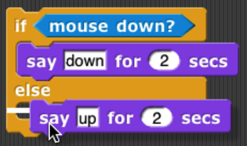 <!-- width="2.311111111111111in" height="1.3666666666666667in" -->For "E-shaped" blocks with more than one
C-shaped slot, only the first slot will wrap around existing blocks in a
script, and only if that C-shaped slot is empty before wrapping. (You
can fill the other slots by dragging blocks into the desired slot.)

## [ ]{.mark} <!-- width="0.3402777777777778in" height="0.24305555555555555in" -->Sprites and Parallelism

Just below the stage is the "new sprite \[\]{.index #new-sprite-button}
" button . Click the button to add a new sprite to the stage. The new
sprite will appear in a random position on the stage, with a random
color, but always facing to the right.

Each sprite has its own scripts. To see the scripts for a particular
sprite in the scripting area, click on the picture of that sprite in the
*sprite corral* \[\]{.index #sprite-corral} in the bottom right corner
of the window. Try putting one of the following scripts in each sprite's
scripting area:

>  <!-- width="1.5506944444444444in" > height="0.99375in" -->
>  <!-- width="1.5416666666666667in" > height="1.1666666666666667in" -->

When you click the green flag, you should see one sprite rotate while
the other moves back and forth. This experiment illustrates the way
different scripts can run in parallel. The turning and the moving happen
together. Parallelism \[\]{.index #parallelism} can be seen with
multiple scripts of a single sprite also. Try this example:

>  <!-- width="1.7291666666666667in" height="0.875in" -->
>  <!-- width="1.7291666666666667in" > height="0.8958333333333334in" -->

When you press the space key, the sprite should move forever in a
circle, because the move and turn blocks are run in parallel. (To stop
the program, click the red stop sign \[\]{.index #stop-sign} at the
right end of the tool bar.)

### Costumes and Sounds

 <!-- width="0.3194444444444444in" height="0.2152777777777778in" --> <!-- width="1.7666666666666666in" height="1.875in" --> <!-- width="0.2916666666666667in" height="0.16666666666666666in" -->To change the appearance of a sprite,
paint or import a new *costume* \[\]{.index #costume} for it. To paint a
costume, click on the Costumes tab above the scripting area, and click
the paint button . The *Paint Editor* that appears is explained on page
[128](#the-paint-editor). There are three ways to import a costume.
First select the desired sprite in the sprite corral. Then, one way is
to click on the file icon in the tool bar , then choose the
"Costumes..."menu item. You will see a list of costumes from the public
media library, and can choose one. The second way, for a costume stored
on your own computer, is to click on the file icon and choose the
"Import..." menu item. You can then select a file in any picture format
(PNG, JPEG, etc.) supported by your browser. The third way is quicker if
the file you want is visible on the desktop: Just drag the file onto the
Snap*!* window. In any of these cases, the scripting area will be
replaced by something like this:

Just above this part of the window is a set of three tabs: Scripts,
Costumes, and Sounds. You'll see that the Costumes tab \[\]{.index
#Costumes-tab} is now selected. In this view, the sprite's *wardrobe*
\[\]{.index #wardrobe} *,* you can choose whether the sprite should wear
its Turtle costume or its Alonzo \[\]{.index #Alonzo} costume. (Alonzo,
the Snap*!* mascot, is named after Alonzo Church \[\]{.index
#Church-Alonzo} , a mathematician who invented the idea of procedures as
data \[\]{.index #procedures-as-data} , the most important way in which
Snap*!* is different from Scratch \[\]{.index #Scratch} .) You can give
a sprite as many costumes as you like, and then choose which it will
wear either by clicking in its wardrobe or by using the or block in a
script. (Every costume has a number as well as a name. The next costume
block selects the next costume by number; after the highest-numbered
costume it switches to costume 1. The Turtle, costume 0, is never chosen
by next costume.) The Turtle costume \[\]{.index #Turtle-costume} is the
only one that changes color to match a change in the sprite's pen color.
Protip: switches to the *previous* costume, wrapping like next costume.

 <!-- width="1.8055555555555556in" height="0.2777777777777778in" --> <!-- width="1.8958333333333333in" height="0.2604166666666667in" --> <!-- width="1.2395833333333333in" height="0.2604166666666667in" -->In addition to its costumes, a sprite can
have *sounds;* the equivalent for sounds of the sprite's wardrobe is
called its *jukebox* \[\]{.index #jukebox} *.* Sound files \[\]{.index
#play-sound-block} can be imported in any format (WAV, OGG, MP3, etc.)
supported by your browser. Two blocks accomplish the task of playing
sounds \[\]{.index #playing-sounds} . If you would like a script to
continue running while the sound is playing, use the block . In
contrast, you can use the block to wait for the sound\'s completion
before continuing the rest of the script*.*

### Inter-Sprite Communication with Broadcast

Earlier we saw an example of two sprites moving at the same time. In a
more interesting program, though, the sprites on stage will *interact*
to tell a story, play a game, etc. Often one sprite will have to tell
another sprite to run a script. Here's a simple example:

 <!-- width="1.71875in" height="0.24938648293963256in" --> <!-- width="0.5694444444444444in" height="1.1111111111111112in" -->
 <!-- width="2.78417760279965in" height="1.5104166666666667in" -->
 <!-- width="1.2430555555555556in" height="0.8611111111111112in" -->
 <!-- width="1.5208333333333333in" height="0.6041666666666666in" -->

 <!-- width="1.7895833333333333in" height="0.2in" --> <!-- width="1.8in" height="0.19166666666666668in" -->In the block, the word "bark" is just an
arbitrary name I made up. When you click on the downward arrowhead in
that input slot, one of the choices (the only choice, the first time) is
"new," which then prompts you to enter a name for the new broadcast.
When this block is run, the chosen message is sent to *every* sprite,
which is why the block is called "broadcast." (But if you click the
right arrow after the message name, the block becomes , and you can
change it to  to send the message just to one sprite.) In this program,
though, only one sprite has a script to run when that broadcast is sent,
namely the dog. Because the boy's script uses broadcast and wait
\[\]{.index #broadcast-and-wait-block} rather than just broadcast, the
boy doesn't go on to his next say block until the dog's script finishes.
That's why the two sprites take turns talking, instead of both talking
at once. In Chapter VII, "Object-Oriented Programming with Sprites,"
you'll see a more flexible way to send a message to a specific sprite
using the tell and ask blocks.

Notice, by the way, that the say block's first input slot is rectangular
rather than oval. This means the input can be any text string, not only
a number. In text input \[\]{.index #text-input} slots, a space
character is shown as a brown dot \[\]{.index #brown-dot} , so that you
can count the number of spaces between words, and in particular you can
tell the difference between an empty slot and one containing spaces. The
brown dots are *not* shown on the stage if the text is displayed.

The stage has its own scripting area. It can be selected by clicking on
the Stage icon at the left of the sprite corral. Unlike a sprite,
though, the stage can't move. Instead of costumes, it has *backgrounds:*
pictures that fill the entire stage area. The sprites appear in front of
the current background. In a complicated project, it's often convenient
to use a script in the stage's scripting area as the overall director of
the action.

## Nesting Sprites \[\]{.index #Nesting-Sprites} : Anchors and Parts {#nesting-sprites-anchors-and-parts}

Sometimes it's desirable to make a sort of "super-sprite" composed of
pieces that can move together but can also be separately articulated.
The classic example is a person's body made up of a torso, limbs, and a
head. Snap*!* allows one sprite to be designated as the *anchor*
\[\]{.index #anchor} of the combined shape, with other sprites as its
*parts* \[\]{.index #parts-(of-nested-sprite)} *.* To set up sprite
nesting \[\]{.index #sprite-nesting} , drag the sprite corral icon of a
*part* sprite onto the stage display (not the sprite corral icon!) of
the desired *anchor* sprite. The precise place where you let go of the
mouse button will be the attachment point of the part on the anchor.

 <!-- width="1.6305555555555555in" height="0.9652777777777778in" -->Sprite nesting is shown in the sprite
corral icons of both anchors and parts:

 <!-- width="1.4444444444444444in" height="1.5625in" -->In
this illustration, it is desired to animate Alonzo's arm. (The arm has
been colored green in this picture to make the relationship of the two
sprites clearer, but in a real project they'd be the same color,
probably.) Sprite, representing Alonzo's body, is the anchor; Sprite(2)
is the arm. The icon for the anchor shows small images of up to three
attached parts at the bottom. The icon for each part shows a small image
of the anchor in its top left corner, and a *synchronous* \[\]{.index
#synchronous-rotation} */dangling rotation* \[\]{.index
#dangling-rotation} *flag* in the top right corner. In its initial,
synchronous setting, as shown above, it means that the when the anchor
sprite rotates, the part sprite also rotates as well as revolving around
the anchor. When clicked, it changes from a circular arrow to a straight
arrow, and indicates that when the anchor sprite rotates, the part
sprite revolves around it, but does not rotate, keeping its original
orientation. (The part can also be rotated separately, using its turn
blocks.) Any change in the position or size of the anchor is always
extended to its parts. Also, cloning the anchor (see Section VII. B)
will also clone all its parts.

*Top: turning the part: the green arm. Bottom: turning the anchor, with
the arm synchronous (left) and dangling (right).*

## Reporter Blocks and Expressions

 <!-- width="1.47in" height="0.52in" --> <!-- width="0.7291666666666666in" height="0.15625in" -->So far, we've used two kinds of block \[\]{.index
#block:reporter} s: hat blocks and command blocks. Another kind is the
*reporter* block \[\]{.index #Reporter-block} , which has an oval shape:
. It's called a "reporter" because when it's run, instead of carrying
out an action, it reports a value that can be used as an input to
another block. If you drag a reporter into the scripting area by itself
and click on it, the value it reports will appear in a speech balloon
next to the block:

When you drag a reporter block over another block's input slot, a white
"halo \[\]{.index #halo} " appears around that input slot, analogous to
the white line that appears when snapping command blocks together:

 <!-- width="2.111111111111111in" height="0.6180555555555556in" -->Don't drop the input over a *red* halo:

That's used for a purpose explained on page
[68](#recursive-calls-to-multiple-input-blocks).

Here's a simple script that uses a reporter block:

Here the x position reporter provides the first input to the say block.
(The sprite's X position \[\]{.index #X-position} is its horizontal
position, how far left (negative values) or right (positive values) it
is compared to the center of the stage. Similarly, the Y position
\[\]{.index #Y-position} is measured vertically, in steps above
(positive) or below (negative) the center.)

You can do arithmetic \[\]{.index #arithmetic} using reporters in the
Operators palette:

The round block rounds 35.3905... to 35, and the + block adds 100 to
that. (By the way, the round block is in the Operators palette, just
like +, but in this script it's a lighter color with black lettering
because Snap*!* alternates light and dark versions of the palette colors
when a block is nested inside another block from the same palette:

 <!-- width="4.854166666666667in" height="1.90625in" -->

 <!-- width="1.9166666666666667in" height="0.23958333333333334in" -->This aid to readability is called *zebra
coloring* \[\]{.index #zebra-coloring} *.*) A reporter block with its
inputs, maybe including other reporter blocks, such as , is called an
*expression* \[\]{.index #expression} *.*

##  Predicates and Conditional Evaluation

 <!-- width="0.6666666666666666in" height="0.1875in" --> <!-- width="1.2083333333333333in" height="0.1875in" -->Most reporters report \[\]{.index #block:predicate}
either a number, like , or a text string, like . A *predicate* is a
special kind of reporter that always reports true or false. Predicate
\[\]{.index #Predicate-block} s have a hexagonal shape \[\]{.index
#hexagonal-shape} :

 <!-- width="1.9479166666666667in" height="0.2604166666666667in" --> <!-- width="1.0729166666666667in" height="0.15625in" -->The special shape is a reminder that predicates don't
generally make sense in an input slot of blocks that are expecting a
number or text. You wouldn't say , although (as you can see from the
picture) Snap*!* lets you do it if you really want. Instead, you
normally use predicates in special hexagonal input slots like this one:

 <!-- width="0.6666666666666666in" height="0.5694444444444444in" -->The C-shaped if block \[\]{.index
#if-block} runs its input script if (and only if) the expression in its
hexagonal input reports true.

 <!-- width="1.59375in" height="0.6145833333333334in" -->A
really useful block \[\]{.index #repeat-until-block} in animation
\[\]{.index #animation} s runs its input script *repeatedly* until a
predicate is satisfied:

 <!-- width="2.2819444444444446in" height="1.46875in" --> <!-- width="2.2916666666666665in" height="0.84375in" -->If, while working on a project, you want to omit
temporarily some commands in a script, but you don't want to forget
where they belong, you can say

Sometimes you want to take the same action whether some condition is
true or false, but with a different input value. For this purpose you
can use the *reporter* if block \[\]{.index #reporter-if-block} :

 <!-- width="4.208333333333333in" height="0.3854166666666667in" -->The technical term for a true or false
value is a "Boolean \[\]{.index #Boolean} " value; it has a capital B
because it's named after a person, George Boole \[\]{.index
#Boole-George} , who developed the mathematical theory of Boolean
values. Don't get confused; a hexagonal block is a *predicate,* but the
value it reports is a *Boolean.*

Another quibble about vocabulary: Many programming languages reserve the
name "procedure \[\]{.index #procedure} " for Commands (that carry out
an action) and use the name "function" for Reporters and Predicates. In
this manual, a *procedure* is any computational capability, including
those that report values and those that don't. Commands, Reporters, and
Predicates are all procedures. The words "a Procedure type" are
shorthand for "Command type, Reporter type, or Predicate type."

 <!-- width="1.375in" height="0.24305555555555555in" --> <!-- width="1.375in" height="0.24305555555555555in" -->If you want to put a *constant* Boolean
\[\]{.index #Boolean-constant} value in a hexagonal slot instead of a
predicate-based expression, hover the mouse over the block and click on
the control that appears:

## Variables

 <!-- width="1.5833333333333333in" height="1.4166666666666667in" -->Try this script:

 <!-- width="1.8854166666666667in" height="1.4375in" -->The input to the move block is an orange oval. To get
it there, drag the orange oval that's part of the for block \[\]{.index
#for-block} :

The orange oval \[\]{.index #orange-oval} is a *variable:* a symbol that
represents a value. (I took this screenshot before changing the second
number input to the for block from the default 10 to 200, and before
dragging in a turn block.) For runs its script input repeatedly, just
like repeat, but before each repetition it sets the variable \[\]{.index
#variable} i to a number starting with its first numeric input, adding 1
for each repetition, until it reaches the second numeric input. In this
case, there will be 200 repetitions, first with i=1, then with i=2, then
3, and so on until i=200 for the final repetition. The result is that
each move draws a longer and longer line segment, and that's why the
picture you see is a kind of spiral. (If you try again with a turn of 90
degrees instead of 92, you'll see why this picture is called a "squiral
\[\]{.index #squiral} .")

 <!-- width="3.1875in" height="1.5in" -->The variable i is
created by the for block, and it can only be used in the script inside
the block's C-slot. (By the way, if you don't like the name i, you can
change it by clicking on the orange oval without dragging it, which will
pop up a dialog window in which you can enter a different name:

"I" isn't a very descriptive name; you might prefer "length" to indicate
its purpose in the script. "I" is traditional because mathematicians
tend to use letters between i and n to represent integer values, but in
programming languages we don't have to restrict ourselves to
single-letter variable names.)

###  Global Variable \[\]{.index #variable:global} s \[\]{.index #global-variable}  {#global-variables}

You can create variables "by hand" that aren't limited to being used
within a single block. At the top of the Variables palette, click the
"Make a variable \[\]{.index #Make-a-variable} " button:

 <!-- width="3.1875in" height="1.84375in" --> <!-- width="2.0520833333333335in" height="2.2708333333333335in" -->This will bring up a dialog window in
which you can give your variable a name:

The dialog also gives you a choice to make the variable available to all
sprites (which is almost always what you want) or to make it visible
only in the current sprite \[\]{.index #sprite-local-variable} . You'd
do that if you're going to give several sprites individual variables
*with the same name,* so that you can share a script between sprites (by
dragging it from the current sprite's scripting area to the picture of
another sprite in the sprite corral), and the different sprites will do
slightly different things when running that script because each has a
different value for that variable name.

 <!-- width="1.6583333333333334in" height="2.2916666666666665in" -->If you give your variable the name "name"
then the Variables palette will look like this:

 <!-- width="1.0416666666666667in" height="0.40625in" -->There's now a "Delete a variable \[\]{.index
#Delete-a-variable} " button, and there's an orange oval with the
variable name in it, just like the orange oval in the for block. You can
drag the variable into any script in the scripting area. Next to the
oval is a checkbox, initially checked. When it's checked, you'll also
see a *variable watcher* \[\]{.index #variable-watcher} on the stage:

When you give the variable a value, the orange box in its watcher
\[\]{.index #watcher} will display the value.

 <!-- width="1.9270833333333333in" height="0.4791666666666667in" -->How *do* you give it a value? You use the
set block \[\]{.index #set-block} :

Note that you *don't* drag the variable's oval into the set block! You
click on the downarrow in the first input slot, and you get a menu of
all the available variable names.

If you do choose "For this sprite only \[\]{.index
#For-this-sprite-only} " when creating a variable, its block in the
palette looks like this:

 <!-- width="0.6583333333333333in" height="0.14166666666666666in" --> The *location*-pin \[\]{.index
#location-pin} icon is a bit of a pun on a sprite-*local* variable
\[\]{.index #variable:sprite-local} . It's shown only in the palette.

### Script Variables

In the name example above, our project is going to carry on an
interaction \[\]{.index #interaction} with the user, and we want to
remember their name throughout the project. That's a good example of a
situation in which a *global* variable \[\]{.index #global-variable}
(the kind you make with the "Make a variable" button) is appropriate.
Another common example is a variable called "score" in a game project.
But sometimes you only need a variable \[\]{.index
#variable:script-local} temporarily, during the running of a particular
script. In that case you can use the script variables block \[\]{.index
#script-variables-block} to make the variable:

As in the for block, you can click on an orange oval in the script
variables block without dragging to change its name. You can also make
more than one temporary variable by clicking on the right arrow at the
end of the block to add another variable oval:

###  <!-- width="2.0833333333333335in" height="0.3020833333333333in" -->Renaming variables \[\]{.index #renaming-variables}  {#renaming-variables}

There are several reasons why you might want to change the name of a
variable:

1.  It has a default name, such as the "a" in script variables or the
    "i" in for.

2.  It conflicts with another name, such as a global variable, that you
    want to use in the same script.

3.  You just decide a different name would be more self-documenting.

In the first and third case, you probably want to change the name
everywhere it appears in that script, or even in all scripts. In the
second case, if you've already used both variables in the script before
realizing that they have the same name, you'll want to look at each
instance separately to decide which ones to rename. Both of these
operations are possible by right-clicking or control-clicking on a
variable oval.

 <!-- width="1.613888888888889in" height="1.507638888888889in" -->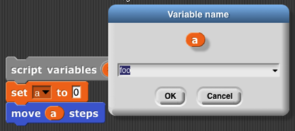 <!-- width="2.826388888888889in" height="1.2569444444444444in" --> <!-- width="1.3819444444444444in" height="0.7430555555555556in" -->If you right-click on an orange oval in a
context in which the variable is *used,* then you are able to rename
just that one orange oval:

 <!-- width="1.7083333333333333in" height="0.8333333333333334in" --> <!-- width="1.4930555555555556in" height="0.7430555555555556in" -->If you right-click on the place where the
variable is *defined* (a script variables block, the orange oval for a
global variable in the Variables palette, or an orange oval that's built
into a block such as the "i" in for), then you are given two renaming
options, "rename" and "rename all." If you choose "rename," then the
name is changed only in that one orange oval, as in the previous case:

 <!-- width="1.4930555555555556in" height="0.7430555555555556in" --> <!-- width="1.7083333333333333in" height="0.8333333333333334in" -->But if you choose "rename all," then the
name will be changed throughout the scope of the variable (the script
for a script variable, or everywhere for a global variable):

### Transient variable \[\]{.index #variable:transient} s {#transient-variables}

 <!-- width="1.2916666666666667in" height="1.0555555555555556in" -->So far we've talked about variables with
numeric values, or with short text strings such as someone's name. But
there's no limit to the amount of information you can put in a variable;
in Chapter IV you'll see how to use *lists* to collect many values in
one data structure, and in Chapter VIII you'll see how to read
information from web sites. When you use these capabilities, your
project may take up a lot of memory \[\]{.index #memory} in the
computer. If you get close to the amount of memory available to Snap*!*,
then it may become impossible to save your project. (Extra space is
needed temporarily to convert from Snap*!* 's internal representation to
the form in which projects are exported or saved.) If your program reads
a lot of data from the outside world that will still be available when
you use it next, you might want to have values containing a lot of data
removed from memory before saving the project. To do this, right-click
or control-click on the orange oval in the Variables palette, to see
this menu:

You already know about the rename options, and help... displays a help
screen about variables in general. Here we're interested in the check
box next to transient. If you check it, this variable's value will not
be saved when you save your project. Of course, you'll have to ensure
that when your project is loaded, it recreates the needed value and sets
the variable to it.

## Debugging \[\]{.index #Debugging}  {#debugging}

Snap*!* provides several tools to help you debug a program. They center
around the idea of *pausing* the running of a script partway through, so
that you can examine the values of variables.

### The pause button

 <!-- width="0.2916666666666667in" height="0.16666666666666666in" --> <!-- width="0.2916666666666667in" height="0.16666666666666666in" -->The simplest way to pause a program is
manually, by clicking the pause button \[\]{.index #button:pause} in the
top right corner of the window. While the program is paused, you can run
other scripts by clicking on them, show variables on stage with the
checkbox next to the variable in the Variables palette or with the show
variable block \[\]{.index #hide-variable-block} , and do all the other
things you can generally do, including modifying the paused scripts by
adding or removing blocks. The button changes shape to and clicking it
again resumes the paused scripts.

### Breakpoint \[\]{.index #breakpoint} s: the pause all block \[\]{.index #pause-all-block}  {#breakpoints-the-pause-all-block}

[]{#pause_all
.anchor} <!-- width="0.8194444444444444in" height="0.2152777777777778in" -->The pause button is great if your program
seems to be in an infinite loop, but more often you'll want to set a
*breakpoint,* a particular point in a script at which you want to pause.
The block, near the bottom of the Control palette, can be inserted in a
script to pause when it is run. So, for example, if your program is
getting an error message in a particular block, you could use pause all
just before that block to look at the values of variables just before
the error happens.

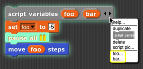 <!-- width="1.8833333333333333in" height="0.9111111111111111in" -->The pause all block turns bright cyan
while paused. Also, during the pause, you can right-click on a running
script and the menu that appears will give you the option to show
watchers for temporary variables of the script:

But what if the block with the error is run many times in a loop, and it
only errors when a particular condition is true---say, the value of some
variable is negative, which shouldn't ever happen. In the iteration
library (see page [25](#libraries-1) for more about how to use
libraries) is a breakpoint block that lets you set a *conditional*
breakpoint, and automatically display the relevant variables before
pausing. Here's a sample use of it:

 <!-- width="1.1944444444444444in" height="1.3333333333333333in" -->(In this contrived example, variable zot
comes from outside the script but is relevant to its behavior.) When you
continue (with the pause button), the temporary variable watchers are
removed by this breakpoint block before resuming the script. The
breakpoint block isn't magic; you could alternatively just put a pause
all inside an if.[^2]

### Visible stepping

 <!-- width="0.2916666666666667in" height="0.16666666666666666in" --> <!-- width="0.5456342957130359in" height="0.1527777777777778in" --> <!-- width="0.2916666666666667in" height="0.16666666666666666in" -->Sometimes you're not exactly sure where
the error is, or you don't understand how the program got there. To
understand better, you'd like to watch the program as it runs, at human
speed rather than at computer speed. You can do this by clicking the
*visible stepping bu* \[\]{.index #button:visible-stepping} *tton*
\[\]{.index #visible-stepping-button} ( ), before running a script or
while the script is paused. The button will light up ( ) and a speed
control slider will appear in the toolbar. When you start or continue
the script, its blocks and input slots will light up cyan one at a time:

In this simple example, the inputs to the blocks are constant values,
but if an input were a more complicated expression involving several
reporter blocks, each of those would light up as they are called. Note
that the input to a block is evaluated before the block itself is
called, so, for example, the 100 lights up before the move.

**. . .**

 <!-- width="0.2916666666666667in" height="0.16666666666666666in" -->The speed of stepping is controlled by
the slider \[\]{.index #slider:stepping-speed} . If you move the slider
all the way to the left, the speed is zero, the pause button turns into
a step button , and the script takes a single step each time you push
it. The name for this is *single stepping* \[\]{.index #single-stepping}
*.*

If several scripts that are visible in the scripting area are running at
the same time, all of them are stepped in parallel. However, consider
the case of two repeat loops with different numbers of blocks. While not
stepping, each script goes through a complete cycle of its loop in each
display cycle, despite the difference in the length of a cycle. In order
to ensure that the visible result of a program on the stage is the same
when stepped as when not stepped, the shorter script will wait at the
bottom of its loop for the longer script to catch up.

When we talk about custom blocks in Chapter III, we'll have more to say
about visible stepping as it affects those blocks.

## Etcetera

This manual doesn't explain every block in detail. There are many more
motion blocks, sound blocks, costume and graphics effects blocks, and so
on. You can learn what they all do by experimentation, and also by
reading the "help screens" that you can get by right-clicking or
control-clicking a block and selecting "help..." from the menu that
appears. If you forget what palette (color) a block is, but you remember
at least part of its name, type control-F and enter the name in the text
block that appears in the palette area.

Here are the primitive blocks that don't exist in Scratch:

 <!-- width="1.25in" height="0.22916666666666666in" --> <!-- width="1.0520833333333333in" height="0.22916666666666666in" --> reports \[\]{.index #pen-trails-block} a
\[\]{.index #pen-vectors-block} new costume consisting of everything
that's drawn on the stage by any sprite. Right-clicking the block in the
scripting area gives the option to change it to if vector logging is
enabled. See page [116](#logpenvectors).

 <!-- width="2.0833333333333335in" height="0.375in" -->Print characters \[\]{.index #write-block} in the given
point size on the stage, at the sprite's position and in its direction.
The sprite moves to the end of the text. (That's not always what you
want, but you can save the sprite's position before using it, and
sometimes you need to know how big the text turned out to be, in turtle
steps.) If the pen is down, the text will be underlined.

 <!-- width="1.2006944444444445in" height="0.5138888888888888in" -->Takes a sprite as input. Like stamp except
that the costume is stamped onto the selected sprite instead of onto the
stage. (Does nothing if the current sprite doesn't overlap the chosen
sprite.)

 <!-- width="1.1916666666666667in" height="0.3388888888888889in" -->Takes a sprite as input. Erases from that
sprite's costume the area that overlaps with the current sprite's
costume. (Does not affect the costume in the chosen sprite's wardrobe,
only the copy currently visible.)

Runs \[\]{.index #warp-block} only this script

until finished. In the Control palette even though it's gray.

 <!-- width="0.5298611111111111in" height="0.5in" --> <!-- width="0.9895833333333334in" height="0.25972222222222224in" --> <!-- width="1.3298611111111112in" height="0.42986111111111114in" --> See page [6](#generic_when). See page
[17](#pause_all).

 <!-- width="1.71in" height="0.23in" -->Reporter version of the if/else primitive command block
\[\]{.index #if-else-reporter-block} . Only one of the two branches is
evaluated, depending on the value of the first input.

 <!-- width="1.83in" height="0.61in" -->Looping block like repeat but \[\]{.index #for-block}
with an index variable \[\]{.index #index-variable} .

 <!-- width="1.3798611111111112in" height="0.28958333333333336in" -->Declare local variables \[\]{.index
#local-variables} in a script. \[\]{.index #script-variables-block}

 <!-- width="0.86in" height="0.19in" --> <!-- width="0.72in" height="0.2in" --> <!-- width="1.17in" height="0.18in" -->
See page [91](#url).

reports the value of a graphics effect \[\]{.index #graphics-effect} .

Constant true \[\]{.index #true-block} or false \[\]{.index
#false-block} value. See page
[12](#predicates-and-conditional-evaluation).

 <!-- width="2.13in" height="0.18in" --> Create a
primitive using JavaScript \[\]{.index #JavaScript} . (This block is
disabled by default; the user must check "Javascript extensions" in the
setting menu *each time* a project is loaded.) \[\]{.index
#pen-down?-block}

The at block \[\]{.index #at-block} lets you examine the screen pixel
\[\]{.index #screen-pixel} directly behind the rotation center of a
sprite, the mouse, or an arbitrary (x,y) coordinate pair dropped onto
the second menu slot. The first five items of the left menu let you
examine the color visible at the position. (The "RGBA" option
\[\]{.index #RGBA-option} reports a list.) The "sprites" option reports
a list of all sprites, including this one, any point of which overlaps
this sprite's rotation center (behind or in front). This is a hyperblock
with respect to its second input.

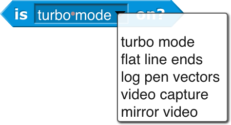 <!-- width="2.4458333333333333in" height="1.3263888888888888in" --> <!-- width="2.3555555555555556in" height="0.3888888888888889in" --> Checks the \[\]{.index
#is-\_-a-\_-?-block} data \[\]{.index #stage-blocks} type \[\]{.index
#type} of a value.

**Blocks only for the Stage:**

Get or set selected global flags.

\[\]{.index #set-flag-block} Turn the \[\]{.index #split-block} text
into a list, using the second input as the delimiter between items. The
default delimiter, indicated by the brown dot in the input slot, is a
single space character. "Letter" puts each character of the text in its
own list item. "Word" puts each word in an item. ( \[\]{.index
#whitespace} Words are separated by any number of consecutive space,
tab, carriage return, or newline characters.) "Line" is a newline
character \[\]{.index #newline-character} (0xa); "tab" is a tab
character \[\]{.index #tab-character} (0x9); "cr" is a carriage return
\[\]{.index #carriage-return-character} (0xd). "Csv" \[\]{.index
#CSV-format} and "json" \[\]{.index #JSON-format} split formatted text
into lists of lists; see page [54](#comma-separated-values). "Blocks"
takes a script as the first input, reporting a list structure
representing the structure of the script. See Chapter XI.

 <!-- width="1.479861111111111in" height="0.18958333333333333in" -->For lists, \[\]{.index #identical-to}
reports true only if its two input values are the very same list, so
changing an item in one of them is visible in the other. (For =, lists
that look the same are the same.) For text strings, uses case-sensitive
comparison, unlike =, which is case-independent.

These *hidden* blocks can be found with the relabel option \[\]{.index
#relabel-option} of any dyadic arithmetic block. They're hidden partly
because writing them in Snap*!* is a good, pretty easy programming
exercise. Note: the two inputs to atan2 \[\]{.index #max-block} are Δ*x*
and Δ*y* in that order, because we measure angles clockwise from north.
Max and min are *variadic;* by clicking the arrowhead, you can provide
additional inputs.

 <!-- width="0.63in" height="0.19in" -->  <!-- width="0.63in" height="0.19in" -->  <!-- width="0.63in" height="0.19in" --> Similarly, these \[\]{.index #≤-block} hidden
predicates can be found by relabeling the relational predicates.

**Metaprogramming (see Chapter XI.** **, page [101](#metaprogramming))**

These blocks support *metaprogramming,* which means manipulating blocks
and scripts as data. This is not the same as manipulating procedures
(see Chapter VI. ), which are what the blocks *mean;* in metaprogramming
the actual blocks, what you see on the screen, are the data. This
capability is new in version 8.0.

**First class list blocks (see Chapter IV, page
[46](#first-class-lists)):**

Numbers from \[\]{.index #numbers-from-block} \[\]{.index
#for-each-block} will count up or down.

The script input to for each can refer to an

item of the list with the item variable.

**\
** <!-- width="0.83in" height="0.21in" -->
 <!-- width="1.43in" height="0.21in" --> report
\[\]{.index #position-block} the sprite or mouse position as a two-item
vector (x,y).

**First class procedure blocks (see Chapter VI, page
[65](#procedures-as-data)):**

**First class continuation blocks (see Chapter X, page
[93](#continuations)):**

**First class sprite, costume, and sound blocks (see Chapter VII, page
[73](#object-oriented-programming-with-sprites)):**

Object is a hyperblock.

**Scenes:**

 <!-- width="2.38in" height="1.32in" -->The major new
feature of version 7.0 is *scenes:* A project can include within it
sub-projects, called scenes, each with its own stage, sprites, scripts,
and so on. This block makes another scene active, replacing the current
one.

Nothing is automatically shared between scenes: no sprites, no blocks,
no variables. But the old scene can send a message to the new one, to
start it running, with optional payload as in broadcast \[\]{.index
#broadcast-block} (page [23](#broadcast)).

 <!-- width="2.54in" height="0.31in" -->In particular,
you can say

> if the new scene expects to be started with a green flag signal.

**\
These aren't new blocks but they have a new feature:**

These accept two-item (x,y) \[\]{.index #points-as-inputs} lists
\[\]{.index #two-item-(xy)-lists} as input, and have extended menus
(also including other sprites): \[\]{.index #to-block}

"Center" means the center of the stage \[\]{.index #center-of-the-stage}
, the point at (0,0). "Direction" is in the point in direction sense,
the direction that would leave this sprite pointing toward another
sprite, the mouse, or the center. "Ray length" is the distance from the
center of this sprite to the nearest point on the other sprite, in the
current direction.

The stop block \[\]{.index #stop-block} has two extra menu choices. Stop
this block is used inside the definition of a custom block to stop just
this invocation of this custom block and continue the script that called
it. Stop all but this script is good at the end of a game to stop all
the game pieces from moving around, but keep running this script to
provide the user's final score. The last two menu choices add a tab at
the bottom of the block because the current script can continue after
it.

The new "pen trails" option is true if the sprite is touching any drawn
or stamped ink on the stage. Also, touching \[\]{.index #touching-block}
will not detect hidden sprites, but a hidden sprite can use it to detect
visible sprites.

 <!-- width="1.0597222222222222in" height="0.2798611111111111in" --> <!-- width="2.433333333333333in" height="0.3in" -->The video block \[\]{.index #video-block} has a snap
option \[\]{.index #snap-option} that takes a snapshot and reports it as
a costume. It is hyperized with
 <!-- width="1.0520833333333333in" height="0.28125in" -->respect to its second input.

The "neg" option \[\]{.index #neg-option} is a monadic \[\]{.index
#of-block-(operators)} \[\]{.index #length-of-text-block} negation
operator \[\]{.index #negation-operator} , equivalent to . "lg" is
log~2~. "id" is the identity function, which reports its input. "sign"
reports 1 for positive input, 0 for zero input, or -1 for negative
input. \[\]{.index #set-background-block}

name changed to clarify that it's different from

\+ and × are *variadic:* they take two or more inputs. If you drop a
list on the arrowheads, the block name changes to sum or product.

I

Extended \[\]{.index #when-I-am-block} mouse interaction events, sensing
clicking, dragging, hovering, etc. The "stopped" option triggers when
all scripts are stopped, as with the stop button; it is useful for
robots whose hardware interface must be told to turn off motors. A when
I am stopped script \[\]{.index #when-I-am-stopped-script} can run only
for a limited time.

[]{#broadcast .anchor}Extended broadcast \[\]{.index #broadcast-block} :
Click the right arrowhead to direct the message to a single sprite or
the stage. Click again to add any value as a payload to the message.

Extended when I receive \[\]{.index #when-I-receive-block} : Click the
right arrowhead to expose a script variable (click on it to change its
name, like any script variable) that will be set to the data of a
matching broadcast. If the first input is set to "any message," then the
data variable will be set to the message, if no payload is included with
the broadcast, or to a two-item list containing the message and the
payload.

 <!-- width="1.68in" height="0.38in" --> If the
input is set to "any key," then a right arrowhead appears:

>  <!-- width="2.25in" > height="0.41944444444444445in" --> <!-- width="1.8194444444444444in" > height="0.3798611111111111in" -->and if you click it, a script variable
> key is created whose value is the key that was pressed. (If the key is
> one that' represented in the input menu by a word or phrase, e.g.,
> "enter" or "up arrow," then the value of key will be that word or
> phrase, *except for* the space character, which is represented as
> itself in key.)\
> []{#ask_lists .anchor}

The RGB(A) \[\]{.index #set-pen-block} option accepts a single number,
which is a grayscale value 0-255; a two-number list, grayscale plus
opacity 0-255; a three-item RGB list, or a four-item RGBA list.

These ask features \[\]{.index #ask-and-wait-block} and more in the
Menus library.

The of block \[\]{.index #of-block-(sensing)} has an extended menu of
attributes of a sprite. Position reports an (x,y) vector. Size reports
the percentage of normal size, as controlled by the set size block in
the Looks category. Left, right, etc. report the stage coordinates of
the corresponding edge of the sprite's bounding box. Variables reports a
list of the names of all variables in scope (global, sprite-local, and
script variables if the right input is a script.

##  Libraries

[]{#libraries-1 .anchor} <!-- width="0.3194444444444444in" height="0.18055555555555555in" -->There are several collections of useful
procedures that aren't Snap*!* primitives, but are provided as
libraries. To include a library in your project, choose the Libraries...
option \[\]{.index #Libraries...-option} in the file ( ) menu.

The library menu is divided into five broad categories. The first is,
broadly, utilities: blocks that might well be primitives. They might be
useful in all kinds of projects.

The second category is blocks related to media computation: ones that
help in dealing with costumes and sounds (a/k/a Jens libraries). There
is some overlap with "big data" libraries, for dealing with large lists
of lists.

The third category is, roughly, specific to non-media applications
(a/k/a Brian libraries). Three of them are imports from other
programming languages: words and sentences from Logo, array functions
from APL, and streams from Scheme. Most of the others are to meet the
needs of the BJC curriculum.

The fourth category is major packages (extensions) provided by users.

The fifth category provides support for hardware devices such as robots,
through general interfaces, replacing specific hardware libraries in
versions before 7.0.

When you click on the one-line description of a library, you are shown
the actual blocks in the library and a longer explanation of its
purpose. You can browse the libraries to find one that will satisfy your
needs.

The libraries and their contents may change, but as of this writing the
list library \[\]{.index #list-library} has these blocks:

 <!-- width="1.8486111111111112in" height="2.4923611111111112in" --> (The lightning bolt \[\]{.index
#lightning-bolt-symbol} before the name in several of these blocks means
that they use compiled HOFs or JavaScript primitives to achieve optimal
speed. They are officially considered experimental.) Remove duplicates
from \[\]{.index #remove-duplicates-from-block} reports a list in which
no two items are equal. The sort \[\]{.index #sort-block} block takes a
list and a two-input comparison predicate, such as \<, and reports a
list with the items sorted according to that comparison. The assoc block
\[\]{.index #assoc-block} is for looking up a key in an *association
list:* a list of two-item lists. In each two-item list, the first is a
*key* and the second is a *value.* The inputs are a key and an
association list; the block reports the first key-value pair whose key
is equal to the input key.

For each item \[\]{.index #for-each-item-block} is a variant of the
primitive version that provides a \# variable \[\]{.index ##-variable}
containing the position in the input list of the currently considered
item. Multimap \[\]{.index #multimap-block} is a version of map that
allows multiple list inputs, in which case the mapping function must
take as many inputs as there are lists; it will be called with all the
first items, all the second items, and so on. Zip takes any number of
lists as inputs; it reports a list of lists: all the first items, all
the second items, and so on. The no-name identity function reports its
input.

Sentence \[\]{.index #sentence-block} and sentence➔list \[\]{.index
#sentence➔list-block} are borrowed from the word and sentence library
(page [27](#wordsent)) to serve as a variant of append that accepts
non-lists as inputs. Printable takes a list structure of any depth as
input and reports a compact representation of the list as a text string.

The iteration, composition library \[\]{.index #iteration-library} has
these blocks:

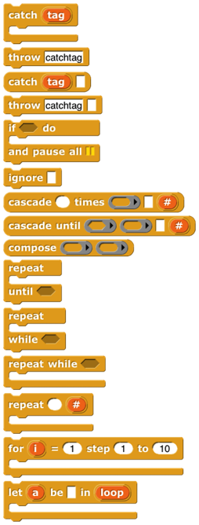 <!-- width="1.6888888888888889in" height="4.75in" -->Catch \[\]{.index #catch-block} and throw \[\]{.index
#throw-block} provide a nonlocal exit facility. You can drag the tag
from a catch block to a throw inside its C-slot, and the throw will then
jump directly out to the matching catch without doing anything in
between.

If do and pause all \[\]{.index #if-do-and-pause-all-block} is for
setting a breakpoint while debugging code. The idea is to put show
variable blocks for local variables in the C-slot; the watchers will be
deleted when the user continues from the pause.

Ignore \[\]{.index #ignore-block} is used when you need to call a
reporter but you don't care about the value it reports. (For example,
you are writing a script to time how long the reporter takes.)

The cascade \[\]{.index #cascade-blocks} blocks take an initial value
and call a function repeatedly on that value,
*f*(*f*(*f*(*f*...(*x*)))).

The compose \[\]{.index #compose-block} block takes two functions and
reports the function *f*(*g*(*x*)).

 <!-- width="1.0444444444444445in" height="0.16111111111111112in" --> <!-- width="3.1527777777777777in" height="0.2986111111111111in" -->The first three repeat blocks \[\]{.index
#repeat-blocks} are variants of the primitive repeat until block, giving
all four combinations of whether the first test happens before or after
the first repetition, and whether the condition must be true or false to
continue repeating. The last repeat block is like the repeat primitive,
but makes the number of repetitions so far available to the repeated
script. The next two blocks are variations on for \[\]{.index
#for-block} : the first allows an explicit step instead of using ±1, and
the second allows any values, not just numbers; inside the script you
say

 <!-- width="3.4409722222222223in" height="1.3611111111111112in" --> <!-- width="3.709722222222222in" height="1.1715277777777777in" -->replacing the grey block in the picture
with an expression to give the next desired value for the loop index.
Pipe allows reordering a nested composition with a left-to-right one:

The stream library \[\]{.index #stream-library} has these blocks:

 <!-- width="3.161111111111111in" height="2.1534722222222222in" -->*Streams* are a special kind of list whose
items are not computed until they are needed. This makes certain
computations more efficient, and also allows the creation of lists with
infinitely many items, such as a list of all the positive integers. The
first five blocks are stream versions of the list blocks in front of
\[\]{.index #in-front-of-stream-block} , item 1 of \[\]{.index
#item-1-of-stream-block} , all but first of \[\]{.index
#all-but-first-of-stream-block} , map \[\]{.index
#map-over-stream-block} , and keep. Show stream \[\]{.index
#show-stream-block} takes a stream and a number as inputs, and reports
an ordinary list of the first *n* items of the stream. Stream
\[\]{.index #Stream-block} is like the primitive list; it makes a finite
stream from explicit items. Sieve \[\]{.index #sieve-block} is an
example block that takes as input the stream of integers starting with 2
and reports the stream of all the prime numbers. Stream with numbers
from is \[\]{.index #Stream-with-numbers-from-block} like the numbers
from block for lists, except that there is no endpoint; it reports an
infinite stream of numbers.

The []{#wordsent .anchor}word and sentence library \[\]{.index
#sentence-library} has these blocks:

 <!-- width="1.679861111111111in" height="3.6430555555555557in" -->This library has the goal of recreating
the Logo approach to handling text: A text isn't best viewed as a string
of characters, but rather as a *sentence*, made of *words,* each of
which is a string of *letters.* With a few specialized exceptions, this
is why people put text into computers: The text is sentences of natural
(i.e., human) language, and the emphasis is on words as constitutive of
sentences. You barely notice the letters of the words, and you don't
notice the spaces between them at all, unless you're proof-reading.
(Even then: Proofreading is *diffciult,* because you see what you expect
to see, what will make the snetence make sense, rather than the
misspelling in front of of your eyes.) Internally, Logo stores a
sentence as a list of words, and a word as a string of letters.
\[\]{.index #all-but-first-blocks}

Inexplicably, the designers of Scratch chose to abandon that tradition,
and to focus on the representation of text as a string of characters.
The one vestige of the Logo tradition \[\]{.index #Logo-tradition} from
which Scratch developed is the block named letter (1) of (world)
\[\]{.index #letter-(1)-of-(world)-block} , rather than character (1) of
(world). Snap*!* inherits its text handling from Scratch.

In Logo, the visual representation of a sentence \[\]{.index
#visual-representation-of-a-sentence} (a list of words) looks like a
natural language sentence: a string of words with spaces between them.
In Snap*!*, the visual representation of a list looks nothing at all
like natural language. On the other hand, representing a sentence as a
string means that the program must continually re-parse the text on
every operation, looking for spaces, treating multiple consecutive
spaces as one, and so on. Also, it's more convenient to treat a sentence
as a list of words rather than a string of words because in the former
case you can use the higher order functions map, keep, and combine on
them. This library attempts to be agnostic as to the internal
representation of sentences. The sentence selectors accept any
combination of lists and strings; there are two sentence constructors,
one to make a string (join words) and one to make a list (sentence).

The selector names come from Logo, and should be self-explanatory.
However, because in a block language you don't have to type the block
name, instead of the terse butfirst or the cryptic bf we spell out "all
but first of" and include "word" or "sentence" to indicate the intended
domain. There's no first letter of block because letter 1 of serves that
need. Join words (the sentence-as-string constructor) is like the
primitive join except that it puts a space in the reported value between
each of the inputs. Sentence (the List-colored sentence-as-list
constructor) accepts any number of inputs, which can be words,
sentences-as-lists, or sentences-as-strings. (If inputs are lists of
lists, only one level of flattening is done.) Sentence reports a list of
words; there will be no empty words or words containing spaces. The four
blocks with right-arrows in their names \[\]{.index
#list-➔-sentence-block} convert back and forth between text strings
(words or sentences) and lists. (Splitting a word into a list of letters
is unusual unless you're a linguist investigating orthography.)
Printable \[\]{.index #printable-block} takes a list (including a deep
list) of words as input and reports a text string in which parentheses
are used to show the structure, as in Lisp/Scheme.

The pixels library \[\]{.index #pixels-library} has one block:

 <!-- width="0.7791666666666667in" height="0.6298611111111111in" -->Costumes are first class data in Snap*!*.
Most of the processing of costume data is done by primitive blocks in
the Looks category. (See page [79](#media-computation-with-costumes).)
This library provides snap \[\]{.index #snap-block} , which takes a
picture using your computer's camera and reports it as a costume.

The bar charts library \[\]{.index #bar-charts-library} has these
blocks:

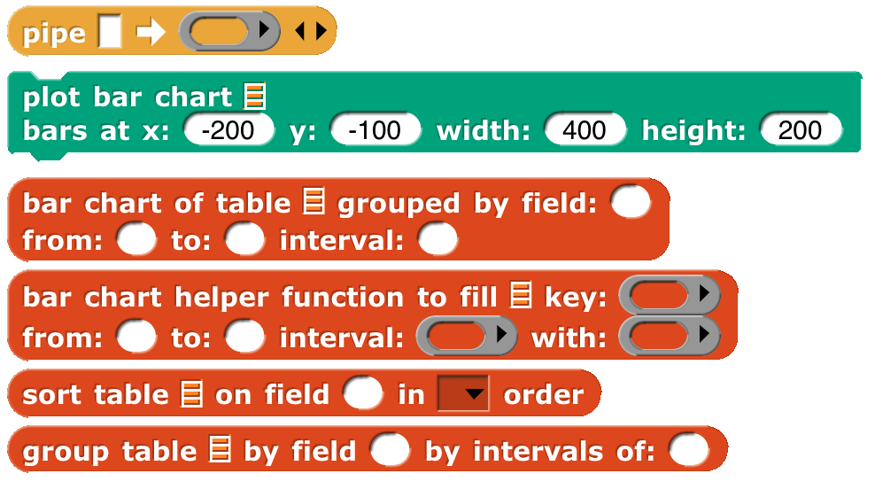 <!-- width="3.4305555555555554in" height="1.9166666666666667in" -->Bar chart \[\]{.index #bar-chart-block}
takes a table (typically from a CSV data set) as input and reports a
summary of the table grouped by the field in the specified column
number. The remaining three inputs are used only if the field values are
numbers, in which case they can be grouped into buckets (e.g., decades,
centuries, etc.). Those inputs specify the smallest and largest values
of interest and, most importantly, the width of a bucket (10 for
decades, 100 for centuries). If the field isn\'t numeric, leave these
three inputs empty or set them to zero. Each string value of the field
is its own bucket, and they appear sorted alphabetically.

Bar chart reports a new table with three columns. The first column
contains the bucket name or smallest number. The second column contains
a nonnegative integer that says how many records in the input table fall
into this bucket. The third column is a subtable containing the actual
records from the original table that fall into the bucket. Plot bar
chart \[\]{.index #plot-bar-chart-block} takes the table reported by bar
chart and graphs it on the stage, with axes labelled appropriately. The
remaining blocks are helpers for those.

If your buckets aren\'t of constant width, or you want to group by some
function of more than one field, load the \"Frequency Distribution
Analysis\" library instead.

The multi-branched conditional library \[\]{.index
#conditional-library:multiple-branch} has these blocks:

 <!-- width="1.85in" height="2.479861111111111in" -->The
catch and throw blocks duplicate ones in the iteration library, and are
included because they are used to implement the others. The cases block
\[\]{.index #cases-block} sets up a multi-branch conditional, similar to
cond in Lisp \[\]{.index #cond-in-Lisp} or switch in C \[\]{.index
#switch-in-C} -family languages. The first branch is built into the
cases block; it consists of a Boolean test in the first hexagonal slot
and an action script, in the C-slot, to be run if the test reports true.
The remaining branches go in the variadic hexagonal input at the end;
each branch consists of an else if block \[\]{.index #else-if-block} ,
which includes the Boolean test and the corresponding action script,
except possibly for the last branch, which can use the unconditional
else block \[\]{.index #else-block} . As in other languages, once a
branch succeeds, no other branches are tested.

### 

The variadic library \[\]{.index #variadic-library} has these blocks:

 <!-- width="1.1965277777777779in" height="0.4166666666666667in" -->These are \[\]{.index #sum-block} versions
\[\]{.index #all-of-block} \[\]{.index #any-of-block} of the associative
operators and, and or that take any number of inputs instead of exactly
two inputs. As with any variadic input, you can also drop a list of
values onto the arrowheads instead of providing the inputs one at a time
As of version 8.0, the arithmetic operators sum, product, minimum, and
maximum are no longer included, because the primitive operators +. ×,
min, and max are themselves variadic.

The colors and crayons library \[\]{.index #colors-library} has these
blocks:

It is intended as a more powerful replacement for the primitive set pen
block \[\]{.index #set-pen-block} , including *first class color*
support; HSL color \[\]{.index #HSL-color} specification as a better
alternative to the HSV that Snap*!* inherits from JavaScript; a "fair
hue \[\]{.index #fair-hue} " scale that compensates for the eye's
grouping a wide range of light frequencies as green while labelling mere
slivers as orange or yellow; the X11/W3C standard color names
\[\]{.index #X11/W3C-color-names} ; RGB in hexadecimal; a linear color
scale (as in the old days, but better) based on fair hues and including
shades (darker colors) and grayscale. Another linear scale is a curated
set of 100 "crayons," explained further on the next page.

 <!-- width="1.1333333333333333in" height="0.23333333333333334in" --> <!-- width="0.95in" height="0.225in" -->Colors
are created by the block (for direct user selection), the color from
block \[\]{.index #color-from-block} to specify a color numerically, or
by , which reports the color currently in use by the pen. The from color
block \[\]{.index #from-color-block} reports names or numbers associated
with a color:

 <!-- width="4.833333333333333in" height="0.4305555555555556in" -->Colors can be created from other colors:
\[\]{.index #mix-colors-block}

The three blocks with pen in their names are improved versions of
primitive Pen blocks. In principle set pen \[\]{.index #set-pen-block} ,
for example, could be implemented using a (hypothetical) set pen to
color composed with the color from block, but in fact set pen benefits
from knowing how the pen color was set in its previous invocation, so
it's implemented separately from color from. Details in Appendix A.

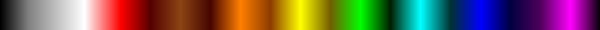 <!-- width="7.5in" height="0.25in" -->The recommended
way to choose a color is from one of two linear scales: the continuous
*color numbers* and the discrete *crayons:*

 <!-- width="7.5in" height="0.25in" -->

 <!-- width="4.0in" height="0.20833333333333334in" -->Color numbers \[\]{.index #color-numbers}
are based on *fair hues,* a modification of the spectrum (rainbow) hue
scale that devotes less space to green and more to orange and yellow, as
well as promoting brown to a real color. Here is the normal hue scale,
for reference:

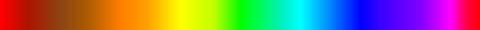 <!-- width="4.0in" height="0.20833333333333334in" -->Here is the fair hue scale:

 <!-- width="5.0in" height="0.20833333333333334in" -->Here is the color number scale:

(The picture is wider so that pure spectral colors line up with the fair
hue scale.)

 <!-- width="5.0in" height="0.20833333333333334in" -->And
here are the 100 crayons \[\]{.index #crayons} :

The color from block, for example, provides different pulldown menus
depending on which scale you choose:

 <!-- width="2.4166666666666665in" height="0.34444444444444444in" -->You can also type the crayon name: There
are many scales:

 <!-- width="4.291666666666667in" height="1.9097222222222223in" -->

The white slot at the end of some of the blocks has two purposes. It can
be used to add a transparency \[\]{.index #transparency} to a color
(0=opaque, 100=transparent):

or it can be expanded to enter three or four numbers for a vector
directly into the block, so these are equivalent:

But note that a transparency number in a four-number RGBA vector is on
the scale 255=opaque, 0=transparent, so the following are *not*
equivalent:

Set pen crayon to provides the equivalent of a box of 100 crayons. They
are divided into color groups, so the menu in the set pen crayon to
input \[\]{.index #set-pen-to-crayon-block} slot has submenus. The
colors are chosen so that starting  <!-- width="4.365277777777778in" height="0.5152777777777777in" -->from crayon 0, change pen crayon by 10
rotates through an interesting, basic set of ten colors:

 <!-- width="4.355555555555555in" height="0.28194444444444444in" -->Using change pen crayon by 5 instead
gives ten more colors, for a total of 20:

(Why didn't we use the colors of the 100-crayon Crayola™ box? A few
reasons, one of which is that some Crayola colors aren't representable
on RGB screens. Some year when you have nothing else to do, look up
"color space" on Wikipedia. Also "crayon." Oh, it's deliberate that
change pen crayon by 5 doesn't include white, since that's the usual
stage background color. White is crayon 14.) Note that crayon 43 is
"Variables"; all the standard block colors are included.

See Appendix A (page [139](#crayons-and-color-numbers)) for more
information.

 <!-- width="1.51in" height="0.9in" -->The **crayon library** \[\]{.index #crayon-library} has
only the crayon features, without the rest of the colors package.

The catch errors library \[\]{.index #catch-errors-library} has these
blocks:

 <!-- width="0.4305555555555556in" height="0.1527777777777778in" --> <!-- width="3.0416666666666665in" height="1.3958333333333333in" -->The safely try block \[\]{.index
#safely-try-block} allows you to handle errors that happen when your
program is run within the program, instead of stopping the script with a
red halo and an obscure error message. The block runs the script in its
first C-slot. If it finishes without an error, nothing else happens. But
if an error happens, the code in the second C-slot is run. While that
second script is running, the variable contains the text of the error
message that would have been displayed if you weren't catching the
error. The error block \[\]{.index #error-block} is sort of the
opposite: it lets your program *generate* an error message, which will
be displayed with a red halo unless it is caught by safely try. Safely
try reporting is the reporter version of safely try.

The text costumes library \[\]{.index #text-costume-library} has only
two blocks:

 <!-- width="0.5347222222222222in" height="0.20833333333333334in" --> <!-- width="1.92in" height="0.4507830271216098in" -->Costume from text reports a costume
\[\]{.index #costume-from-text-block} that can be used with the switch
to  <!-- width="3.2597222222222224in" height="0.18958333333333333in" -->costume block to make a button:

Costume with background \[\]{.index #costume-with-background-block}
reports a costume made from another costume by coloring its background,
taking a color input like the set pen color to RGB(A) block and a number
of turtle steps of padding around the original costume. These two blocks
work together to make even better buttons:

 <!-- width="5.51in" height="0.68in" -->

The text to speech library \[\]{.index #speech-synthesis-library} has
these blocks:

 <!-- width="2.275in" height="0.8in" -->This library interfaces with a capability in up-to-date
browsers, so it might not work for you. \[\]{.index #speak-block} It
works best if the accent matches the text!

The parallelization library \[\]{.index #parallelization-library}
contains these blocks:

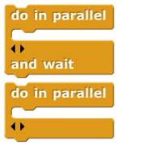 <!-- width="1.179861111111111in" height="1.2597222222222222in" -->The two do in parallel block \[\]{.index
#do-in-parallel-block} s take any number of scripts as inputs. Those
scripts will be run in parallel, like ordinary independent scripts in
the scripting area. The and wait version waits until all of those
scripts have finished before continuing the script below the block.

 <!-- width="1.3777777777777778in" height="1.4833333333333334in" -->The create variables library \[\]{.index
#variables-library} has these blocks: \[\]{.index #does-var-exist-block}

These blocks allow a program to perform the same operation as the

button, making global, sprite local, or script variables, but allowing
the program to compute the variable name(s). It can also set and find
the values of these variables, show and hide their stage watchers,
delete them, and find out if they already exist.

The getters and setters library \[\]{.index #getter/setter-library} has
these blocks:

 <!-- width="1.875in" height="1.05in" --> <!-- width="0.2916666666666667in" height="0.16666666666666666in" -->The purpose of this library is to allow
program access to the settings controlled by user interface elements,
such as the settings menu. The setting block \[\]{.index #setting-block}
reports a setting; the set flag block \[\]{.index #set-flag-block} sets
yes-or-no options that have checkboxes in the user interface, while the
set value block \[\]{.index #set-value-block} controls settings with
numeric or text values, such as project name.

Certain settings are ordinarily remembered on a per-user basis, such as
the "zoom blocks" value. But when these settings are changed by this
library, the change is in effect only while the project using the
library is loaded. No permanent changes are made. Note: this library has
not been converted for version 7.0, so you'll have to enable Javascript
extensions to use it.

The bignums, rationals, complex #s library \[\]{.index
#infinite-precision-integer-library} has these blocks:

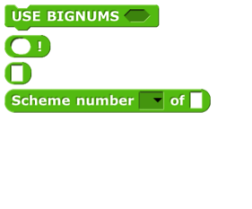 <!-- width="1.875in" height="1.55in" -->The USE BIGNUMS
block \[\]{.index #BIGNUMS-block} takes a Boolean input, to turn the
infinite precision feature on or off. When on, all of the arithmetic
operators are redefined to accept and report integers of any number of
digits (limited only by the memory of your computer) and, in fact, the
entire Scheme numeric tower, with exact rationals and with complex
numbers. The Scheme number block \[\]{.index #Scheme-number-block} has a
list of functions applicable to Scheme numbers, including subtype
predicates such as rational? and infinite?, and selectors such as
numerator and real-part.

The ! block \[\]{.index #!-block} computes the factorial function
\[\]{.index #factorial-} , useful to test whether bignums are turned on.
Without bignums:

With bignums:

The 375-digit value of 200! isn't readable on this page, but if you
right-click on the block and choose "result pic," you can open the
resulting picture in a browser window and scroll through it. (These
values end with a bunch of zero digits. That's not roundoff error; the
prime factors of 100! and 200! include many copies of 2 and 5.) The
block with no name \[\]{.index #block-with-no-name} is a way to enter
things like 3/4 and 4+7i into numeric input slots by converting the slot
to Any type.

The strings, multi-line input library \[\]{.index
#string-processing-library} provides these blocks: \[\]{.index
#case-independent-comparisons-block}

 <!-- width="3.9375in" height="2.0416666666666665in" -->All of these could be written in Snap*!*
itself, but these are implemented using the corresponding JavaScript
library functions directly, so they run fast. They can be used, for
example, in scraping data from a web site. The command use
case-independent comparisons applies only to this library. The multiline
block \[\]{.index #multiline-block} accepts and reports a text input
that can include newline characters.

The animation library \[\]{.index #animation-library} has these blocks:

 <!-- width="4.0125in" height="2.33125in" -->Despite the
name, this isn't only about graphics; you can animate the values of a
variable, or anything else that's expressed numerically.

 <!-- width="0.9652777777777778in" height="0.19444444444444445in" -->The central idea of this library is an
*easing function* \[\]{.index #easing-function} *,* a reporter whose
domain and range are real numbers between 0 and 1 inclusive. The
function represents what fraction of the "distance" (in quotes because
it might be any numeric value, such as temperature in a simulation of
weather) from here to there should be covered in what fraction of the
time. A linear easing \[\]{.index #easing-block} function means steady
progression. A quadratic easing function means starting slowly and
accelerating. (Note that, since it's a requirement that *f*(0)=0 and
*f*(1)=1, there is only one linear easing function, *f*(*x*)=*x*, and
similarly for other categories.) The block reports some of the common
easing functions.

 <!-- width="4.631944444444445in" height="0.6319444444444444in" -->The two Motion blocks in this library
animate a sprite. Glide always animates the sprite's motion. Animate's
first pulldown menu input allows you to animate horizontal or vertical
motion, but will also animate the sprite's direction or size. The
animate block \[\]{.index #animate-block} in Control lets you animate
any numeric quantity with any easing function. The getter and setter
inputs are best explained by example:

 <!-- width="3.4097222222222223in" height="0.2569444444444444in" -->is equivalent to

The other blocks in the library are helpers for these four.

The serial ports library \[\]{.index #serial-ports-library} contains
these blocks:

 <!-- width="1.7326388888888888in" height="1.0347222222222223in" -->It is used to allow hardware developers to
control devices such as robots that are

connected to your computer via a serial port.

The frequency distribution analysis library \[\]{.index
#frequency-distribution-analysis-library} has these blocks:

 <!-- width="4.027083333333334in" height="2.3958333333333335in" -->

This is a collection of tools for analyzing large data sets and plotting
histogram \[\]{.index #histogram} s of how often some value is found in
some column of the table holding the data.

For more information go here:

https://tinyurl.com/jens-data

The audio comp library \[\]{.index #sound-manipulation-library} includes
these blocks:

 <!-- width="3.5416666666666665in" height="2.98125in" -->This library takes a sound, one that you record or
one from our collection of sounds, and manipulates it by systematically
changing the intensity of the samples in the sound and by changing the
sampling rate at which the sound is reproduced. Many of the blocks are
helpers for the plot sound block, used to plot the waveform of a sound
\[\]{.index #plot-sound-block} . The play sound (primitive) block
\[\]{.index #play-block} plays a sound. \_\_ Hz for \[\]{.index
#Hz-for-block} reports a sine wave as a list of samples.

The web services library \[\]{.index #web-services-library} has these
blocks:

 <!-- width="3.4097222222222223in" height="1.1041666666666667in" -->The first block is a generalization of the
primitive url block \[\]{.index #url-block} , allowing more control over
the various options in web requests: GET, POST, PUT, and DELETE, and
fine control over the content of the message sent to the server. Current
location \[\]{.index #current-location-block} reports your latitude and
longitude. Listify \[\]{.index #listify-block} takes some text in JSON
format (see page [54](#multi-dimensional-lists-and-json)) and converts
it to a structured list. Value at key \[\]{.index #value-at-key-block}
looks up a key-value pair in a (listified) JSON dictionary. The
key:value: block \[\]{.index #key\\:value\\:-block} is just a
constructor for an abstract data type used with the other blocks

The database library \[\]{.index #database-library} contains these
blocks:

 <!-- width="2.263888888888889in" height="1.2222222222222223in" -->It is used to keep data that persist from
one Snap*!* session to the next, if you use the same browser and the
same login.

The world map library \[\]{.index #map-library} has these blocks:

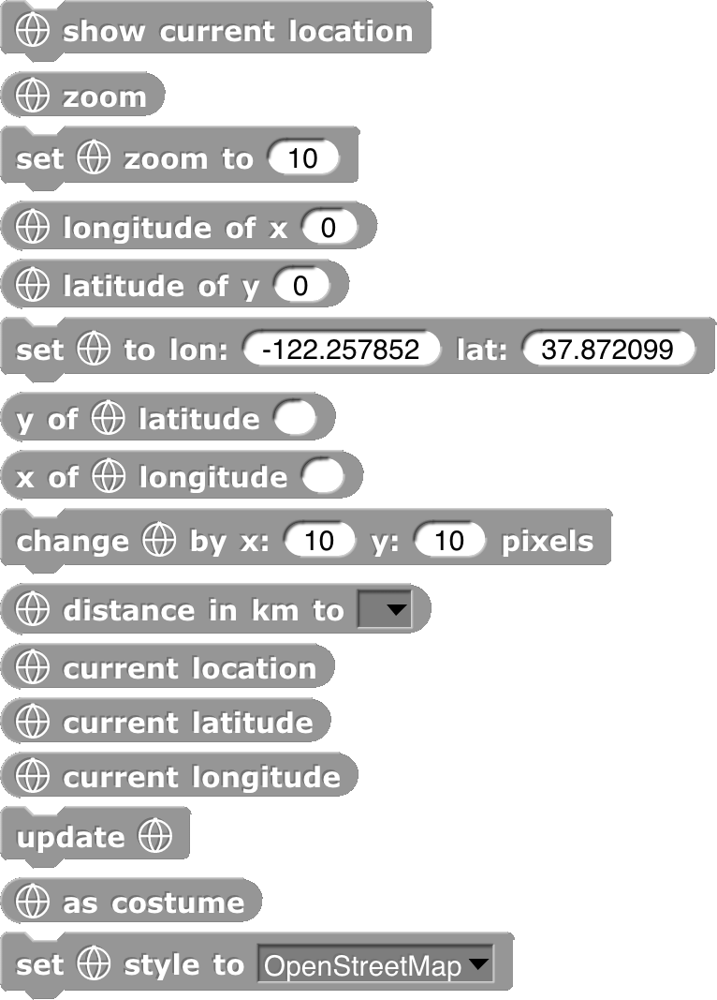 <!-- width="2.442361111111111in" height="3.4027777777777777in" -->Using any of the command blocks puts a map
on the screen, in a layer in front of the stage's background but behind
the pen trails layer (which is in turn behind all the sprites). The
first block asks your browser for your current physical location, for
which you may be asked to give permission. The next two blocks get and
set the map's zoom amount; the default zoom of 10 fits from San Francisco
not quite down to Palo Alto on the screen. A zoom of 1 fits almost the
entire world. A zoom of 3 fits the United States; a zoom of 5 fits
Germany. The zoom can be changed in half steps, i.e., 5.5 is different
from 5, but 5.25 isn't.

The next five blocks convert between stage coordinates (pixels) and
Earth coordinates (latitude and longitude). The change by x: y: block
shifts the map relative to the stage. The distance to block measures the
map distance (in meters) between two sprites. The three reporters with
current in their names find *your* actual location, again supposing that
geolocation is enabled on your device. Update redraws the map; as
costume reports the visible section of the map as a costume. Set style
allows things like satellite pictures.

The APL primitives library contains \[\]{.index #APL-library} these
blocks:

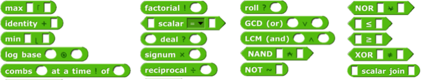 <!-- width="5.733333333333333in" height="1.1133333333333333in" -->

 <!-- width="6.453333333333333in" height="2.04in" -->

For more information about APL, see Appendix B (page
[148](#appendix-b.-apl-features)).

The  <!-- width="1.2in" height="0.4895833333333333in" -->**list comprehension library** \[\]{.index
#list-comprehension-library} has one block, zip. Its first input is a
function of two inputs. The two Any-type inputs are deep lists (lists of
lists of...) interpreted as trees, and the function is called with every
possible combination of a leaf node of the first tree and a leaf node of
the second tree. But instead of taking atoms (non-lists) as the leaves,
zip allows the leaves of each tree to be vectors (one-dimensional
lists), matrices (two-dimensional lists), etc. The Number-type inputs
specify the leaf dimension for each tree, so the function input might be
called with a vector from the first tree and an atom from the second
tree.

 <!-- width="0.89in" height="1.51in" -->The
**bitwise library** \[\]{.index #bitwise-library} provides bitwise logic
functions; each bit of the reported value is the result of applying the
corresponding Boolean function to the corresponding bits of the
input(s). The Boolean functions are not for ¬, and for ∧, or for ∨, and
xor (exclusive or) for ⊻. The remaining functions shift their first
input left or right by the number of bits given by the second input.
\<\< is left shift, \>\> is arithmetic right shift (shifting in one bits
from the left), and \>\>\> is logical right shift (shifting in zero bits
from the left). If you don't already know what these mean, find a
tutorial online.

The **MQTT library** \[\]{.index #MQTT-library} supports the Message
Queuing Telemetry Transport protocol, for connecting with IOT devices.
See <https://mqtt.org/> for more information.

The **Signada library** \[\]{.index #Signada-library} allows you to
control a microBit or similar device that works with the Signada
MicroBlocks project.

 <!-- width="3.39in" height="1.9in" -->

The **menus library** \[\]{.index #menus-library} provides the ability
to display hierarchical menus on the stage, using the ask block's
ability to take lists as inputs. See page [24](#ask_lists).

The **SciSnap*!* library** \[\]{.index #SciSnap!\--library} and the
**TuneScope library** \[\]{.index #TuneScope-library} are too big to
discuss here and are documented separately at
<http://emu-online.de/ProgrammingWithSciSnap.pdf> and
<https://maketolearn.org/creating-art-animations-and-music/>
respectively.

