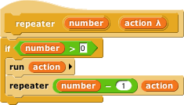
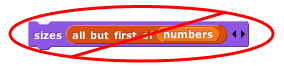
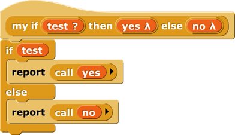

# Procedures as Data

## Call and Run

 <!-- width="3.6729166666666666in" height="1.5833333333333333in" -->In the for block \[\]{.index #for-block}
example above, the input named action has been declared as type "Command
(C-shaped)"; that's why the finished block is C-shaped. But how does the
block actually tell Snap*!* to carry out the commands inside the C-slot?
Here is a simple version of the block script:

This is simplified because it assumes, without checking, that the ending
value is greater than the starting value; if not, the block should
(depending on the designer's purposes) either not run at all, or change
the variable by −1 for each repetition instead of by 1.

 <!-- width="0.5in" height="0.15625in" -->The important
part of this script is the run block \[\]{.index #run-block} near the
end. This is a Snap*!* built-in command block that takes a Command-type
value (a script) as its input, and carries out its instructions. (In
this example, the value of the input is the script that the user puts in
the C-slot of the my for block.) There is a similar call reporter block
for invoking a Reporter or Predicate block. The call \[\]{.index
#call-block-} and run blocks are at the heart of Snap*!*'s first class
procedure \[\]{.index #first-class-procedures} feature; they allow
scripts and blocks to be used as data---in this example, as an input to
a block---and eventually carried out under control of the user's
program.

Here's another example, this time using a Reporter-type input in a map
block (see page [50](#map)): \[\]{.index #map-block}

Here we are calling the Reporter "multiply by 10" three times, once with
each item of the given list as its input, and collecting the results as
a list. (The reported list will always be the same length as the input
list.) Note that the multiplication block has two inputs, but here we
have specified a particular value for one of them (10), so the call
block knows to use the input value given to it just to fill the other
(empty) input slot in the multiplication block. In the my map
definition, the input function is declared to be type Reporter, and data
is of type List.

### Call/Run with inputs

 <!-- width="1.8125in" height="0.20833333333333334in" -->The call block (like the run block) has a
right arrowhead at the end; clicking on it adds the phrase "with inputs"
and then a slot into which an input can be inserted:

If the left arrowhead is used to remove the last input slot, the "with
inputs \[\]{.index #with-inputs} " disappears also. The right arrowhead
can be clicked as many times as needed for the number of inputs required
by the reporter block being called.

 <!-- width="2.7291666666666665in" height="0.31805555555555554in" -->If the number of inputs given to call
(not counting the Reporter-type input that comes first) is the same as
the number of empty input slots \[\]{.index #empty-input-slots-filling}
, then the empty slots are filled from left to right with the given
input values. If call is given exactly one input, then *every* empty
input slot of the called block is filled with the same value:

If the number of inputs provided is neither one nor the number of empty
slots, then there is no automatic filling of empty slots. (Instead you
must use explicit parameters in the ring, as discussed in Section C
below.)

An even more important thing to notice about these examples is the
*ring* \[\]{.index #ring-gray} around the Reporter-type input slots in
call and map above. This notation indicates that *the block itself,* not
the number or other value that the block would report when called, is
the input. If you want to use a block itself in a non-Reporter-type
(e.g., Any-type) input slot, you can enclose it explicitly in a ring,
found at the top of the Operators palette.

As a shortcut, if you right-click or control-click on a block (such as
the + block in this example), one of the choices in the menu that
appears is "ringify \[\]{.index #ringify} " and/or "unringify
\[\]{.index #unringify} ." The ring indicating a Reporter-type or
Predicate-type input slot is essentially the same idea for reporters as
the C-shaped input slot with which you're already familiar; with a
C-shaped slot, it's *the script* you put in the slot that becomes the
input to the C-shaped block.

There are three ring shapes. All are oval on the outside, indicating
that the ring reports a value, the block or script inside it, but the
inside shapes are command, reporter, or predicate, indicating what kind
of block or script is expected. Sometimes you want to put something more
complicated than a single reporter inside a reporter ring; if so, you
can use a script, but the script must report a value, as in a custom
reporter definition.

### Variables in Ring Slots

Note that the run block \[\]{.index #variables-in-ring-slots} in the
definition of the my for block (page [65](#call-and-run)) doesn't have a
ring around its input variable action. When you drag a variable into a
ringed input slot, you generally *do* want to use *the value of* the
variable, which will be the block or script you're trying to run or
call, rather than the orange variable reporter itself. So Snap*!*
automatically removes the ring in this case. If you ever do want to use
the variable *block itself,* rather than the value of the variable, as a
Procedure-type input, you can drag the variable into the input slot,
then control-click or right-click it and choose "ringify" from the menu
that appears. (Similarly, if you ever want to call a function that will
report a block to use as the input, such as item 1 of applied to a list
*of blocks,* you can choose "unringify" from the menu. Almost all the
time, though, Snap*!* does what you mean without help.)

## Writing Higher Order Procedures

A *higher order procedure* \[\]{.index #higher-order-procedure} is one
that takes another procedure as an input, or that reports a procedure.
In this document, the word "procedure \[\]{.index #procedure} "
encompasses scripts, individual blocks, and nested reporters. (Unless
specified otherwise, "reporter" includes predicates. When the word is
capitalized inside a sentence, it means specifically oval-shaped blocks.
So, "nested reporters" includes predicates, but "a Reporter-type input"
doesn't.)

Although an Any-type input slot (what you get if you use the small
input-name dialog box) will accept a procedure input, it doesn't
automatically ring the input as described above. So the declaration of
Procedure-type inputs makes the use of your custom higher order block
much more convenient.

 <!-- width="2.375in" height="1.3541666666666667in" -->Why would you want a block to take a
procedure as input? This is actually not an obscure thing to do; the
primitive conditional and looping blocks (the C-shaped ones in the
Control palette) take a script as input. Users just don't usually think
about it in those terms! We could write the repeat block \[\]{.index
#repeat-block} as a custom block this way, if Snap*!* didn't already
have one:

The lambda (λ) next to action in the prototype indicates that this is a
C-shaped block \[\]{.index #C-shaped-block} , and that the script
enclosed by the C when the block is used is the input named action in
the body of the script. The only way to make sense of the variable
action is to understand that its value is a script.

 <!-- width="2.5833333333333335in" height="1.6041666666666667in" -->To declare an input to be Procedure-type,
open the input name dialog as usual, and click on the arrowhead:

Then, in the long dialog, choose the appropriate Procedure type. The
third row of input types has a ring in the shape of each block type
(jigsaw for Commands, oval for Reporters, and hexagonal for Predicates).
In practice, though, in the case of Commands it's more common to choose
the C-shaped slot on the fourth row, because this "container" for
command scripts is familiar to Scratch users. Technically the C-shaped
slot is an *unevaluated* procedure type, something discussed in Section
E below. The two Command-related input types (inline and C-shaped) are
connected by the fact that if a variable, an item (#) of \[list\] block,
or a custom Reporter block is dropped onto a C-shaped slot of a custom
block, it turns into an inline slot, as in the repeater block's
recursive call above. (Other built-in Reporters can't report scripts, so
they aren't accepted in a C-shaped slot.)

 <!-- width="0.19791666666666666in" height="0.19791666666666666in" --> <!-- width="3.6527777777777777in" height="2.75455271216098in" -->\
Why would you ever choose an inline Command slot rather than a C shape?
Other than the run block
 <!-- width="2.1145833333333335in" height="0.46875in" -->discussed below, the only case I can think of is
something like the C \[\]{.index #C-programming-language} /C++/Java
\[\]{.index #Java-programming-language} for loop, which actually has
*three* command script inputs (and one predicate input), only one of
which is the "featured" loop body:

Okay, now that we have procedures as inputs to our blocks, how do we use
them? We use the blocks run \[\]{.index #run-block} (for commands) and
call \[\]{.index #call-block-} (for reporters). The run block's script
input is an inline ring, not C-shaped, because we anticipate that it
will be rare to use a specific, literal script as the input. Instead,
the input will generally be a variable whose *value* is a script.

The run and call blocks have arrowheads at the end that can be used to
open slots for inputs to the called procedures. How does Snap*!* know
where to use those inputs? If the called procedure (block or script) has
empty input slots, Snap*!* "does the right thing." This has several
possible meanings:

 <!-- width="3.4479166666666665in" height="0.34405949256342955in" -->1. If the number of empty slots
\[\]{.index #empty-input-slots-filling} is exactly equal to the number
of inputs provided, then Snap*!* fills the empty slots from left to
right:

2\. If exactly one input is provided, Snap*!* will fill any number of
empty slots with it:

 <!-- width="2.8020833333333335in" height="0.30694444444444446in" -->

3\. Otherwise, Snap*!* won't fill any slots, because the user's
intention is unclear.

If the user wants to override these rules, the solution is to use a ring
\[\]{.index #ring-gray} with explicit input names that can be put into
the given block or script to indicate how inputs are to be used. This
will be discussed more fully below.

### Recursive Calls to Multiple-Input Blocks

A relatively rare situation not yet considered here is the case of a
recursive block that has a variable number of inputs. Let's say the user
of your project calls your block with five inputs one time, and 87
inputs another time. How do you write the recursive call \[\]{.index
#recursive-call} to your block when you don't know how many inputs to
give it? The answer is that you collect the inputs in a list \[\]{.index
#input-list} (recall that, when you declare an input name to represent a
variable number of inputs, your block sees those inputs as a list of
values in the first place), and then, in the recursive call, you drop
that input list *onto the arrowheads* that indicate a variable-input
slot \[\]{.index #variable-input-slot} , rather than onto the input
slot:

 <!-- width="0.13194444444444445in" height="0.13194444444444445in" --> <!-- width="2.501388888888889in" height="1.9444444444444444in" --> <!-- width="2.225in" height="1.1708333333333334in" --> <!-- width="2.2756944444444445in" height="1.5972222222222223in" -->\
Note that the halo \[\]{.index #halo:red} you see while dragging onto
the arrowheads \[\]{.index #arrowheads} is red \[\]{.index #red-halo}
instead of white, and covers the input slot as well as the arrowheads.
And when you drop the expression onto the arrowheads, the words "input
list \[\]{.index #input-list} :" are added to the block text and the
arrowheads disappear (in this invocation only) to remind you that the
list represents all of the multiple inputs, not just a single input. The
items in the list are taken *individually* as inputs to the script.
Since numbers is a list of numbers, each individual item is a number,
just what sizes wants. This block will take any number of numbers as
inputs, and will make the sprite grow and shrink accordingly:

 <!-- width="2.9583333333333335in" height="0.6875in" -->The user of this block calls it with any number of
*individual numbers* as inputs. But inside the definition of the block,
all of those numbers form *a* *list* that has a single input name,
numbers. This recursive definition first checks to make sure there are
any inputs at all. If so, it processes the first input (item 1 of the
list), then it wants to make a recursive call with all but the first
number. But sizes doesn't take a list as input; it takes numbers as
inputs! So this would be wrong:

## Formal Parameters

The rings around Procedure-type inputs \[\]{.index #input-name} have an
arrowhead at the right. Clicking the arrowhead allows you to give the
inputs to a block or script explicit names \[\]{.index #name-input} ,
instead of using empty input slots as we've done until now.

The names #1 \[\]{.index ##1} , #2, etc. are provided by default, but
you can change a name by clicking on its orange oval in the input names
list. Be careful not to *drag* the oval when clicking; that's how you
use the input inside the ring. The names of the input variables are
called the *formal parameters* \[\]{.index #formal-parameters} of the
encapsulated procedure.

 <!-- width="4.322916666666667in" height="0.45416666666666666in" -->Here's a simple but contrived example
using explicit names to control which input goes where inside the ring:

Here we just want to put one of the inputs into two different slots. If
we left all three slots empty, Snap*!* would not fill any of them,
because the number of inputs provided (2) would not match the number of
empty slots (3).

 <!-- width="4.679861111111111in" height="3.0180555555555557in" -->Here is a more realistic, much more
advanced example \[\]{.index #crossproduct} :

 <!-- width="4.347222222222222in" height="1.4027777777777777in" -->

This is the definition of a block that takes any number of lists, and
reports the list of all possible combinations of one item from each
list. The important part for this discussion is that near the bottom
there are two *nested* calls \[\]{.index #nested-calls} to map, the
higher order function \[\]{.index #higher-order-function} that applies
an input function to each item of an input list. In the inner block, the
function being mapped is in front of, and that block takes two inputs.
The second, the empty List-type slot, will get its value in each call
from an item of the inner map's list input. But there is no way for the
outer map to communicate values to empty slots of the in front of block.
We must give an explicit name, newitem, to the value that the outer map
is giving to the inner one, then drag that variable into the in front of
block.

By the way, once the called block provides names for its inputs, Snap*!*
will not automatically fill empty slots \[\]{.index
#empty-input-slots-filling} , on the theory that the user has taken
control. In fact, that's another reason you might want to name the
inputs explicitly: to stop Snap*!* from filling a slot that should
really remain empty.

## Procedures as Data

 <!-- width="5.1875in" height="1.65625in" -->Here's an
example of a situation in which a procedure must be explicitly marked as
data by pulling a ring from the Operators palette and putting the
procedure (block or script) inside it:

Here, we are making a list of procedures \[\]{.index
#list-of-procedures} . But the list block accepts inputs of any type, so
its input slots are not ringed. We must say explicitly that we want the
block *itself* as the input, rather than whatever value would result
from evaluating the block.

 <!-- width="3.8333333333333335in" height="0.84375in" -->Besides the list block in the example above, other
blocks into which you may want to put procedures are set (to set the
value of a variable to a procedure), say and think (to display a
procedure to the user), and report (for a reporter that reports a
procedure):

## Special Forms

 <!-- width="2.4993055555555554in" height="0.27847222222222223in" --> <!-- width="2.402083333333333in" height="1.4270833333333333in" -->The primitive if else \[\]{.index
#if-else-block-} block has two C-shaped command slots and chooses one or
the other depending on a Boolean test. Because Scratch doesn't emphasize
functional programming, it lacks a corresponding reporter block to
choose between two expressions. Snap*!* has one, but we could write our
own:

 <!-- width="4.291666666666667in" height="0.8486111111111111in" --> <!-- width="3.818985126859143in" height="0.27433070866141734in" -->Our block works for these simple
examples, but if we try to use it in writing a recursive operator
\[\]{.index #recursive-operator} , it'll fail:

The problem is that when any block is called, all of its inputs are
computed (evaluated) before the block itself runs. The block itself
knows only the values of its inputs, not what expressions were used to
compute them. In particular, all of the inputs to our if then else block
are evaluated first thing. That means that even in the base case,
factorial \[\]{.index #factorial} will try to call itself recursively,
causing an infinite loop. We need our if then else block to be able to
select only one of the two alternatives to be evaluated.

We have a mechanism to allow that: declare the then and else inputs to
be of type Reporter rather than type Any. Then, when calling the block,
those inputs will be enclosed in a ring so that the expressions
themselves, rather than their values, become the inputs:

 <!-- width="1.1145833333333333in" height="0.6979166666666666in" --> <!-- width="4.520833333333333in" height="1.0229166666666667in" --> <!-- width="2.6173611111111112in" height="1.5104166666666667in" -->

In this version, the program works, with no infinite loop. But we've
paid a heavy price: this reporter-if is no longer as intuitively obvious
as the Scratch command-if. You have to know about procedures as data,
about rings, and about a trick to get a constant value in a ringed slot
\[\]{.index #constant-functions} . (The id block \[\]{.index #id-block}
implements the identity function \[\]{.index #identity-function} , which
reports its input.[^6] We need it because rings take only reporters as
input, not numbers.) What we'd like is a reporter-if that *behaves* like
this one, delaying the evaluation of its inputs, but *looks* like our
first version, which was easy to use except that it didn't work.

Such blocks are indeed possible. A block that seems to take a simple
expression as input, but delays the evaluation of that input by wrapping
an "invisible ring" around it (and, if necessary, an id-like
transformation of constant data into constant functions) is called a
*special form* \[\]{.index #special-form} . To turn our if block into a
special form, we edit the block's prototype, declaring the inputs yes
and no to be of type "Any (unevaluated) \[\]{.index
#Any-(unevaluated)-type} " instead of type Reporter. The script for the
block is still that of the second version, including the use of call to
evaluate either yes or no but not both. But the slots appear as white
Any-type rectangles, not Reporter-type rings, and the factorial block
will look like our first attempt.

In a special form's prototype, the unevaluated \[\]{.index
#unevaluated-type} input slot(s) are indicated by a lambda (λ) next to
the input name, just as if they were declared as Procedure type
\[\]{.index #Procedure-type} . They *are* Procedure type, really;
they're just disguised to the user of the block.

Special forms trade off implementor sophistication \[\]{.index
#sophistication} for user sophistication. That is, you have to
understand all about procedures as data to make sense of the special
form implementation of my if then else. But any experienced Scratch
programmer can *use* my if then else without thinking at all about how
it works internally.

### Special Forms in Scratch

Special forms are actually not a new invention in Snap*!*. Many of
Scratch's conditional and looping blocks are really special forms. The
hexagonal input slot in the if block is a straightforward Boolean value,
because the value can be computed once, before the if block makes its
decision about whether or not to run its action input. But the forever
if, repeat until, and wait until blocks' inputs can't be Booleans; they
have to be of type "Boolean (unevaluated) \[\]{.index
#Boolean-(unevaluated)-type} ," so that Scratch can evaluate them over
and over again. Since Scratch doesn't have custom C‑shaped blocks, it
can afford to handwave away the distinction between evaluated and
unevaluated Booleans, but Snap*!* can't. The pedagogic value of special
forms is proven by the fact that no Scratcher ever notices that there's
anything strange about the way in which the hexagonal inputs in the
Control blocks are evaluated.

Also, the C-shaped slot \[\]{.index #C-shaped-slot} familiar to Scratch
users is an unevaluated procedure type; you don't have to use a ring to
keep the commands in the C-slot from being run before the C-shaped block
is run. Those commands themselves, not the result of running them, are
the input to the C-shaped Control block. (This is taken for granted by
Scratch users, especially because Scratchers don't think of the contents
of a C-slot as an input at all.) This is why it makes sense that
"C‑shaped" is on the fourth row of types in the long form input dialog,
with other unevaluated types.

