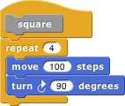

#  Continuations

Blocks are usually used within a script. The *continuation* of a block
within a particular script is the part of the computation that remains
to be completed after the block does its job. A continuation
\index{continuation} can be represented as a ringed script.
Continuations are always part of the interpretation of any program in
any language, but usually these continuations are implicit in the data
structures of the language interpreter or compiler. Making continuations
explicit is an advanced but versatile programming technique that allows
users to create control structures such as nonlocal exit and
multithreading.

In the simplest case, the
continuation of a command block may just be the part of the script after
the block. For example, in the script

the continuation of the move
100 steps block is

But some situations are more
complicated. For example, what is the continuation of move 100 steps in
the following script?

That’s a trick question; the
move block is run four times, and it has a different continuation each
time. The first time, its continuation is

Note that there is no repeat 3 block in the actual script, but the
continuation has to represent the fact that there are three more times
through the loop to go. The fourth time, the continuation is just

What counts is not what’s
physically below the block in the script, but what computational work
remains to be done.

(This is a situation in which visible code may be a little misleading.
We have to put a repeat 3 block in the *picture* of the continuation,
but the actual continuation is made from the evaluator’s internal
bookkeeping of where it’s up to in a script. So it’s really the original
script plus some extra information. But the pictures here do correctly
represent what work the process still has left to do.)  
When
a block is used inside a custom block, its continuation may include
parts of more than one script. For example, if we make a custom square
block

and then use that block in a script:

then the continuation of the
first use of move 100 steps is

in which part comes from
inside the square block and part comes from the call to square.
Nevertheless, ordinarily when we *display* a continuation we show only
the part within the current script.

The
continuation of a command block, as we’ve seen, is a simple script with
no input slots. But the continuation of a *reporter* block has to do
something with the value reported by the block, so it takes that value
as input. For example, in the script

the continuation of the 3+4 block is

Of course the name result in
that picture is arbitrary; any name could be used, or no name at all by
using the empty-slot notation for input substitution.

## Continuation Passing Style

Like all \index{continuation passing style} programming languages,
Snap*!* evaluates compositions of nested reporters from the inside out.
For example, in the expression
Snap*!*
first adds 4 and 5, then multiplies 3 by that sum. This often means that
the order in which the operations are done is backwards from the order
in which they appear in the expression: When reading the above
expression you say “times” before you say “plus.” In English, instead of
saying “three times four plus five,” which actually makes the order of
operations ambiguous, you could say, “take the sum of four and five, and
then take the product of three and that sum.” This sounds more awkward,
but it has the virtue of putting the operations in the order in which
they’re actually performed.

That
may seem like overkill in a simple expression, but suppose you’re trying
to convey the expression

to a friend over the phone. If you say “factorial of three times
factorial of two plus two plus five” you might mean any of these:

Wouldn’t it be better to say, “Add two and two, take the factorial of
that, add five to that, multiply three by that, and take the factorial
of the result”? We can do a similar reordering of an expression if we
first define versions of all the reporters that take their continuation
as an explicit input. In the following picture, notice that the new
blocks are *commands*, not reporters.

We can check that these blocks give the results we want:

The original expression can
now be represented as

If you read this top to
bottom, don’t you get “Add two and two, take the factorial of that, add
five to that, multiply three by that, and take the factorial of the
result”? Just what we wanted! This way of working, in which every block
is a command that takes a continuation as one of its inputs, is called
*continuation-passing style (CPS).* Okay, it looks horrible, but it has
subtle virtues. One of them is that each script is just one block long
(with the rest of the work buried in the continuation given to that one
block), so each block doesn’t have to remember what else to do—in the
vocabulary of this section, the (implicit) continuation of each block is
empty. Instead of the usual picture of recursion, with a bunch of little
people \index{little people} all waiting for each other, with CPS
\index{CPS} what happens is that each little person hands off the
problem to the next one and goes to the beach, so there’s only one
active little person at a time. In this example, we start with Alfred,
an add specialist, who computes the value 4 and then hands off the rest
of the problem to Francine, a factorial specialist. She computes the
value 24, then hands the problem off to Anne, another add specialist,
who computes 29. And so on, until finally Sam, a say specialist, says
the value 2.107757298379527×10132, which is a very large
number!

Go back to the definitions of these blocks. The ones, such as add, that
correspond to primitive reporters are simple; they just call the
reporter and then call their continuation with its result. But the
definition of factorial is more interesting. It doesn’t just call our
original factorial reporter and send the result to its continuation. CPS
is used inside factorial too! It says, “See if my input is zero. Send
the (true or false) result to if. If the result is true, then call my
continuation with the value 1. Otherwise, subtract 1 from my input. Send
the result of that to factorial, with a continuation that multiplies the
smaller number’s factorial by my original input. Finally, call my
continuation with the product.” You can use CPS to unwind even the most
complicated branched recursions.

By the way, I cheated a bit above. The if/else block should also use
CPS; it should take one true/false input and *two continuations.* It
will go to one or the other continuation depending on the value of its
input. But in fact the C-shaped blocks (or E-shaped, like if/else) are
really using CPS in the first place, because they implicitly wrap rings
around the sub-scripts within their branches. See if you can make an
explicitly CPS if/else block.

## Call/Run w/Continuation

To use explicit continuation passing style, we had to define special
versions of all the reporters, add and so on. Snap*!* provides a
primitive mechanism for capturing continuations when we need to, without
using continuation passing throughout a project.

Here’s the classic example. We want to write a recursive block that
takes a list of numbers as input, and reports the product of all the
numbers:

But we can improve the
efficiency of this block, in the case of a list that includes a zero; as
soon as we see the zero, we know that the entire product is zero.

But this is not as efficient as it might seem. Consider, as an example,
the list 1,2,3,0,4,5. We find the zero on the third recursive call (the
fourth call altogether), as the first item of the sublist 0,4,5. What is
the continuation of the report 0 block? It’s

Even though we already know
that result is zero, we’re going to do three unnecessary multiplications
while unwinding the recursive calls.

We can improve upon this by
capturing the continuation \index{call w/continuation block } of the
top-level call to product:

The
 block takes as its input a
one-input script, as shown in the product example. It calls that script
with *the continuation of the* call-with-continuation *block itself* as
its input. In this case, that continuation is

reporting to whichever script
called product. If the input list doesn’t include a zero, then nothing
is ever done with that continuation, and this version works just like
the original product. But if the input list is 1,2,3,0,4,5, then three
recursive calls are made, the zero is seen, and product-helper *runs the
continuation,* with an input of 0. The continuation immediately reports
that 0 to the caller of product, *without* unwinding all the recursive
calls and without the unnecessary multiplications.

I could have written product
a little more simply using a Reporter ring instead of a Command ring:

but it’s customary to use a script to represent the input to
call** **w/continuation because very often that input takes the form

so that the continuation is saved permanently and can be called from
anywhere in the project. That’s why the input slot in call
w/continuation has a Command ring rather than a Reporter ring.

First class continuations are an experimental feature in Snap*!* and
there are many known limitations in it. One is that the display of
reporter continuations shows only the single block in which the call
w/continuation is an input.

###  Nonlocal exit

Many programming \index{nonlocal exit} languages have a break command
\index{break command} that can be used inside a looping construct such
as repeat to end the repetition early. Using first class continuations,
we can generalize this mechanism to allow nonlocal exit even within a
block called from inside a loop, or through several levels of nested
loops:

The upvar break has as its
value a continuation \index{run w/continuation} that can be called from
anywhere in the program to jump immediately to whatever comes after the
catch block in its script. Here’s an example with two nested invocations
of catch \index{catch block} , with the upvar renamed in the outer one:

As shown, this will say 1, then 2, then 3, then exit both nested catches
and think “Hmm.” If in the run block the variable break is used instead
of outer, then the script will say 1, 2, 3, and “Hello!” before thinking
“Hmm.”

There are corresponding catch and throw blocks for reporters. The catch
block is a reporter that takes an expression as input instead of a
C-shaped slot. But the throw block is a command; it doesn’t report a
value to its own continuation, but instead reports a value (which it
takes as an additional input, in addition to the catch tag) to *the
corresponding catch block*’s continuation:

Without the throw, the inner call reports 5, the + block reports 8, so
the catch block reports 8, and the × block reports 80. With the throw,
the inner call doesn’t report at all, and neither does the + block. The
throw block’s input of 20 becomes the value reported by the catch block,
and the × block multiplies 10 and 20.  
**Creating a Thread System**

Snap*!* can be running several scripts at once, within a single sprite
and across many sprites. If you only have one computer, how can it do
many things at once? The answer is that only one is actually running at
any moment, but Snap*!* switches its attention from one script to
another frequently. At the bottom of every looping block (repeat, repeat
until, forever), there is an implicit “yield” command, which remembers
where the current script is up to, and switches to some other script,
each in turn. At the end of every script is an implicit “end thread
\index{thread} ” command (a *thread* is the technical term for the
process of running a script), which switches to another script without
remembering the old one.

Since this all happens
automatically, there is generally no need for the user to think about
threads. But, just to show that this, too, is not magic, here is an
implementation of a simple thread system. It uses a global variable
named tasks that initially contains an empty list. Each use of the
C-shaped thread block \index{thread block} adds a continuation (the
ringed script) to the list. The yield block \index{yield block} uses run
w/continuation to create a continuation for a partly done thread, adds
it to the task list, and then runs the first waiting task. The
end** **thread block (which is automatically added at the end of every
thread’s script by the thread block) just runs the next waiting task.

Here is a sample script using the thread system. One thread says
numbers; the other says letters. The number thread yields after every
prime number, while the letter thread yields after every vowel. So the
sequence of speech balloons is
1,2,a,3,b,c,d,e,4,5,f,g,h,i,6,7,j,k,l,m,n,o,8,9,10,11,
p,q,r,s,t,u,12,13,v,w,x,y,z,14,15,16,17,18,…30.

If we wanted this to behave exactly like Snap*!*’s own threads, we’d
define new versions of repeat and so on that run yield after each
repetition.

